

COURSE PROJECT

    </img> 
    <strong>Universidad Peruana de Ciencias Aplicadas</strong> 
     
    <strong>Facultad de Ingeniería</strong> 
    <strong>Carrera de Ingeniería de Software</strong> 
    <strong>Ciclo 2026-2</strong>

  <strong>Código del curso: </strong>1ACC0238 
  <strong>Curso: </strong>Aplicaciones para Dispositivos Móviles

  <strong>NRC: 4945</strong>

    <strong>Profesor: </strong>Mayta Guillermo, Jorge Luis

    <strong>Informe de la TB1</strong>

    <strong>Nombre del startup: </strong> NexoraPe

    <strong>Nombre del producto:</strong> SafeWork

    <h3 align="center">Integrantes del equipo:</h3>
    

     <table align="center">
        <tr>
            <th style="text-align:center;">Nombre</th>
            <th style="text-align:center;">Código</th>
        </tr>
        <tr>
            <td>Ruiz Huisa, Daniel Elias </td>
            <td>u202210764</td>
        </tr>
        <tr>
            <td>Apellido, Nombre </td>
            <td>Codigo</td>
        </tr>
        <tr>
            <td>Apellido, Nombre </td>
            <td>Codigo</td>
        </tr>
    </table>

    <strong>Septiembre, 2026</strong>

---

# Registro de Versiones del Informe

| **Versión** | **Fecha** | **Autor** | **Descripción de modificación** |
|     ---     |     ---   |     ---   |             ---                 |
| 1.0 | 18/09/2026 | R. Daniel| Se adapto el proyecto utilizado anteriormente a la nueva plantilla de contenidos |

---

# Project Report Collaboration Insights
**URL del repositorio para el Project Report:** [Reporte](https://github.com/NexoraPe-1ACC0238-2620-4945/report.git) 

**TB1**

---

# Contenido

- [Registro de Versiones del Informe](#registro-de-versiones-del-informe)
- [Project Report Collaboration Insights](#project-report-collaboration-insights)
- [Contenido](#contenido)
- [Student Outcome](#student-outcome)
- [Objetivos SMART](#objetivos-smart)
- [Capítulo I: Presentación](#capítulo-i-presentación)
  - [1.1. Startup Profile](#11-startup-profile)
    - [1.1.1. Descripción de la Startup](#111-descripción-de-la-startup)
    - [1.1.2. Perfiles de integrantes del equipo](#112-perfiles-de-integrantes-del-equipo)
  - [1.2. Solution Profile](#12-solution-profile)
    - [1.2.1. Antecedentes y problemática](#121-antecedentes-y-problemática)
        - [**¿Cuál es el problema? (What)**](#cuál-es-el-problema-what)
    - [1.2.2. Lean UX Process](#122-lean-ux-process)
      - [1.2.2.1. Lean UX Problem Statements](#1221-lean-ux-problem-statements)
      - [1.2.2.2. Lean UX Assumptions](#1222-lean-ux-assumptions)
      - [1.2.2.3. Lean UX Hypothesis Statements](#1223-lean-ux-hypothesis-statements)
      - [1.2.2.4. Lean UX Canvas](#1224-lean-ux-canvas)
  - [1.3. Segmentos objetivo](#13-segmentos-objetivo)
- [Capítulo II: Requirements Development and Software Solution Design](#capítulo-ii-requirements-development-and-software-solution-design)
  - [2.1. Competidores](#21-competidores)
    - [2.1.1. Análisis competitivo](#211-análisis-competitivo)
    - [2.1.2. Estrategias y tácticas frente a competidores](#212-estrategias-y-tácticas-frente-a-competidores)
  - [2.2. Entrevistas](#22-entrevistas)
    - [2.2.1. Diseño de entrevistas](#221-diseño-de-entrevistas)
    - [2.2.2. Registro de entrevistas](#222-registro-de-entrevistas)
    - [2.2.3. Análisis de entrevistas](#223-análisis-de-entrevistas)
  - [2.3. Needfinding](#23-needfinding)
    - [2.3.1. User Personas](#231-user-personas)
    - [2.3.2. User Task Matrix](#232-user-task-matrix)
    - [2.3.3. User Journey Mapping](#233-user-journey-mapping)
    - [2.3.4. Empathy Mapping](#234-empathy-mapping)
    - [2.3.5. Big Picture EventStorming](#235-big-picture-eventstorming)
    - [2.3.6. Ubiquitous Language](#236-ubiquitous-language)
  - [2.4. Requirements specification](#24-requirements-specification)
    - [2.4.1. User Stories](#241-user-stories)
    - [2.4.2. Impact Mapping](#242-impact-mapping)
    - [2.4.3. Product Backlog](#243-product-backlog)
  - [2.5. Strategic-Level Domain-Driven Design](#25-strategic-level-domain-driven-design)
    - [2.5.1. EventStorming](#251-eventstorming)
      - [2.5.1.1. Candidate Context Discovery](#2511-candidate-context-discovery)
      - [2.5.1.2. Domain Message Flows Modeling](#2512-domain-message-flows-modeling)
      - [2.5.1.3. Bounded Context Canvases](#2513-bounded-context-canvases)
    - [2.5.2. Context Mapping](#252-context-mapping)
    - [2.5.3. Software Architecture](#253-software-architecture)
      - [2.5.3.1. Software Architecture Context Level Diagrams](#2531-software-architecture-context-level-diagrams)
      - [2.5.3.2. Software Architecture Container Level Diagrams](#2532-software-architecture-container-level-diagrams)
      - [2.5.3.3. Software Architecture Deployment Diagrams](#2533-software-architecture-deployment-diagrams)
  - [2.6. Tactical-Level Domain-Driven Design](#26-tactical-level-domain-driven-design)
    - [2.6.x. Bounded Context: ](#26x-bounded-context-)
      - [2.6.x.1. Domain Layer](#26x1-domain-layer)
      - [2.6.x.2. Interface Layer](#26x2-interface-layer)
      - [2.6.x.3. Application Layer](#26x3-application-layer)
      - [2.6.x.4. Infrastructure Layer](#26x4-infrastructure-layer)
      - [2.6.x.5. Bounded Context Software Architecture Component Level Diagrams](#26x5-bounded-context-software-architecture-component-level-diagrams)
      - [2.6.x.6. Bounded Context Software Architecture Code Level Diagrams](#26x6-bounded-context-software-architecture-code-level-diagrams)
        - [2.6.x.6.1. Bounded Context Domain Layer Class Diagrams](#26x61-bounded-context-domain-layer-class-diagrams)
        - [2.6.x.6.2. Bounded Context Database Design Diagram](#26x62-bounded-context-database-design-diagram)
- [Capítulo III: Solution UI/UX Design](#capítulo-iii-solution-uiux-design)
  - [3.1. Product design](#31-product-design)
    - [3.1.1. Style Guidelines](#311-style-guidelines)
      - [3.1.1.1. General Style Guidelines](#3111-general-style-guidelines)
    - [3.1.2. Information Architecture](#312-information-architecture)
      - [3.1.2.1. Organization Systems](#3121-organization-systems)
      - [3.1.2.2. Labelling Systems](#3122-labelling-systems)
      - [3.1.2.3. SEO Tags and Meta Tags](#3123-seo-tags-and-meta-tags)
      - [3.1.2.4. Searching Systems](#3124-searching-systems)
      - [3.1.2.5. Navigation Systems](#3125-navigation-systems)
    - [3.1.3. Landing Page UI Design](#313-landing-page-ui-design)
      - [3.1.3.1. Landing Page Wireframe](#3131-landing-page-wireframe)
      - [3.1.3.2. Landing Page Mock-up](#3132-landing-page-mock-up)
    - [3.1.4. Mobile Applications UX/UI Design](#314-mobile-applications-uxui-design)
      - [3.1.4.1. Mobile Applications Wireframes](#3141-mobile-applications-wireframes)
      - [3.1.4.2. Mobile Applications Wireflow Diagrams](#3142-mobile-applications-wireflow-diagrams)
      - [3.1.4.3. Mobile Applications Mock-ups](#3143-mobile-applications-mock-ups)
      - [3.1.4.4. Mobile Applications User Flow Diagrams](#3144-mobile-applications-user-flow-diagrams)
      - [3.1.4.5. Mobile Applications Prototyping](#3145-mobile-applications-prototyping)
- [Capítulo IV: Product Implementation \& Validation](#capítulo-iv-product-implementation--validation)
  - [4.1. Software Configuration Management](#41-software-configuration-management)
    - [4.1.1. Software Development Environment Configuration](#411-software-development-environment-configuration)
    - [4.1.2. Source Code Management](#412-source-code-management)
    - [4.1.3. Source Code Style Guide \& Conventions](#413-source-code-style-guide--conventions)
    - [4.1.4. Software Deployment Configuration](#414-software-deployment-configuration)
  - [4.2. Landing Page \& Mobile Application Implementation](#42-landing-page--mobile-application-implementation)
    - [4.2.1. Sprint n](#421-sprint-n)
      - [4.2.1.1. Sprint Planning n](#4211-sprint-planning-n)
      - [4.2.1.2. Aspect Leaders and Collaborators](#4212-aspect-leaders-and-collaborators)
      - [4.2.1.3. Sprint Backlog n](#4213-sprint-backlog-n)
      - [4.2.1.4. Development Evidence for Sprint Review](#4214-development-evidence-for-sprint-review)
      - [4.2.1.5. Testing Suite Evidence for Sprint Review](#4215-testing-suite-evidence-for-sprint-review)
      - [4.2.1.6. Execution Evidence for Sprint Review](#4216-execution-evidence-for-sprint-review)
      - [4.2.1.7. Services Documentation Evidence for Sprint Review](#4217-services-documentation-evidence-for-sprint-review)
      - [4.2.1.8. Software Deployment Evidence for Sprint Review](#4218-software-deployment-evidence-for-sprint-review)
      - [4.2.1.9. Team Collaboration Insights during Sprint](#4219-team-collaboration-insights-during-sprint)
  - [4.3. Validation Interviews](#43-validation-interviews)
    - [4.3.1. Diseño de Entrevistas](#431-diseño-de-entrevistas)
    - [4.3.2. Registro de Entrevistas](#432-registro-de-entrevistas)
    - [4.3.3. Evaluaciones según heurísticas](#433-evaluaciones-según-heurísticas)
- [Conclusiones](#conclusiones)
  - [Conclusiones y recomendaciones](#conclusiones-y-recomendaciones)
- [Video App Validation](#video-app-validation)
  - [Video About the product](#video-about-the-product)
  - [Video About the team](#video-about-the-team)
- [Glosario](#glosario)
- [Bibliografía](#bibliografía)
- [Anexos](#anexos)

---

# Student Outcome

El curso contribuye al cumplimiento del Student Outcome ABET: 
**ABET - EAC - Student Outcome 7**

**Criterio:** La capacidad de adquirir y aplicar nuevos
conocimientos según sea necesario, utilizando estrategias de aprendizaje apropiadas.

En elsiguiente cuadro se describe las accionesrealizadas y enunciados de conclusiones
por parte del grupo, que permiten sustentar el haber alcanzado el logro del ABET –
EAC - Student Outcome 7.

<table>
  <thead>
    <tr>
      <th width="25%">Criterio específico</th>
      <th width="50%">Aportes Individuales</th>
      <th width="25%">Acciones realizadas (Equipo)</th>
    </tr>
  </thead>
  <tbody>
    <!-- FILA 1 -->
    <tr>
      <td><b>Actualiza conceptos y conocimientos necesarios para su desarrollo profesional y en especial para su proyecto en soluciones de software.</b></td>
      <td>
        
<b>[Nombre de integrante 1]</b>

        <ul>
          <li><b>TB1:</b> [Aporte correspondiente a TB1 sobre actualización de conceptos y conocimientos]</li>
          <li><b>TP:</b> [Aporte correspondiente a TP sobre actualización de conceptos y conocimientos]</li>
          <li><b>TB2:</b> [Aporte correspondiente a TB2 sobre actualización de conceptos y conocimientos]</li>
          <li><b>TF:</b> [Aporte correspondiente a TF sobre actualización de conceptos y conocimientos]</li>
        </ul>
        
<b>[Nombre de integrante 2]</b>

        <ul>
          <li><b>TB1:</b> [Aporte correspondiente a TB1 sobre actualización de conceptos y conocimientos]</li>
          <li><b>TP:</b> [Aporte correspondiente a TP sobre actualización de conceptos y conocimientos]</li>
          <li><b>TB2:</b> [Aporte correspondiente a TB2 sobre actualización de conceptos y conocimientos]</li>
          <li><b>TF:</b> [Aporte correspondiente a TF sobre actualización de conceptos y conocimientos]</li>
        </ul>
        
<b>Ruiz Huisa, Daniel Elias</b>

        <ul>
          <li><b>TB1:</b> [Aporte correspondiente a TB1 sobre actualización de conceptos y conocimientos]</li>
          <li><b>TP:</b> [Aporte correspondiente a TP sobre actualización de conceptos y conocimientos]</li>
          <li><b>TB2:</b> [Aporte correspondiente a TB2 sobre actualización de conceptos y conocimientos]</li>
          <li><b>TF:</b> [Aporte correspondiente a TF sobre actualización de conceptos y conocimientos]</li>
        </ul>
        
<b>[Nombre de integrante 3]</b>

        <ul>
          <li><b>TB1:</b> [Aporte correspondiente a TB1 sobre actualización de conceptos y conocimientos]</li>
          <li><b>TP:</b> [Aporte correspondiente a TP sobre actualización de conceptos y conocimientos]</li>
          <li><b>TB2:</b> [Aporte correspondiente a TB2 sobre actualización de conceptos y conocimientos]</li>
          <li><b>TF:</b> [Aporte correspondiente a TF sobre actualización de conceptos y conocimientos]</li>
        </ul>
      </td>
      <td>
        <ul>
          <li><b>TB1:</b> [Acción realizada por el equipo en TB1 para la actualización de conceptos]</li>
          <li><b>TP:</b> [Acción realizada por el equipo en TP para la actualización de conceptos]</li>
          <li><b>TB2:</b> [Acción realizada por el equipo en TB2 para la actualización de conceptos]</li>
          <li><b>TF:</b> [Acción realizada por el equipo en TF para la actualización de conceptos]</li>
        </ul>
      </td>
    </tr>
    <!-- FILA 2 -->
    <tr>
      <td><b>Reconoce la necesidad del aprendizaje permanente para el desempeño profesional y el desarrollo de proyectos en soluciones de software.</b></td>
      <td>
        
<b>[Nombre de integrante 1]</b>

        <ul>
          <li><b>TB1:</b> [Aporte correspondiente a TB1 sobre aprendizaje permanente]</li>
          <li><b>TP:</b> [Aporte correspondiente a TP sobre aprendizaje permanente]</li>
          <li><b>TB2:</b> [Aporte correspondiente a TB2 sobre aprendizaje permanente]</li>
          <li><b>TF:</b> [Aporte correspondiente a TF sobre aprendizaje permanente]</li>
        </ul>
        
<b>[Nombre de integrante 2]</b>

        <ul>
          <li><b>TB1:</b> [Aporte correspondiente a TB1 sobre aprendizaje permanente]</li>
          <li><b>TP:</b> [Aporte correspondiente a TP sobre aprendizaje permanente]</li>
          <li><b>TB2:</b> [Aporte correspondiente a TB2 sobre aprendizaje permanente]</li>
          <li><b>TF:</b> [Aporte correspondiente a TF sobre aprendizaje permanente]</li>
        </ul>
        
<b>Ruiz Huisa, Daniel Elias</b>

        <ul>
          <li><b>TB1:</b> [Aporte correspondiente a TB1 sobre aprendizaje permanente]</li>
          <li><b>TP:</b> [Aporte correspondiente a TP sobre aprendizaje permanente]</li>
          <li><b>TB2:</b> [Aporte correspondiente a TB2 sobre aprendizaje permanente]</li>
          <li><b>TF:</b> [Aporte correspondiente a TF sobre aprendizaje permanente]</li>
        </ul>
        
<b>[Nombre de integrante 3]</b>

        <ul>
          <li><b>TB1:</b> [Aporte correspondiente a TB1 sobre aprendizaje permanente]</li>
          <li><b>TP:</b> [Aporte correspondiente a TP sobre aprendizaje permanente]</li>
          <li><b>TB2:</b> [Aporte correspondiente a TB2 sobre aprendizaje permanente]</li>
          <li><b>TF:</b> [Aporte correspondiente a TF sobre aprendizaje permanente]</li>
        </ul>
      </td>
      <td>
        <ul>
          <li><b>TB1:</b> [Acción realizada por el equipo en TB1 para fomentar el aprendizaje permanente]</li>
          <li><b>TP:</b> [Acción realizada por el equipo en TP para fomentar el aprendizaje permanente]</li>
          <li><b>TB2:</b> [Acción realizada por el equipo en TB2 para fomentar el aprendizaje permanente]</li>
          <li><b>TF:</b> [Acción realizada por el equipo en TF para fomentar el aprendizaje permanente]</li>
        </ul>
      </td>
    </tr>
  </tbody>
</table>

# Objetivos SMART

<table>
  <thead>
    <tr>
      <th width="20%">Integrante</th>
      <th width="35%">Objetivo SMART 1 (Desarrollo Profesional)</th>
      <th width="35%">Objetivo SMART 2 (Desarrollo Profesional)</th>
      <th width="10%">Plan de Medición</th>
    </tr>
  </thead>
  <tbody>
    <!-- INTEGRANTE 1: TÚ -->
    <tr>
      <td><b>Ruiz Huisa, Daniel Elias</b></td>
      <td>
        
<b>[Título breve del Objetivo 1]</b>

        <ul>
          <li><b>S (Específico):</b> [Qué habilidad, certificación o rol laboral específico planeas conseguir tras graduarte]</li>
          <li><b>M (Medible):</b> [Métrica clara, p. ej. obtener la certificación X, aprobar con puntaje Y, conseguir puesto Z]</li>
          <li><b>A (Alcanzable):</b> [Pasos previos o recursos que te permitirán lograrlo]</li>
          <li><b>R (Relevante):</b> [Cómo impacta este objetivo en tu carrera profesional a largo plazo]</li>
          <li><b>T (Temporal):</b> [Fecha límite o plazo exacto posterior a la graduación, p. ej., 6 meses post-graduación]</li>
        </ul>
      </td>
      <td>
        
<b>[Título breve del Objetivo 2]</b>

        <ul>
          <li><b>S (Específico):</b> [Qué especialización o logro profesional buscas alcanzar]</li>
          <li><b>M (Medible):</b> [Métrica o entregable concreto que confirme su logro]</li>
          <li><b>A (Alcanzable):</b> [Estrategia o formación requerida]</li>
          <li><b>R (Relevante):</b> [Aporte al crecimiento profesional continuo]</li>
          <li><b>T (Temporal):</b> [Plazo de ejecución, p. ej., primer año posgrado/laboral]</li>
        </ul>
      </td>
      <td>
        <ul>
          <li><b>Revisión:</b> Semestral</li>
          <li><b>Evidencia:</b> Certificado / Contrato / Portafolio</li>
        </ul>
      </td>
    </tr>
    <tr>
      <td><b>[Nombre de Integrante 2]</b></td>
      <td>
        
<b>[Título breve del Objetivo 1]</b>

        <ul>
          <li><b>S (Específico):</b> [Descripción del objetivo profesional 1]</li>
          <li><b>M (Medible):</b> [Indicador de éxito]</li>
          <li><b>A (Alcanzable):</b> [Plan de acción inicial]</li>
          <li><b>R (Relevante):</b> [Importancia en su perfil laboral]</li>
          <li><b>T (Temporal):</b> [Tiempo de cumplimiento]</li>
        </ul>
      </td>
      <td>
        
<b>[Título breve del Objetivo 2]</b>

        <ul>
          <li><b>S (Específico):</b> [Descripción del objetivo profesional 2]</li>
          <li><b>M (Medible):</b> [Indicador de éxito]</li>
          <li><b>A (Alcanzable):</b> [Plan de acción inicial]</li>
          <li><b>R (Relevante):</b> [Importancia en su perfil laboral]</li>
          <li><b>T (Temporal):</b> [Tiempo de cumplimiento]</li>
        </ul>
      </td>
      <td>
        <ul>
          <li><b>Revisión:</b> Anual</li>
          <li><b>Evidencia:</b> Documentación acreditada</li>
        </ul>
      </td>
    </tr>
    <tr>
      <td><b>[Nombre de Integrante 3]</b></td>
      <td>
        
<b>[Título breve del Objetivo 1]</b>

        <ul>
          <li><b>S (Específico):</b> [Descripción del objetivo profesional 1]</li>
          <li><b>M (Medible):</b> [Indicador de éxito]</li>
          <li><b>A (Alcanzable):</b> [Plan de acción inicial]</li>
          <li><b>R (Relevante):</b> [Importancia en su perfil laboral]</li>
          <li><b>T (Temporal):</b> [Tiempo de cumplimiento]</li>
        </ul>
      </td>
      <td>
        
<b>[Título breve del Objetivo 2]</b>

        <ul>
          <li><b>S (Específico):</b> [Descripción del objetivo profesional 2]</li>
          <li><b>M (Medible):</b> [Indicador de éxito]</li>
          <li><b>A (Alcanzable):</b> [Plan de acción inicial]</li>
          <li><b>R (Relevante):</b> [Importancia en su perfil laboral]</li>
          <li><b>T (Temporal):</b> [Tiempo de cumplimiento]</li>
        </ul>
      </td>
      <td>
        <ul>
          <li><b>Revisión:</b> Anual</li>
          <li><b>Evidencia:</b> Documentación acreditada</li>
        </ul>
      </td>
    </tr>
  </tbody>
</table>

# Capítulo I: Presentación

## 1.1. Startup Profile
### 1.1.1. Descripción de la Startup
Retornamos con NexoraPE, un equipo de estudiantes de la Universidad Peruana de Ciencias Aplicadas comprometidos con el desarrollo de soluciones tecnológicas que mejoren la seguridad laboral en el Perú.
Nuestra misión es ofrecer una plataforma digital que facilite el reporte y seguimiento de incidentes laborales en tiempo real, permitiendo a trabajadores y responsables de seguridad actuar de manera rápida y eficiente para prevenir accidentes y garantizar entornos de trabajo más seguros.
Nuestra visión es convertirnos en la herramienta líder en gestión de seguridad laboral en Latinoamérica, ayudando a las empresas a reducir riesgos, cumplir con normativas y proteger la integridad de sus trabajadores mediante el uso de tecnología accesible, intuitiva y confiable.
### 1.1.2. Perfiles de integrantes del equipo
| Foto | Nombre y Apellidos | Código | Carrera | Resumen de Conocimientos y Habilidades |
| :---: | :--- | :---: | :---: | :--- |
|  | **Daniel Elias Ruiz Huisa** | u202210764 | Estudiante de Ingeniería de Software. Me intereso por el desarrollo web y la evolucion de tecnologias como los nuevos agentes AI. Tengo conocimientos en Frameworks orientados a node.js como Astro, Vue y Angular. Domino lenguajes como python, C++ y typescript. Soy una persona responsable que busca siempre generar un ambiente sano y agradable para todos.     |
|  | **Estudiante** | Codigo | Descripcion |
|  | **Estudiante** | Codigo | Descripcion |
## 1.2. Solution Profile
SafeWork empezo como una aplicación web diseñada para mejorar la gestión de la seguridad laboral en fábricas, almacenes y construcciones. Ahora cambiamos a un enfoque movil, mucho mas versatil e inmediato. El aplicativo debe permitir que los trabajadores reporten incidentes con su telefono, evitando retrasos o la pérdida de información en papeleo. La plataforma asigna responsables de seguimiento, envía notificaciones inmediatas y facilita el monitoreo de cada caso hasta su resolución. Con esto, se garantiza mayor transparencia, rapidez y trazabilidad en los procesos de seguridad. SafeWork contribuye a reducir riesgos, fomentar una cultura de prevención y brindar a las empresas una base de datos útil para analizar y prevenir futuros incidentes.
### 1.2.1. Antecedentes y problemática

##### **¿Cuál es el problema? (What)**

En muchas empresas del sector industrial, logístico y de construcción, los incidentes laborales (accidentes, riesgos o fallas de seguridad) no se reportan de manera inmediata o se pierden en trámites burocráticos. Este retraso impide que se tomen acciones correctivas rápidas y expone a los trabajadores a mayores riesgos. Según la Superintendencia Nacional de Fiscalización Laboral **(SUNAFIL, 2024)**, en el Perú se registraron más de 2,800 inspecciones relacionadas a accidentes de trabajo entre el 2023 y 2024, siendo 381 de ellos mortales. 

 **¿Cuándo ocurre el problema? (When)**

El problema ocurre en el día a día de las operaciones de fábricas, almacenes y obras de construcción, especialmente en actividades de alto riesgo (uso de maquinaria, manipulación de materiales, transporte interno). Los incidentes suelen suceder en horarios de alta carga laboral o en turnos nocturnos, cuando la supervisión es limitada y los procedimientos de reporte se vuelven más lentos o poco efectivos.

 **¿Dónde ocurre el problema? (Where)**

Esta problemática se presenta en empresas medianas y grandes del sector industrial, logístico y de construcción en el Perú, donde la alta rotación de personal y la falta de digitalización dificultan el seguimiento de incidentes. También es frecuente en organizaciones donde la gestión de la seguridad depende de reportes en papel o sistemas fragmentados, lo que genera pérdida de información y baja trazabilidad.

 **¿A quién afecta el problema? (Who)**

El problema impacta directamente a los trabajadores, quienes enfrentan riesgos de salud y seguridad sin un sistema eficiente para reportarlos. También afecta al personal de seguridad y salud ocupacional, que debe gestionar incidentes sin herramientas modernas de control, y a las empresas, que se ven expuestas a sanciones legales, pérdida de productividad y altos costos asociados a accidentes laborales.

 **¿Por qué sucede el problema? (Why)**

La causa principal es la dependencia de procesos manuales (formularios físicos, llamadas telefónicas o correos informales) que retrasan la comunicación. Además, existe una cultura de poca prevención, donde los reportes de incidentes menores no siempre se registran, lo que impide detectar patrones de riesgo a tiempo. A esto se suma la falta de plataformas digitales especializadas en seguridad laboral que integren reporte, seguimiento y análisis en un mismo sistema.

 **¿Cómo sucede el problema? (How)**

Cuando ocurre un incidente, el trabajador debe llenar formularios en papel o informar verbalmente a un supervisor. Esta información tarda en llegar al área de seguridad, se puede extraviar o se registra de manera incompleta. El seguimiento depende de llamadas o correos aislados, sin trazabilidad clara ni métricas de control. Como resultado, los incidentes se resuelven tarde o se repiten por falta de medidas preventivas oportunas.

**¿Cuán grande es el impacto de este problema? (How much)**

El impacto es significativo en términos humanos, legales y económicos. Según el Ministerio de Trabajo y Promoción del Empleo **(MTPE)**, en el año 2022 se registraron 16,458 accidentes laborales, siendo los sectores más afectados la construcción, manufactura y minería. A nivel social, la falta de sistemas efectivos de gestión de incidentes perpetúa entornos de trabajo inseguros y afecta la calidad de vida de miles de trabajadores y sus familias.

### 1.2.2. Lean UX Process
#### 1.2.2.1. Lean UX Problem Statements

En el sector industrial, logístico y de construcción en el Perú, los trabajadores y responsables de seguridad enfrentan grandes dificultades para gestionar de manera eficiente los incidentes laborales que ocurren en el día a día. La mayoría de reportes se realizan en papel, llamadas o mensajes informales, lo cual retrasa la atención y genera pérdida de información importante.

Hemos observado que no existen herramientas digitales simples y accesibles que permitan a los trabajadores reportar incidentes en tiempo real y a las empresas darles seguimiento estructurado hasta su resolución. Esta falta de digitalización limita la prevención de riesgos y perpetúa entornos de trabajo inseguros.

¿Cómo podemos ayudar a las empresas y trabajadores en el Perú a reportar y gestionar incidentes laborales de forma rápida, organizada y transparente, promoviendo la prevención de accidentes, reduciendo riesgos y garantizando la seguridad en sus entornos de trabajo?

#### 1.2.2.2. Lean UX Assumptions

**¿Quién es el usuario?**

Trabajadores de fábricas, almacenes y obras de construcción en el Perú, así como personal de seguridad y salud ocupacional que necesitan gestionar incidentes laborales de manera organizada y en tiempo real.

**¿Dónde encaja nuestro producto en su vida?**

SafeWork se integra como una herramienta esencial en la rutina laboral, permitiendo a los trabajadores reportar riesgos o accidentes de forma inmediata desde su celular, y al personal de seguridad darles seguimiento estructurado, reduciendo papeleo y asegurando que los incidentes no pasen desapercibidos.

**¿Qué problemas tiene nuestro producto y cómo se pueden resolver?**

* Posible resistencia al uso de tecnología por parte de algunos trabajadores.  
  → Solución: interfaz intuitiva, capacitaciones breves y soporte en campo.  
* Temor a represalias por reportar incidentes.  
  → Solución: opción de reportes anónimos y protocolos de confidencialidad.  
* Baja frecuencia de uso en ambientes donde no siempre ocurren incidentes.  
  → Solución: agregar funciones de checklist preventivo y recordatorios de seguridad.

**¿Cómo y cuándo es usado nuestro producto?**

El producto se utiliza en el momento exacto en que ocurre un incidente o cuando un trabajador detecta un riesgo. Además, es empleado diariamente por el personal de seguridad para monitorear reportes, asignar responsables y cerrar incidentes. También se puede usar en reuniones de seguridad para revisar métricas e historial de casos.

**¿Qué características son importantes?**

* Reporte de incidentes en tiempo real con foto, ubicación y descripción.  
* Panel de control para responsables de seguridad.  
* Historial de incidentes y estadísticas exportables.  
* Sistema de asignación de responsables y seguimiento de casos.  
* Opción de reportes anónimos.  
* Dashboard de indicadores de seguridad.  
* Multiplataforma: acceso desde web.

**¿Cómo debe verse nuestro producto y cómo comportarse?**

Debe tener un diseño claro, simple y profesional, con íconos fáciles de reconocer y colores asociados a seguridad **(verde, amarillo, rojo)**. Su comportamiento debe ser rápido y confiable, con notificaciones inmediatas y flujos de interacción que requieran pocos pasos para registrar un reporte. Debe comportarse de manera que transmita confianza, facilidad y utilidad real en el entorno laboral.

#### 1.2.2.3. Lean UX Hypothesis Statements

* **Creemos que** al permitir a los trabajadores reportar incidentes laborales de manera inmediata y digital desde la web, lograremos que los responsables de seguridad los atiendan más rápido y se reduzca el tiempo de respuesta ante riesgos. **Sabremos que** hemos tenido éxito cuando al menos el 60% de los incidentes sean registrados en la plataforma dentro de las primeras 24 horas de ocurridos.

* **Creemos que** al implementar un panel web de seguimiento con asignación de responsables y estado de incidentes, lograremos mayor control y trazabilidad en la gestión de la seguridad laboral. **Sabremos que** hemos tenido éxito cuando más del 70% de los reportes registrados tengan un responsable asignado y un estado actualizado dentro de los primeros 3 días.

* **Creemos que** ofrecer un historial accesible de incidentes con estadísticas y reportes ayudará a las empresas a tomar decisiones preventivas más efectivas. **Sabremos que** hemos tenido éxito cuando al menos el 80% de los usuarios responsables de seguridad accedan al módulo de reportes y estadísticas al menos una vez por semana.

#### 1.2.2.4. Lean UX Canvas

| 1. Businesses Problem | 5. Solutions | 2. Businesses Outcomes |
|-----------------------|--------------|-------------------------|
| Actualmente, muchas empresas en Perú gestionan incidentes laborales de forma manual y desorganizada, lo que dificulta la prevención de accidentes y el cumplimiento normativo. No existen muchas soluciones que sean digital accesible y estandarizada que permitan reportar, organizar y dar seguimiento a estos incidentes de forma eficiente. Esta falta de herramientas genera riesgos operativos, pérdida de información y baja transparencia en los entornos laborales. | SafeWork es una aplicación web que permite a los trabajadores reportar incidentes, riesgos y fallas de seguridad de forma inmediata desde sus dispositivos móviles. El personal de seguridad recibe estos reportes, asigna responsables, da seguimiento y cierra los casos una vez resueltos. La plataforma también almacena un historial de incidentes para generar reportes y estadísticas que faciliten la toma de decisiones preventivas.   Características clave: - Reporte de incidentes en tiempo real con foto, ubicación y descripción - Panel de control para responsables de seguridad - Historial de incidentes y estadísticas exportables - Sistema de asignación de responsables y seguimiento de casos - Opción de reportes anónimos - Panel visual con indicadores clave de seguridad | Sabremos que estamos resolviendo el problema cuando las empresas comiencen a reportar incidentes laborales a través de la plataforma de forma consistente, reduciendo el tiempo de hacer un reporte en al menos un 40%. Esperamos ver un aumento en la trazabilidad de los casos, una mejora en el cumplimiento normativo, y una adopción de la app sostenida por parte de empresas medianas, con una tasa de retención superior al 70% en los primeros seis meses. |

| 3. Users |
|----------|
| Nos enfocaremos inicialmente en tres tipos de usuarios: (1) trabajadores operativos en fábricas, almacenes y obras de construcción que necesitan reportar incidentes de forma rápida y sencilla; (2) personal de seguridad y salud ocupacional que gestiona y da seguimiento a los reportes; y (3) gerentes o jefes de área que aprueban la adopción del sistema y supervisan su uso. Estos perfiles son clave para garantizar la adopción, configuración y uso efectivo de la aplicación. |

| 4. User Outcomes & Benefits |
|-----------------------------|
| Los usuarios buscan nuestra solución para reducir el tiempo y la complejidad al reportar incidentes laborales, lo que les permite enfocarse en tareas más importantes y disminuir el estrés. El personal de seguridad obtiene una herramienta organizada para clasificar y gestionar incidentes, mejorando la trazabilidad y la respuesta. Los gerentes logran mayor visibilidad y control sobre los riesgos, lo que se traduce en decisiones más efectivas y ahorro económico. Observamos como cambio de comportamiento una mayor frecuencia en los reportes, tiempos de respuesta más cortos y una disminución en incidentes repetitivos. |

| 6. Hypotheses |
|----------------|
| - Creemos que se logrará una reducción del tiempo de hacer un reporte en al menos 40% si los trabajadores operativos pueden reportar incidentes rápidamente mediante la función de reporte en tiempo real con foto, ubicación y descripción. - Creemos que se mejorará la trazabilidad de los casos si el personal de seguridad y salud ocupacional obtiene mayor control mediante el panel de gestión de incidentes. - Creemos que se logrará un mejor cumplimiento normativo de riesgos si los gerentes pueden visualizar métricas clave mediante el panel de indicadores de seguridad. - Creemos que se alcanzará una adopción sostenida por parte de empresas medianas en al menos 70% de los casos si los usuarios pueden acceder fácilmente a la plataforma mediante la versión web. |

| 7. What's the most important thing we need to learn first? | 8. What's the least amount of work we need to do to learn the next most important thing? |
|------------------------------------------------------------|--------------------------------------------------------------------------------------------|
| ¿Realmente los trabajadores usarán la función de reporte en tiempo real en el momento del incidente? | Validar si los trabajadores están dispuestos y son capaces de reportar incidentes en tiempo real, sin necesidad de construir el sistema completo:  - Prototipo interactivo (sin backend): Simulación de la función de reporte en una app o mockup clickable - Video demo + encuesta: Mostrar cómo funciona la aplicación y recolectar feedback |

## 1.3. Segmentos objetivo

**Personal encargado de la tramitación de accidentes e incidentes laborales**

Profesionales y responsables dentro de las áreas de seguridad ocupacional, recursos humanos o jefaturas inmediatas, que tienen como función reportar, registrar y dar seguimiento a accidentes o incidentes en el centro laboral.

**Características:**

* Buscan herramientas digitales que simplifiquen el proceso de reporte y documentación.  
* Necesitan reducir errores y duplicidad en la información al gestionar casos.  
* Valoran contar con un sistema centralizado que facilite la comunicación con las entidades competentes.

**Trabajadores afectados por accidentes o incidentes laborales**

Colaboradores que han sufrido un accidente o incidente en su centro de trabajo y requieren un seguimiento adecuado de su caso.

**Características:**

* Necesitan acceso rápido y claro a la información sobre el estado de su reporte.  
* Buscan confianza y transparencia en el proceso de registro y resolución de incidentes.  
* Valoran plataformas que les permitan sentirse acompañados y respaldados durante la gestión de su caso.

---

# Capítulo II: Requirements Development and Software Solution Design

## 2.1. Competidores

Los competidores que hemos identificado para SafeWork son los siguientes:
CetAPP GO: Solución móvil especializada en la gestión de seguridad, salud y medio ambiente (HSE), con enfoque en grandes corporaciones. Destaca por su escalabilidad, rendimiento y operación sin instalación.
Laus: Plataforma integral para la gestión de Seguridad y Salud en el Trabajo (SST), orientada al cumplimiento normativo y automatización de procesos como capacitaciones, reportes de incidentes y control de equipos de protección.
Work Wallet: Aplicación todo-en-uno para la gestión digital de procesos de seguridad laboral, que incluye reportes de accidentes, auditorías, permisos de trabajo y control de personal, con enfoque en flexibilidad y personalización

### 2.1.1. Análisis competitivo

<table>
  <tr>
    <th colspan="6">Competitive Analysis Landscape</th>
  </tr>

  <tr>
    <th>¿Por qué llevar a cabo este análisis?</th>
    <th colspan="5">
      Con el objetivo de identificar las ventajas competitivas de SafeWork ante los competidores y definir las estrategias competitivas frente al mercado de seguridad en el trabajo.
    </th>
  </tr>

  <tr>
    <th rowspan="4">Perfil</th>
    <th></th>
    <th>SafeWork 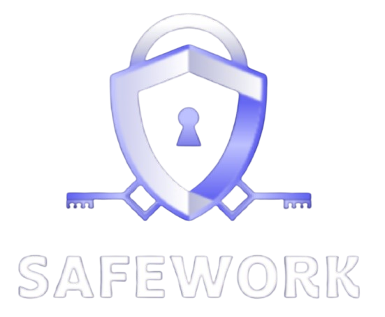</th>
    <th>CetApp GO </th>
    <th>Laus </th>
    <th>Work Wallet </th>
  </tr>

  <tr>
    <td><b>Overview</b></td>
    <td>
      Plataforma web que centraliza el reporte, seguimiento y resolución de incidentes laborales, con un enfoque en simplicidad, accesibilidad y trazabilidad para empresas medianas y pequeñas.
    </td>
    <td>
      Herramienta digital de gestión de Seguridad y Salud en el Trabajo (SST), utilizada para registrar, investigar y hacer seguimiento de incidentes laborales.
    </td>
    <td>
      Software especializado en prevención de riesgos laborales y gestión de salud ocupacional, con módulos de formación, inspecciones y auditorías.
    </td>
    <td>
      Plataforma internacional enfocada en comunicación de seguridad y gestión de incidentes en el lugar de trabajo. Incluye reportes en tiempo real, auditorías y checklists móviles.
    </td>
  </tr>

  <tr>
    <td><b>Ventaja competitiva</b></td>
    <td>
      Simplicidad, accesibilidad y costos bajos enfocados en PYMEs, permitiendo reportes y trazabilidad en tiempo real sin requerir grandes infraestructuras.
    </td>
    <td>
      Adaptación sólida al marco normativo de seguridad local e integración orientada a la gestión documental exigida por las normativas de la región.
    </td>
    <td>
      Solución integral de prevención de riesgos que combina de forma robusta la formación, las inspecciones y la gestión avanzada de incidentes.
    </td>
    <td>
      Fuerte enfoque en la experiencia móvil, comunicación instantánea y reportes en tiempo real para operaciones dinámicas a gran escala.
    </td>
  </tr>

  <tr>
    <td><b>¿Qué valor ofrece a los clientes?</b></td>
    <td>
      Permite a trabajadores y responsables registrar y dar seguimiento en tiempo real a los incidentes, con reportes claros y exportables. Accesible y económico frente a soluciones internacionales.
    </td>
    <td>
      Cumplimiento con normativa nacional de SST, mayor formalización de los procesos y reducción del papeleo.
    </td>
    <td>
      Ofrece una solución integral de prevención, combinando gestión de incidentes con capacitación y control de cumplimiento.
    </td>
    <td>
      Accesibilidad móvil y comunicación inmediata, lo que agiliza la reacción en incidentes y refuerza la cultura de seguridad.
    </td>
  </tr>

  <tr>
    <th rowspan="2">Perfil de Marketing</th>
    <td><b>Mercado Objetivo</b></td>
    <td>
      Empresas medianas o pequeñas, especialmente de manufactura, logística y construcción que requieren cumplir con normativas de seguridad sin grandes costos.
    </td>
    <td>
      Empresas nacionales que deben cumplir con la Ley de Seguridad y Salud en el Trabajo en Perú y Latinoamérica.
    </td>
    <td>
      Corporaciones y empresas con alta exposición a riesgos laborales, interesadas en centralizar prevención, formación y control.
    </td>
    <td>
      Empresas globales que buscan mejorar la comunicación interna en seguridad y reducir incidentes mediante apps móviles.
    </td>
  </tr>

  <tr>
    <td><b>Estrategias de Marketing</b></td>
    <td>
      Alianzas con gremios empresariales, campañas educativas en LinkedIn y webinars sobre SST accesible.
    </td>
    <td>
      Posicionamiento a través de consultoras en SST y capacitaciones empresariales.
    </td>
    <td>
      Marketing institucional, presencia en ferias de seguridad laboral, venta directa a grandes clientes.
    </td>
    <td>
      Campañas digitales en mercados internacionales, uso de casos de éxito en grandes organizaciones.
    </td>
  </tr>

  <tr>
    <th rowspan="3">Perfil de Producto</th>
    <td><b>Productos & Servicios</b></td>
    <td>
      Registro digital de incidentes y accidentes laborales. Panel de seguimiento para responsables de seguridad. Historial de casos por trabajador y por área. Sistema de asignación de responsables y seguimiento de casos. Opción de reportes anónimos. Dashboard de indicadores de seguridad.
    </td>
    <td>
      Registro y notificación de accidentes e incidentes en cumplimiento con normativas locales. Módulos de investigación y análisis de causas. Gestión documental para SST (informes, actas, auditorías). Generación de indicadores y estadísticas de seguridad. Integración con capacitaciones en seguridad.
    </td>
    <td>
      Gestión integral de prevención de riesgos laborales. Módulo de inspecciones y auditorías internas. Capacitación online para trabajadores. Registro de incidentes y enfermedades ocupacionales. Herramientas de cumplimiento normativo internacional.
    </td>
    <td>
      Reporte de incidentes en tiempo real desde dispositivos móviles. Auditorías y checklists digitales. Comunicación instantánea entre trabajadores y responsables vía app. Módulo de inducción digital para trabajadores nuevos. Herramientas de análisis de tendencias en seguridad.
    </td>
  </tr>

  <tr>
    <td><b>Precios & Costos</b></td>
    <td>
      Modelo SaaS accesible, con planes escalonados según número de usuarios y nivel de funcionalidad.
    </td>
    <td>
      Suscripción por licencia anual, con precios adaptados al tamaño de la empresa.
    </td>
    <td>
      Modelo de licencias empresariales con costo elevado, diseñado para corporaciones.
    </td>
    <td>
      Planes por suscripción mensual, con precios diferenciados según cantidad de usuarios activos.
    </td>
  </tr>

  <tr>
    <td><b>Canales de distribución (Web y/o Móvil)</b></td>
    <td>Plataforma web responsive</td>
    <td>Plataforma web y aplicación móvil</td>
    <td>Plataforma web con módulos móviles</td>
    <td>Web y aplicación móvil (iOS y Android)</td>
  </tr>

  <tr>
    <th rowspan="4">Análisis SWOT</th>
    <td><b>Fortalezas</b></td>
    <td>
      Simplicidad y accesibilidad para PYMEs, costos bajos, enfoque local amigable.
    </td>
    <td>
      Adaptación al marco normativo peruano y latinoamericano, experiencia sólida en SST.
    </td>
    <td>
      Solución muy completa e integral que combina formación, prevención e incidentes.
    </td>
    <td>
      Fuerte enfoque móvil, diseño multiplataforma y comunicación instantánea fluida.
    </td>
  </tr>

  <tr>
    <td><b>Debilidades</b></td>
    <td>
      Base de usuarios inicial limitada y falta de reputación consolidada en el mercado.
    </td>
    <td>
      Interfaz más técnica, orientada a especialistas y menos intuitiva para el trabajador promedio.
    </td>
    <td>
      Costo elevado, accesible principalmente para empresas grandes o corporaciones.
    </td>
    <td>
      Dependencia estricta de conectividad móvil y mayor curva de aprendizaje para usuarios operativos.
    </td>
  </tr>

  <tr>
    <td><b>Oportunidades</b></td>
    <td>
      Creciente necesidad de digitalizar reportes y cumplir normativas de forma económica en PYMEs.
    </td>
    <td>
      Alta demanda continua de cumplimiento legal obligatorio en empresas medianas de la región.
    </td>
    <td>
      Expansión constante en corporaciones multinacionales con altos presupuestos de prevención.
    </td>
    <td>
      Auge global del trabajo remoto, esquemas híbridos y digitalización avanzada de la SST.
    </td>
  </tr>

  <tr>
    <td><b>Amenazas</b></td>
    <td>
      Presencia de competidores internacionales robustos y cambios regulatorios imprevistos.
    </td>
    <td>
      Aparición constante de nuevas soluciones locales orientadas a ser más fáciles de usar.
    </td>
    <td>
      Pérdida paulatina de atractivo comercial frente a alternativas de software más económicas.
    </td>
    <td>
      Competencia directa de apps locales adaptadas de manera específica al marco legal de cada país.
    </td>
  </tr>
</table>

### 2.1.2. Estrategias y tácticas frente a competidores

**SafeWork** aplicará una estrategia de diferenciación enfocada en la simplicidad de uso y en la adaptación al contexto local de seguridad laboral, destacando por su sistema de reportes inmediatos, trazabilidad clara de casos y generación automática de informes. Frente a competidores como CetApp GO, Laus y Work Wallet, SafeWork se posiciona como una solución ágil, accesible y diseñada para pequeñas y medianas empresas, donde el cumplimiento normativo y la prevención de riesgos son críticos, pero los recursos suelen ser limitados.

El valor de SafeWork está en ofrecer una plataforma ligera y directa, con un flujo de reporte optimizado, lo que reduce los tiempos de respuesta y minimiza la subnotificación de incidentes. Además, integra un chat interno para comunicación rápida, lo cual no está plenamente desarrollado en soluciones competidoras.

Aprovechará las debilidades de otros sistemas como su alta complejidad, precios elevados o la poca adaptación a la realidad de las PYMEs locales. Para mitigar amenazas como la resistencia al cambio tecnológico o la competencia de grandes soluciones internacionales, SafeWork implementará capacitaciones digitales simples, un modelo de precios accesible y un acompañamiento continuo al cliente, reforzando la confianza y el uso sostenido de la herramienta.

## 2.2. Entrevistas
### 2.2.1. Diseño de entrevistas

**Segmento objetivo 1: Personal encargado de la tramitación de accidentes e incidentes laborales**

* ¿Cuál es tu nombre completo?

* ¿Cuántos años tienes?

* ¿En dónde vives?

* ¿Cuál es tu cargo dentro de la empresa?

* ¿Cada cuánto tiempo recibes reportes de incidentes laborales?

* ¿Qué medios utilizan actualmente para registrar y dar seguimiento a los incidentes?

* ¿Qué problemas encuentras en el proceso actual de reporte y documentación de incidentes?

* ¿Has tenido casos en los que los reportes se pierden o llegan tarde? ¿Qué consecuencias generó?

* ¿Qué características crees que debería tener una herramienta digital para ayudarte a gestionar incidentes de manera más eficiente?

* ¿Te resultaría útil que la plataforma genere reportes automáticos y consolidados para auditorías o inspecciones?

* ¿Qué tan importante es para ti poder asignar responsables y dar seguimiento en tiempo real a la resolución de un incidente?

**Segmento objetivo 2: Trabajadores afectados por accidentes o incidentes laborales**

* ¿Cuál es tu nombre completo?

* ¿Cuántos años tienes?

* ¿En dónde vives?

* ¿En qué área o puesto trabajas actualmente?

* ¿Has tenido algún accidente o incidente laboral en tu centro de trabajo? ¿Cómo lo reportaste?

* ¿Qué tan fácil o difícil fue reportarlo en ese momento?

* ¿Alguna vez sentiste que tu reporte no fue atendido o quedó sin seguimiento?

* ¿Qué tanto confías en el proceso actual que tiene tu empresa para registrar y resolver incidentes laborales?

* ¿Qué tan importante sería para ti contar con una plataforma donde pudieras reportar un incidente de forma rápida y saber el estado de tu caso en tiempo real?

* ¿Qué información te gustaría poder registrar en un reporte digital (fotos, ubicación, descripción, testigos, etc.)?

* ¿Crees que una plataforma así te daría más confianza de que tu seguridad y bienestar están siendo tomados en serio?

* ¿Qué temores o preocupaciones tendrías al usar una herramienta digital para reportar incidentes?

### 2.2.2. Registro de entrevistas

**Segmento objetivo \#1: Personal encargado de la tramitación de accidentes e incidentes laborales** 

Entrevistado N°1: Miguel Angel Saucedo Zambrano

* Sexo: Masculino  
* Edad: 34 años  
* Ubicación en la que vive: Santiago de Chile

Acerca de la entrevista:

* Instante en el que inicia: 0:00
* Duración: 3:24

Resumen:

Para Miguel, debido a que en su puesto de trabajo se realizan estos informes de manera manual en papel, tienen problemas debido a que en ocasiones estos formularios llegan incompletos, con el papel dañado o sin ciertos datos que no permiten realizar un correcto seguimiento, además a tenido varios casos en los que se pierden los informes lo que lleva a faltas de coordinación e incluso a más riesgos en un futuro ya que los problemas no son solucionados como deberían.

Entrevistado N°2: Nicole Requena Saiwa

* Sexo: Femenino   
* Edad: 27 años  
* Ubicación en la que vive: Ciudad de Arequipa

Acerca de la entrevista:

* Instante en el que inicia: 3:33
* Duración: 2:53

Resumen:

En el puesto de trabajo de Nicole, utilizan métodos tradicionales para completar los formularios de incidentes como a mano en una hoja de papel o en ocasiones dentro de hojas de excel. Considera que es difícil consolidar todos los datos para el informe ya que muchas veces estos informes llegan incompletos o son perdidos antes de ser terminados. Finalmente cree que una aplicación similar a SafeWork podría ayudarle mucho en su posición. 

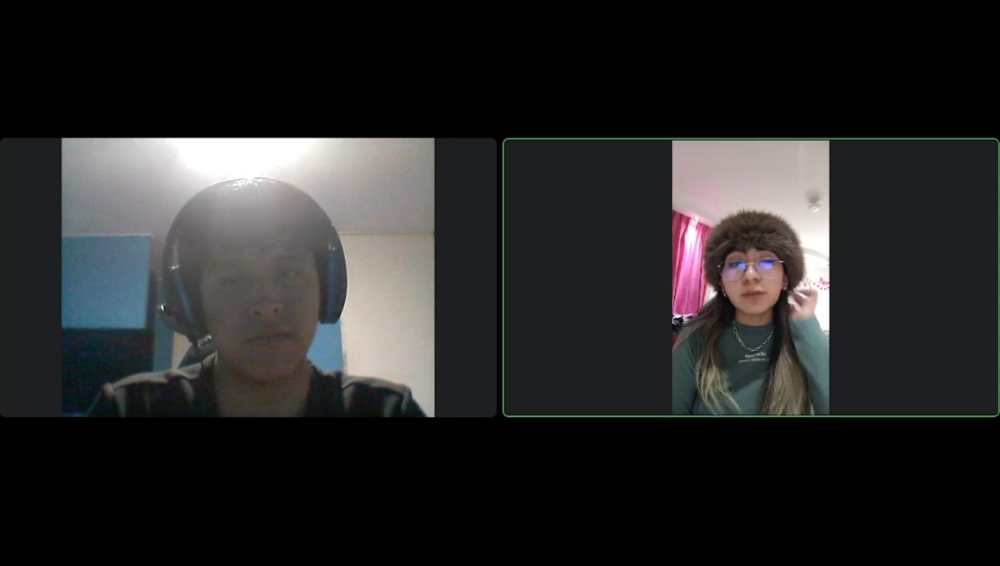

Entrevistado N°3: Luis Alberto Paredes

* Sexo: Masculino  
* Edad: 24  
* Ubicación en la que vive: San Martín de Porres

Acerca de la entrevista:

* Instante en el que inicia: 6:29 
* Duración: 4:55

Luis Alberto es un asistente de seguridad en una empresa de construcción y comenta que recibe reportes de accidentes laborales casi semanalmente, la mayoría de estos siendo casos pequeños. En su empresa, utilizan excel o medios comunicativos como WhatsApp para reportar estos incidentes. Considera que tienen problemas ya que los reportes no siempre llegan completos lo que lleva a un difícil seguimiento. Cree que una aplicación como SafeWork si le ayudaria bastante en su área de trabajo.

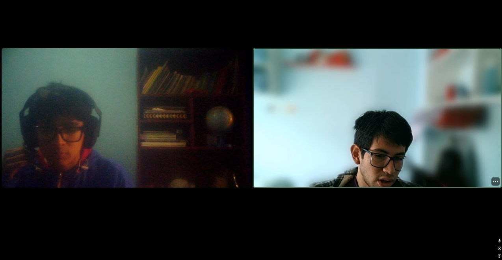

**Segmento objetivo \#2: Trabajadores afectados por accidentes o incidentes laborales**

Entrevistada N°1: Mario André Cacho Seminario

* Sexo: Masculino  
* Edad: 22  
* Ubicación en la que vive: Lima, Surco

Acerca de la entrevista:

* Instante en el que inicia: 11:29
* Duración: 3:20

Resumen:  
Para Mario, cuando pasó por este pequeño accidente durante sus horas de trabajo, lo más complicado para él fue realizar el reporte ya que el sistema presentaba fallas y se demoraba en responder, por ello se le fue difícil subir la información para su reporte. Considera además que una plataforma como SafeWork podría ser muy útil cuando no puedes depender de solo el servicio que tiene tu empresa ya que en ocasiones pueden ocurrir problemas como le ocurrió a él.

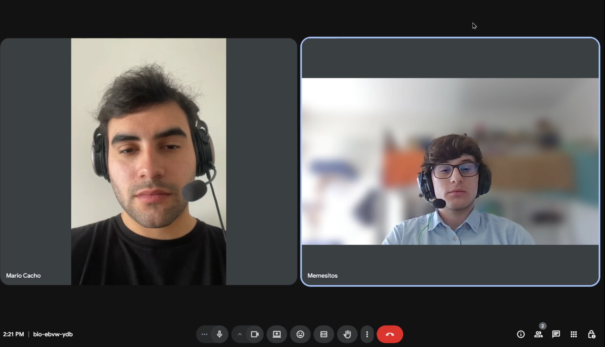

Entrevistado N°2: Sebastián De Las Casas Latour

* Sexo: Masculino  
* Edad: 21  
* Ubicación en la que vive: Lima, Surco

Acerca de la entrevista:

* Instante en el que inicia: 14:52  
* Duración: 5:26

Resumen:

Para Sebastián una plataforma que le permita organizar y mantener un seguimiento de los incidentes o accidentes podría ser de gran ayuda en caso pase por un problema similar en un futuro. Si bien considera que no tuvo problemas al reportar los incidentes ya que la empresa lo manejo de una manera correcta, indica que si hubiera tenido una herramienta similar a SafeWork, el proceso hubiera sido más rápido, no se habría encontrado confundido de qué hacer cuando sufrió el accidente y podría tener un registro de lo que ocurre en caso se tenga que realizar algún seguimiento.

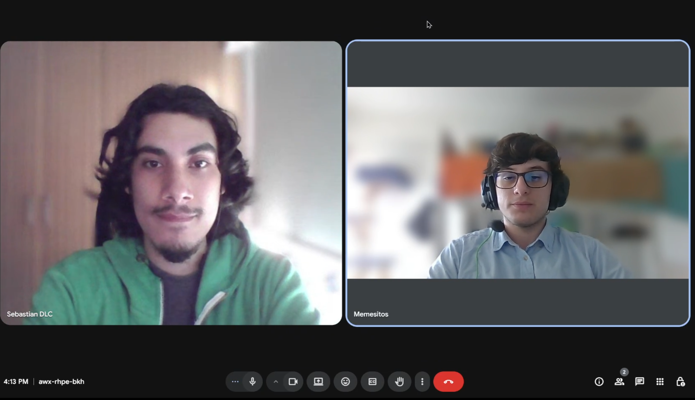

Entrevistado N°3: Diego Alarcon Rivas

* Sexo: Masculino  
* Edad: 22  
* Ubicación en la que vive: San Juan de Lurigancho

Acerca de la entrevista:

* Instante en el que inicia: 20:22
* Duración: 5:10

Resumen:

Diego trabaja actualmente en el área de almacenamiento, es un ayudante de logística y si ha tenido accidentes anteriormente en este puesto. En su trabajo anotan los incidentes/accidentes que ocurren en los cuadernos para llevar un seguimiento simple de los problemas que ocurren. Debido a que no había un formato claro para el reporte, se le complicó llenar con la información que consideraba importante. Considera que SafeWork podría ayudar bastante en su puesto de trabajo para llevar una lista de los incidentes y poder seguirlos correctamente.

El video completo de las entrevistas puede ser visualizado en el siguiente link: https://upcedupe-my.sharepoint.com/:v:/g/personal/u202223990_upc_edu_pe/EXompS5DmExMneyAoAHRKAgBHiOofaiA4tbpoGPA-7fmFQ?e=NXfew1 [https://upcedupe-my.sharepoint.com/personal/u202223990_upc_edu_pe/_layouts/15/stream.aspx?id=%2Fpersonal%2Fu202223990_upc_edu_pe%2FDocuments%2Fupc-pre-202520-1asi0729-7349-SafeWork-needfinding-sprint-1%2Emp4&ga=1&referrer=StreamWebApp%2EWeb&referrerScenario=AddressBarCopied%2Eview%2E3a8e9694-9835-42b7-a44b-12e8189e3111]

### 2.2.3. Análisis de entrevistas

De acuerdo con la información recopilada de las entrevistas, realizamos el siguiente análisis de entrevistas:

* **Segmento objetivo \#1:**

**Hallazgos:**
**Uso de métodos informales:** actualmente se emplean Excel, WhatsApp o formularios en papel para recibir y procesar reportes (caso Luis, Nicole y Miguel).  
**Reportes incompletos:** la información llega con datos faltantes, lo que complica el seguimiento adecuado de los casos.  
**Pérdida de información:** los formularios físicos o archivos mal gestionados se extravían o se dañan, generando riesgos de coordinación.  
**Dificultad en la consolidación de datos:** procesar la información de forma manual o dispersa hace que elaborar informes sea lento y poco confiable.  
**Valor percibido de SafeWork:** todos coinciden en que una aplicación digital centralizada facilitaría enormemente su trabajo, asegurando reportes completos y organizados.

* **Segmento objetivo \#2:** 

**Hallazgos:**  
**Problemas técnicos**: los sistemas actuales pueden fallar o ser poco confiables (caso Mario).  
**Falta de claridad**: los trabajadores no siempre saben qué hacer en el momento del accidente (caso Sebastián).  
**Valor percibido de SafeWork**: ambos coinciden en que una plataforma externa facilitaría el proceso, ya sea por ser más confiable o por ofrecer seguimiento claro.  
**Necesidad de accesibilidad**: los trabajadores quieren poder reportar y dar seguimiento de manera rápida, sencilla y sin depender exclusivamente del área de la empresa.

* Conclusiones de ambos segmentos:

El segmento de personal SST enfrenta problemas recurrentes de desorganización, pérdida de información y falta de uniformidad en los reportes debido al uso de métodos manuales o informales. Existe una clara percepción de que una herramienta como SafeWork podría optimizar la gestión de reportes, mejorar la trazabilidad y reducir riesgos derivados de información incompleta o extraviada.

Por otro lado, para el segmento 2, las entrevistas muestran que, aunque la gestión interna de accidentes puede funcionar en algunos casos, existen fallas técnicas y vacíos en la experiencia del trabajador que generan frustración o confusión. Una herramienta como SafeWork representa una oportunidad clara para mejorar la confiabilidad del proceso de reporte frente a fallas en los sistemas empresariales, guiar al trabajador en los pasos a seguir inmediatamente después del accidente y por último brindar trazabilidad y registro histórico, aumentando la seguridad y confianza de los trabajadores en la gestión de sus incidentes.

## 2.3. Needfinding

Se presentan en esta sección los resultados del análisis de la información recolectada de los segmentos objetivos.

**Segmento objetivo \#1: Personal encargado de la tramitación de accidentes e incidentes laborales** 

* Motivaciones Principales:  
- Garantizar un registro completo y confiable de los incidentes laborales.

- Reducir la carga administrativa que generan los reportes manuales.
  
- Mejorar el seguimiento de los casos para prevenir futuros accidentes.
   
- Cumplir con las normativas de seguridad y salud en el trabajo.

* Problemas Identificados:  
- Reportes incompletos que dificultan el análisis posterior.
  
- Uso de medios informales (WhatsApp, papel, Excel) que generan desorden.
  
- Pérdida de información por documentos extraviados o dañados.
  
- Dificultad en consolidar datos para elaborar informes y reportes oficiales.
  
- Falta de trazabilidad en los procesos de gestión de incidentes.

* Requerimientos para una plataforma ideal:  
- Un sistema digital centralizado y seguro para registrar los incidentes.
  
- Formularios estructurados que obliguen a completar todos los campos necesarios.
  
- Posibilidad de almacenar y consultar reportes anteriores de forma organizada.
  
- Herramientas para consolidar automáticamente los datos y generar informes.
  
- Interfaz simple y accesible para que todo el personal pueda usarla fácilmente.

**Segmento objetivo \#2: Trabajadores afectados por accidentes o incidentes laborales**

* Motivaciones Principales:  
- Reportar rápidamente un accidente/incidente para recibir ayuda inmediata.

- Garantizar que su caso sea atendido y no quede olvidado en trámites internos.

- Tener claridad y orientación sobre qué hacer en el momento del accidente.

- Mantener un registro personal de los accidentes/incidentes sufridos.

- Confiar en que su información será tratada de forma segura y transparente.

* Problemas Identificados:  
- Sistemas internos de la empresa que presentan fallas técnicas o lentitud al momento de reportar (ejemplo Mario).

- Falta de claridad sobre los pasos a seguir después de un accidente (ejemplo Sebastián).

- Procesos burocráticos que generan demora en la atención.

- Ausencia de un registro personal accesible de los casos.

- Dependencia total de las áreas internas de la empresa, lo que genera vulnerabilidad cuando fallan sus sistemas.

* Requerimientos para una plataforma ideal:  
- Interfaz simple y rápida que permita registrar un reporte en pocos pasos.

- Guía paso a paso para que el trabajador sepa qué hacer en cada situación.

- Confiabilidad técnica (sin fallas, carga ligera, accesible desde web y móvil).

- Funcionalidad de seguimiento en tiempo real para ver el estado del caso.

- Historial de reportes accesible en el perfil del usuario.

- Seguridad de datos que brinde confianza en el manejo de la información sensible.

### 2.3.1. User Personas

**User Persona del Personal encargado de la tramitación de accidentes e incidentes laborales:** 
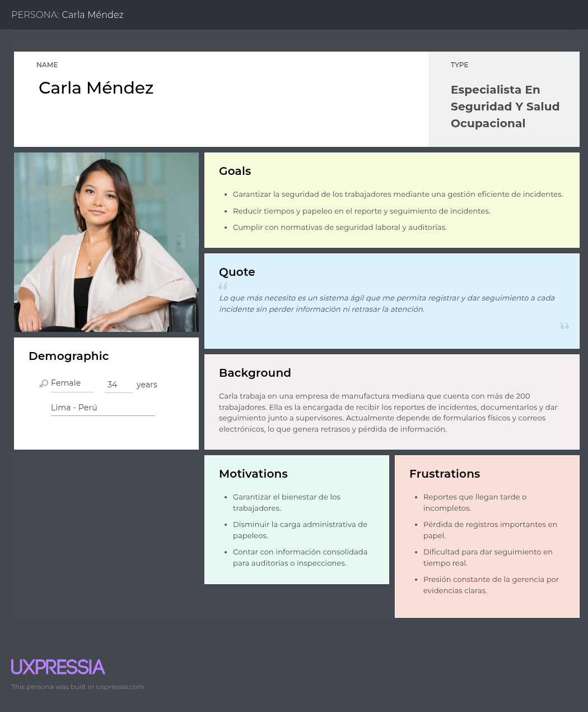

**User Persona del Trabajador afectado por accidentes o incidentes laborales:**  
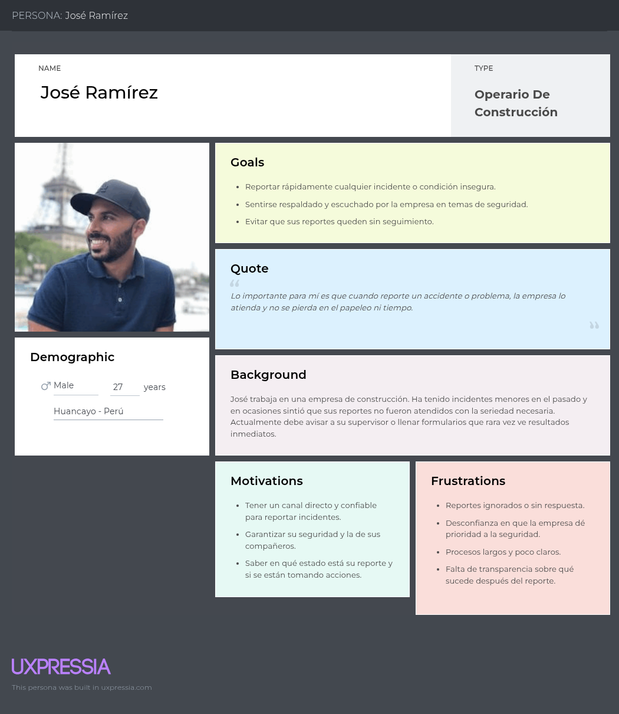

### 2.3.2. User Task Matrix

En esta se presenta el user task matrix, herramienta centrada en los segmentos objetivos que nos permitirá identificar las tareas y objetivos claves de los usuarios.

| USER TASK  | Carla Méndez |  | José Ramírez |  |
| ----- | :---: | :---: | :---: | :---: |
|  | **Frequency** | **Importance** | **Frequency** | **Importance** |
| Registrar un accidente o incidente | Always | High | Sometimes | High |
| Revisar reportes de trabajadores | Often | High | Rarely | Medium |
| Revisar reportes de trabajadores | Always | High | Often | High |
| Generar informes para auditorías o gerencia | Often | High | Never | Low |
| Acceder al historial de incidentes pasados | Often | Medium | Sometimes | Medium |
| Recibir notificaciones sobre actualizaciones de casos | Always | High | Always | High |
| Subir evidencia (fotos, documentos, videos) | Sometimes | High | Often | High |
| Consultar medidas correctivas aplicadas | Often | High | Sometimes | High |
| Comunicarme con responsables (supervisor, médico laboral, etc.) | Often | High | Sometimes | High |
| Reportar condiciones inseguras (antes que un accidente ocurra) | Sometimes | High | Often | High |

### 2.3.3. User Journey Mapping

**User Journey Mapping Personal encargado de la tramitación de accidentes e incidentes laborales:**  
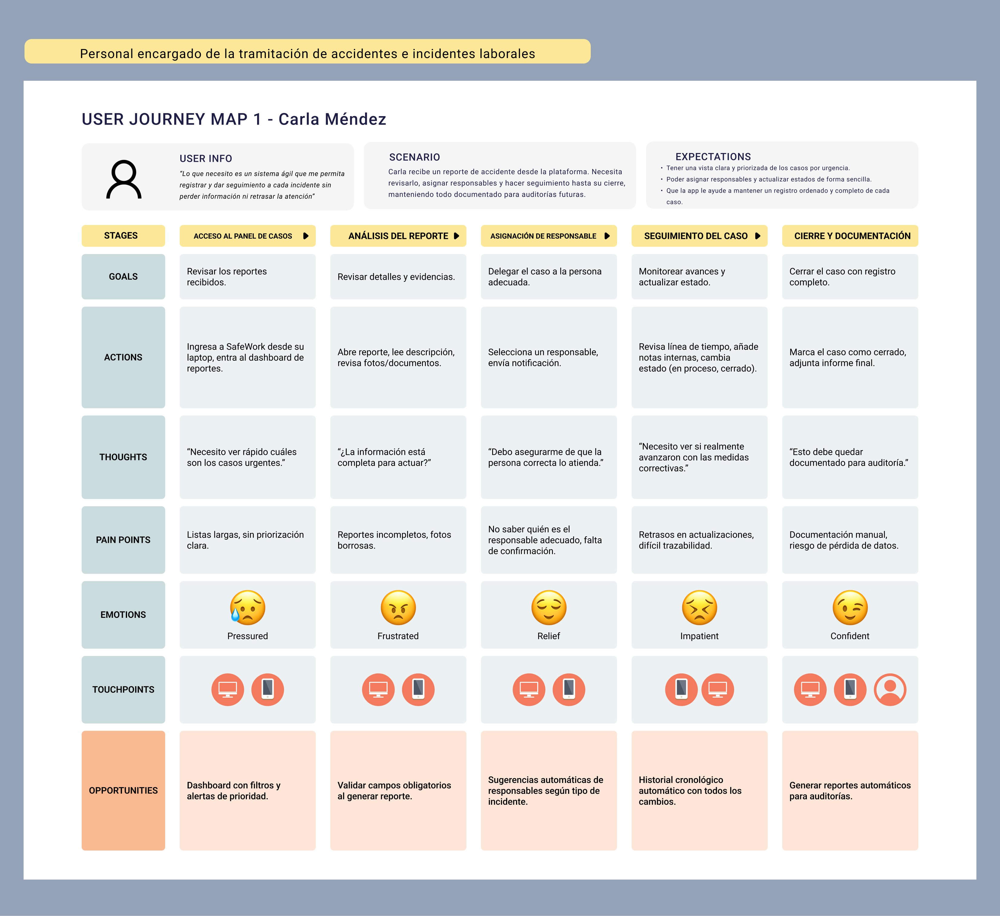

**User Journey Mapping Trabajador afectado por accidentes o incidentes laborales:**  
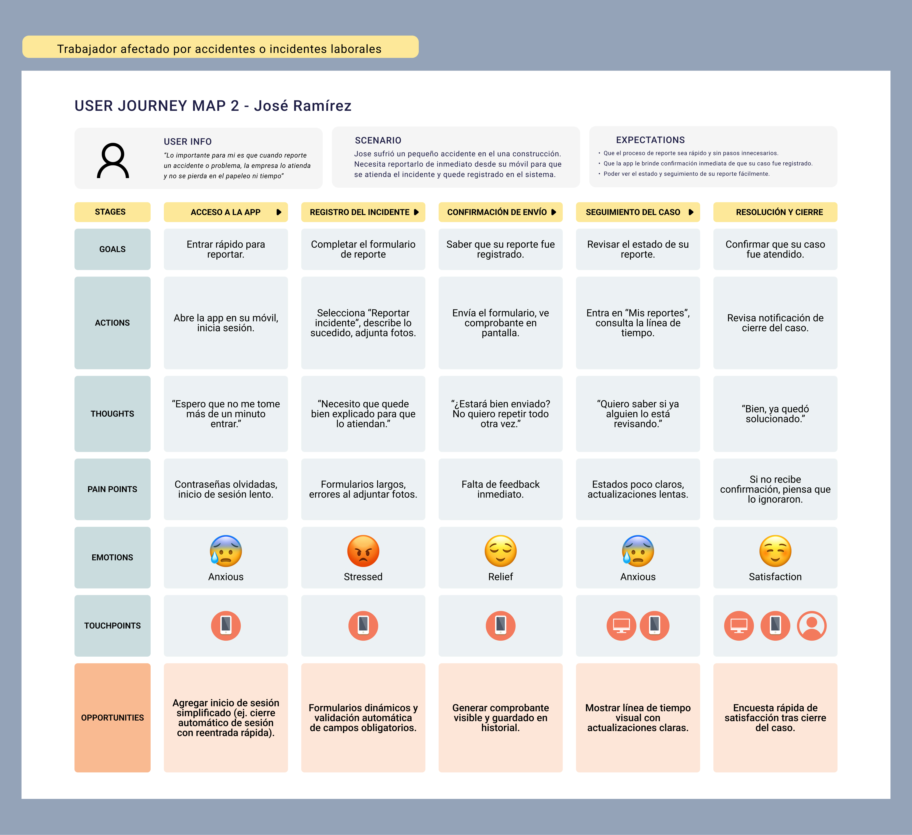

### 2.3.4. Empathy Mapping

**Empathy mapping de Personal encargado de la tramitación de accidentes e incidentes laborales:**  
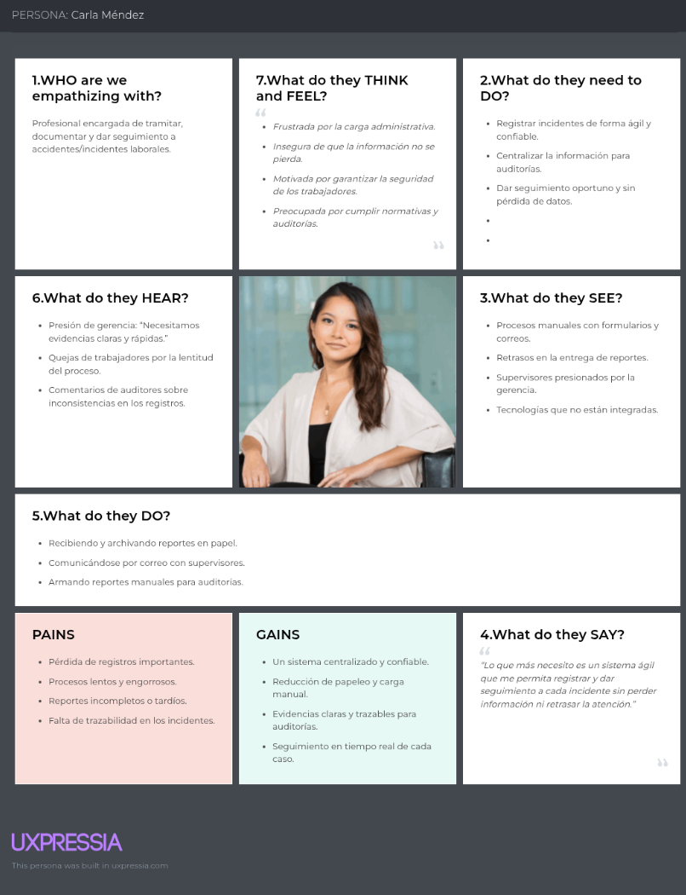

**Empathy mapping de Trabajador afectado por accidentes o incidentes laborales:**

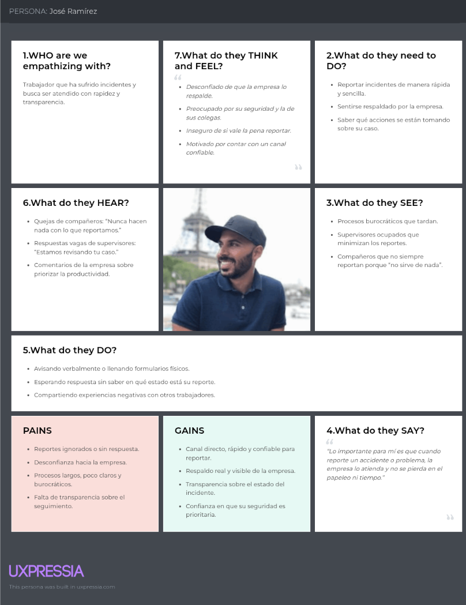

### 2.3.5. Big Picture EventStorming

Big Picture Event Storming es una técnica colaborativa que nos permitirá comprender el funcionamiento global de SAFEWORK. Se basará en visualizar eventos clave del dominio(domain events), fomentar el diálogo entre roles (actores) diversos y detectar oportunidades de mejora. El proceso se divide en tres fases principales:

**Primera Etapa: OPEN**

Aquí colocamos todos los eventos de dominios que se nos pueda ocurrir.
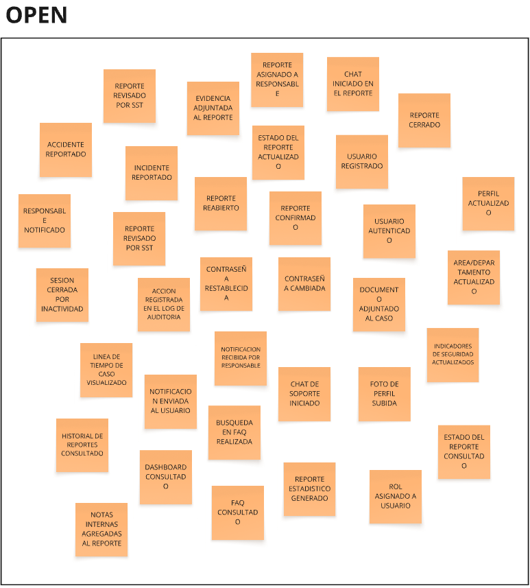

**Segunda Etapa: EXPLORE**

Identificamos actores y pain points que luego cuestionamos, y lo más importante crear una secuencia entre los eventos de dominio.
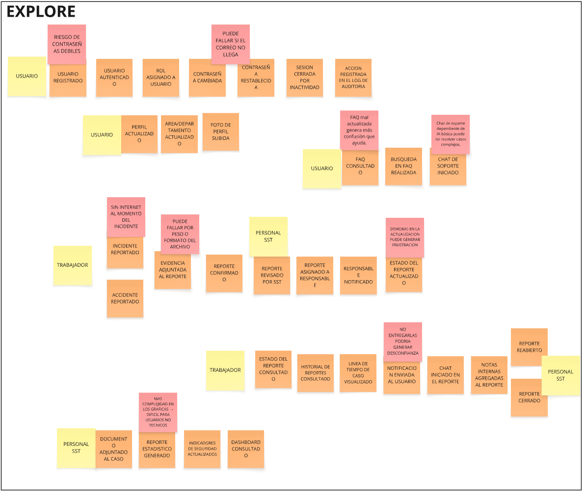

**Tercera Etapa: CLOSE**

Identificamos problemas que hayamos encontrado, temas a investigar más a fondo y declaramos que esta fuera de nuestro alcance actual.

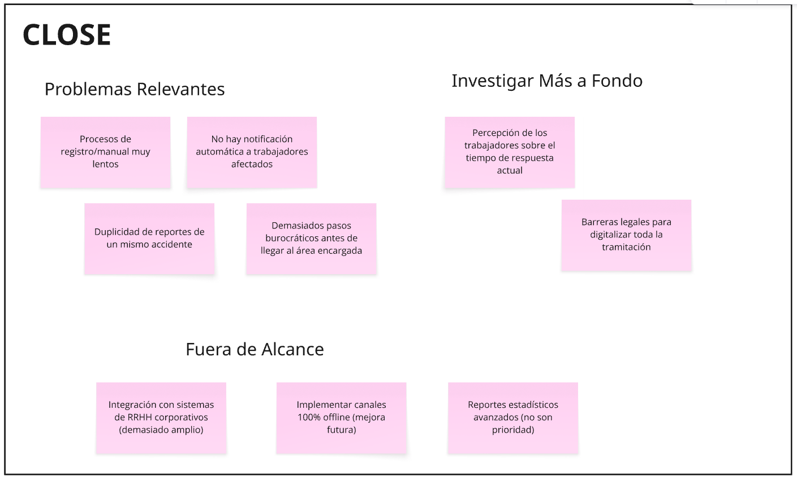

### 2.3.6. Ubiquitous Language

**Términos Clave:**
*- Incident (Incidente):*
Evento no deseado que ocurre en el lugar de trabajo y que no causa daño grave, pero que puede indicar una condición insegura.

*- Accident (Accidente):*
Suceso inesperado en el trabajo que causa daño físico a un trabajador o afecta la seguridad.

*- Report (Reporte):*
Registro formal de un accidente o incidente, que incluye datos relevantes como descripción, lugar, fecha, fotos o documentos.

*- Case (Caso):*
Conjunto de reportes y acciones relacionadas a un accidente o incidente específico que está siendo gestionado.

*- Case Status (Estado del caso):*
Fase en la que se encuentra un reporte: pendiente, en revisión, en proceso de acción correctiva o cerrado.

**Roles y Actores**

*- Worker (Trabajador):*
Persona que realiza labores en la empresa y que puede reportar incidentes o accidentes.

*- Affected Worker (Trabajador afectado):*
Colaborador que ha sufrido un accidente o incidente y requiere seguimiento de su caso.

*- Occupational Health and Safety Staff (Personal SST):*
Especialistas responsables de recibir, gestionar y dar seguimiento a los reportes de accidentes e incidentes laborales.

*-Responsible (Responsable):*
Persona designada para atender y resolver un caso específico.

*- Administrator (Administrador):*
Usuario con permisos para gestionar configuraciones, seguridad de datos y auditorías dentro de la plataforma.

**Acciones y Procesos**

*- Report Submission (Registro de reporte):*
Acción realizada por un trabajador para informar sobre un accidente o incidente.

*- Case Management (Gestión de casos):*
Proceso que incluye la recepción, revisión, asignación de responsables, actualización de estado y cierre de un caso.

*- Follow-up (Seguimiento):*
Actividad de monitoreo continuo sobre el progreso de un caso hasta su resolución.

*- Evidence (Evidencia):*
Documentos, fotos o archivos que respaldan la veracidad de un reporte.

*- Audit (Auditoría):*
Revisión oficial de registros y casos para comprobar cumplimiento de normativas de seguridad.

*- Notification (Notificación):*
Aviso enviado en tiempo real al usuario sobre cambios en el estado de un reporte o asignación de responsabilidades.

*- Timeline (Línea de tiempo):*
Representación cronológica de las etapas de un caso desde su registro hasta su cierre.

 
**Contexto Organizacional:**

*- Occupational Safety (Seguridad Ocupacional):*
Conjunto de medidas y procedimientos destinados a proteger la integridad física y psicológica de los trabajadores.

*- Corrective Action (Acción Correctiva):*
Medida implementada para solucionar un problema detectado en un reporte.

*- Preventive Action (Acción Preventiva):*
Medida destinada a evitar que un accidente o incidente vuelva a ocurrir.

*- Transparency (Transparencia):*
Cualidad del sistema que permite a los trabajadores conocer en todo momento el estado de sus reportes.

---

## 2.4. Requirements specification
### 2.4.1. User Stories

* EPICS

Las Epic definidas para SafeWork están orientadas a cubrir las necesidades principales tanto del personal encargado de la tramitación de accidentes e incidentes laborales como la de los trabajadores afectados por accidentes o incidentes laborales. Estas epics abordan funcionalidades esenciales para el funcionamiento de la plataforma, asegurando una experiencia fluida y efectiva por parte de ambos segmentos.

| Epic ID | Título | Descripción |
| :---: | :--- | :--- |
| **EP01** | Landing Page y Captación App Móvil | Como visitante o usuario interesado, deseo acceder a una vista/landing responsiva e informativa para conocer las funcionalidades móviles de SafeWork y descargar la aplicación. |
| **EP02** | Autenticación y Registro Móvil | Como usuario, deseo registrarme e iniciar sesión de forma segura usando biometría o credenciales para acceder a mis funciones según mi rol (trabajador o personal SST). |
| **EP03** | Recuperación de Contraseña | Como usuario registrado, deseo solicitar la recuperación de mi clave desde la app para restablecerla mediante código/enlace y no perder acceso. |
| **EP04** | Reporte In-Situ de Accidentes e Incidentes | Como trabajador, deseo registrar incidentes desde mi smartphone usando la cámara y el GPS integrado (con o sin señal) para notificar de inmediato al área encargada. |
| **EP05** | Gestión y Asignación de Reportes Móviles | Como personal SST, deseo recibir, revisar, filtrar y asignar casos desde mi dispositivo móvil para dar respuesta ágil en la planta o campo. |
| **EP06** | Tracking y Estado de Casos | Como trabajador, deseo consultar el estado de mis reportes en tiempo real para hacer un seguimiento transparente desde mi teléfono. |
| **EP07** | Soporte y Centro de Ayuda Móvil | Como usuario, deseo un centro de ayuda táctil con FAQ y un chatbot móvil para resolver dudas rápidamente dentro de la aplicación. |
| **EP08** | Perfil de Usuario y Ajustes Móviles | Como usuario, deseo configurar mi perfil, foto, rol y preferencias en la app para personalizar la experiencia táctil. |
| **EP09** | Sistema de Notificaciones Push y Alertas | Como usuario, deseo recibir notificaciones push en tiempo real en mi teléfono sobre actualizaciones de reportes y asignación de casos. |
| **EP10** | Captura de Evidencia y Gestión Documental | Como usuario (trabajador o SST), deseo tomar/adjuntar fotos, notas de voz o PDFs a los reportes directamente desde el almacenamiento o cámara de la app. |
| **EP11** | Comunicación e Interacción Móvil | Como trabajador o personal SST, deseo utilizar notas internas e historial del caso para estar coordinados sobre cada incidente. |
| **EP12** | Dashboard y Analítica Móvil | Como personal SST o administrador, deseo visualizar indicadores clave y gráficos adaptados a pantallas móviles para tomar decisiones rápidas. |
| **EP13** | Seguridad de Datos y Modo Offline Móvil | Como administrador, deseo que los datos almacenados localmente y transmitidos por la app estén encriptados y protegidos para asegurar la confidencialidad. |

* User Stories

| Epic / Story ID | Título | Descripción | Criterios de Aceptación | Relacionado con (Epic ID) |
| :---: | :--- | :--- | :--- | :---: |
| **US01** | Navegación Intuitiva en Landing Movilizada | Como visitante, deseo que la landing page sea 100% responsiva con menús táctiles para conocer la app. | **Escenario 01:** Given el usuario entra a la landing desde su smartphone, When abre el menú desplegable, Then ve accesos a “Beneficios”, “Descargar App” y “Contacto”.  **Escenario 02:** Given el usuario toca un elemento del menú, When interactúa con él, Then el botón muestra retroalimentación visual inmediata. | EP01 |
| **US02** | Visualización de Beneficios Móviles | Como visitante, deseo ver cómo la app agiliza el reporte en campo para conocer su valor. | **Escenario 01:** Given el usuario está en la landing, When desliza verticalmente, Then ve íconos y textos sobre captura con cámara, GPS y alertas push. | EP01 |
| **US03** | Testimonios en Pantalla Móvil | Como visitante, deseo leer testimonios formateados para pantallas pequeñas para ganar confianza. | **Escenario 01:** Given el usuario revisa la landing, When llega al carrusel de testimonios, Then puede deslizar horizontalmente (*swipe*) entre las opiniones. | EP01 |
| **US04** | Registro de Usuario en App | Como usuario nuevo, deseo registrarme desde la app con mis datos corporativos para crear mi cuenta. | **Escenario 01:** Given el usuario abre la app por primera vez, When completa el formulario de registro y acepta términos, Then su cuenta se crea y se inicia su sesión. | EP02 |
| **US05** | Iniciar Sesión con Biometría | Como usuario, deseo iniciar sesión con credenciales o biometría (huella/FaceID) para ingresar rápido. | **Escenario 01:** Given el usuario ya se registró, When ingresa credenciales o usa autenticación biométrica, Then accede a su panel principal. | EP02 |
| **US06** | Selección de Rol en la App | Como usuario nuevo, deseo elegir si soy "Trabajador" o "Personal SST" para ajustar la interfaz. | **Escenario 01:** Given el usuario está registrándose, When selecciona su rol, Then la app adapta las pestañas principales según los permisos del rol. | EP02 |
| **US07** | Recuperación de Contraseña en Móvil | Como usuario, deseo solicitar el restablecimiento de mi clave mediante código/enlace desde la app. | **Escenario 01:** Given el usuario no recuerda su clave, When toca "Olvidé mi contraseña" e ingresa su correo, Then recibe un token/código para cambiarla.  **Escenario 02:** Given el usuario ingresa el código recibido, When valida e ingresa una nueva contraseña, Then recupera su acceso. | EP03 |
| **US08** | Validación de Contraseña Segura | Como usuario, deseo que la app valide que mi clave cumple requisitos de seguridad al crearla. | **Escenario 01:** Given el usuario escribe una clave débil, When la app la analiza, Then muestra alertas en tiempo real sobre los requisitos faltantes.  **Escenario 02:** Given la clave cumple con los criterios, When confirma el registro, Then la cuenta se crea exitosamente. | EP02 |
| **US09** | Reporte In-Situ con Cámara y GPS | Como trabajador, deseo tomar fotos y usar mi ubicación GPS para reportar un accidente al instante. | **Escenario 01:** Given el trabajador abre la función de reporte, When toma la foto con la cámara del celular y activa el GPS, Then los datos se adjuntan automáticamente al formulario. | EP04 |
| **US10** | Reporte Rápido de Incidente Menor | Como trabajador, deseo reportar un incidente menor mediante un formulario corto de pocos toques. | **Escenario 01:** Given el trabajador selecciona "Incidente Menor", When completa la descripción rápida y ubicación, Then puede enviar el reporte sin requerir adjuntos obligatorios. | EP04 |
| **US11** | Agregar Referencias de Ubicación Externa | Como trabajador, deseo adjuntar un enlace o coordenada externa si el incidente ocurrió fuera de la ruta habitual. | **Escenario 01:** Given el trabajador llena un reporte, When pega una URL de mapa o selecciona un punto en el mapa, Then la coordenada queda vinculada al caso. | EP04 |
| **US12** | Revisión de Reportes para SST | Como personal SST, deseo ver una lista priorizada de reportes en mi smartphone para actuar rápido. | **Escenario 01:** Given el usuario SST abre la app, When accede al listado de casos, Then observa tarjetas visuales ordenadas por nivel de urgencia. | EP05 |
| **US13** | Asignación de Responsables en Móvil | Como personal SST, deseo asignar un caso a un técnico desde la app para delegar su atención. | **Escenario 01:** Given el personal SST revisa un caso, When selecciona "Asignar responsable" y elige un usuario, Then el sistema envía una alerta push al asignado. | EP05 |
| **US14** | Actualización Táctil de Estado | Como personal SST, deseo cambiar el estado de un caso tocando un selector para reflejar avances. | **Escenario 01:** Given el personal SST actualiza un caso, When cambia el estado a "En proceso" o "Resuelto", Then la interfaz refresca el estado en la base de datos local y remota. | EP05 |
| **US15** | Visualización del Estado en Tiempo Real | Como trabajador, deseo consultar el estado de mi reporte dentro de la app para saber su avance. | **Escenario 01:** Given el trabajador abre la pestaña "Mis Reportes", When toca sobre su caso, Then visualiza el estado actual y quién lo tiene a cargo. | EP05 |
| **US16** | Historial Personal de Reportes | Como trabajador, deseo ver un historial de todos mis reportes pasados con filtros simples. | **Escenario 01:** Given el trabajador entra a su perfil, When presiona "Historial de Reportes", Then la app muestra una lista cronológica con badges de estado final. | EP06 |
| **US17** | FAQ Interactivo en la App | Como usuario, deseo un menú desplegable de FAQ en la app para resolver dudas comunes. | **Escenario 01:** Given el usuario entra al módulo de ayuda, When navega por las categorías de preguntas, Then puede desplegar y leer las respuestas con un toque. | EP07 |
| **US18** | Chatbot Integrado en la App | Como usuario, deseo conversar con un asistente virtual dentro de la app para consultas inmediatas. | **Escenario 01:** Given el usuario tiene dudas, When abre la pestaña de chat, Then el bot responde sus consultas con mensajes predeterminados e IA. | EP07 |
| **US19** | Edición de Perfil desde el Teléfono | Como usuario, deseo editar mi información de contacto directamente en la app. | **Escenario 01:** Given el usuario está en la vista de perfil, When modifica su teléfono o datos y toca "Guardar", Then su información se actualiza.  **Escenario 02:** Given el usuario vuelve a ingresar al perfil, When carga la pantalla, Then observa los datos modificados. | EP08 |
| **US20** | Foto de Perfil desde la Galería/Cámara | Como usuario, deseo subir o tomar una foto desde mi smartphone para mi avatar. | **Escenario 01:** Given el usuario edita su perfil, When otorga permisos de cámara/galería y elige una imagen, Then la foto se procesa y guarda como avatar. | EP08 |
| **US21** | Notificaciones Push por Cambio de Estado | Como trabajador, deseo recibir una notificación push en mi teléfono cuando mi caso cambie de estado. | **Escenario 01:** Given el trabajador tiene la app cerrada o en segundo plano, When el área SST actualiza su caso, Then recibe una alerta push instantánea en la barra de su móvil. | EP09 |
| **US22** | Avisos e Indicadores In-App | Como trabajador, deseo ver badges de alerta dentro de la app sobre actualizaciones de mis reportes. | **Escenario 01:** Given el reporte del usuario sigue en revisión, When el usuario abre la app, Then observa una tarjeta/banner indicando la etapa actual.  **Escenario 02:** Given el reporte fue cerrado, When abre la app, Then observa un aviso de confirmación de cierre. | EP08 |
| **US23** | Adjuntar Archivos Móviles (SST) | Como personal SST, deseo adjuntar PDFs o imágenes de inspección usando el gestor de archivos del móvil. | **Escenario 01:** Given el personal SST edita un caso, When presiona "Adjuntar Documento" y selecciona un archivo, Then el archivo se sube y asocia al registro. | EP10 |
| **US24** | Captura Instantánea de Evidencias | Como trabajador, deseo tomar y adjuntar múltiples fotos al momento de realizar el reporte. | **Escenario 01:** Given el trabajador está creando un reporte, When presiona el ícono de cámara y captura 2 o más fotos, Then estas se previsualizan y se envían con la alerta. | EP10 |
| **US25** | Notas Internas en la Ficha del Caso | Como personal SST, deseo redactar notas internas en la app para dejar registro del seguimiento. | **Escenario 01:** Given el personal SST inspecciona el lugar, When escribe una nota interna y guarda, Then se almacena con marca de tiempo y nombre del auditor.  **Escenario 02:** Given otro miembro SST abre el caso, When consulta la sección de notas, Then observa los comentarios en orden cronológico. | EP09 |
| **US26** | Línea de Tiempo Visual del Caso | Como trabajador, deseo ver un gráfico de línea de tiempo dentro de la app para entender las etapas transcurridas. | **Escenario 01:** Given el trabajador abre el detalle de su reporte, When revisa la línea de tiempo, Then ve íconos de avance con fechas (Enviado -> En Revisión -> Resuelto).  **Escenario 02:** Given hay un cambio de etapa, When se actualiza el registro, Then la línea de tiempo marca la nueva fase como completada. | EP09 |
| **US27** | Vista Detallada de Incidente Móvil | Como personal SST, deseo ver todos los detalles (mapa, fotos, datos) en una sola vista adaptada a mi smartphone. | **Escenario 01:** Given el personal SST selecciona un reporte de la lista, When abre el detalle, Then ve una pantalla optimizada con galería de fotos, ubicación en mapa y datos del emisor. | EP12 |
| **US28** | Tarjetas de Métricas Rápidas en App | Como administrador/SST, deseo ver tarjetas resumidas de métricas en mi celular para evaluación rápida. | **Escenario 01:** Given el usuario tiene perfil administrador, When entra al Dashboard móvil, Then observa tarjetas resumen (KPIs) e indicadores visuales simples.  **Escenario 02:** Given el usuario aplica un filtro de fechas, When confirma, Then las tarjetas recalculan los valores en pantalla. | EP07 |
| **US29** | Encriptación de Datos Local y Remota | Como administrador, deseo que los reportes guardados en el dispositivo se encripten para proteger la información. | **Escenario 01:** Given la app almacena reportes localmente, When la información se escribe en el almacenamiento del teléfono, Then se guarda encriptada mediante AES. | EP13 |
| **US30** | Cambio de Contraseña desde la App | Como usuario, deseo cambiar mi clave desde los ajustes de la app para mantener la cuenta segura. | **Escenario 01:** Given el usuario entra a "Seguridad" en la app, When ingresa su clave actual y la nueva contraseña, Then se valida el cambio.  **Escenario 02:** Given la clave se actualiza correctamente, When vuelve a abrir la app, Then el inicio de sesión solicita los nuevos accesos. | EP02 |
| **US31** | Adaptabilidad en Pantallas Móviles | Como visitante, deseo que la landing page responda de forma fluida a distintos tamaños de smartphone o tablet. | **Escenario 01:** Given el usuario abre la landing desde cualquier modelo móvil, When navega verticalmente, Then el contenido y botones se reescalan sin desbordes. | EP01 |
| **US32** | Actualización de Área/Departamento | Como usuario, deseo seleccionar/editar mi área de trabajo dentro del perfil de la app. | **Escenario 01:** Given el usuario está en la configuración de su cuenta, When selecciona su nuevo departamento de un desplegable y guarda, Then la app actualiza sus datos de área.  **Escenario 02:** Given el usuario revisa su perfil, When abre la vista principal, Then observa el nombre del área actualizada. | EP08 |
| **US33** | Cierre de Sesión por Inactividad Móvil | Como usuario, deseo que la app bloquee o cierre mi sesión tras inactividad para evitar accesos no autorizados en mi teléfono. | **Escenario 01:** Given el usuario deja la app abierta sin interactuar por 15 minutos, When intenta realizar una acción, Then la app solicita nuevamente credenciales o biometría.  **Escenario 02:** Given el usuario autentica su identidad nuevamente, When ingresa, Then es devuelto a la pantalla donde se encontraba. | EP02 |
| **US34** | Comprobante de Reporte Generado | Como trabajador, deseo ver un modal/pantalla de confirmación tras enviar un reporte para estar seguro del envío. | **Escenario 01:** Given el trabajador presiona "Enviar Reporte", When la app procesa el envío, Then se despliega una pantalla con el número de ticket generado. | EP04 |
| **US35** | Buscador y Filtros Táctiles de Reportes | Como personal SST, deseo un buscador con filtros táctiles en la app para encontrar reportes específicos. | **Escenario 01:** Given el usuario SST abre el listado de casos, When escribe el nombre de un trabajador o tipo de falta en la barra de búsqueda, Then la app filtra y muestra únicamente las coincidencias. | EP05 |
| **US36** | Validación de Campos en Registro de Incidente | Como trabajador, deseo que la app me señale qué campos faltan llenar antes de enviar un reporte. | **Escenario 01:** Given el trabajador olvida colocar la descripción obligatoria, When intenta enviar, Then la app resalta el campo vacío en rojo y bloquea el envío.  **Escenario 02:** Given el trabajador completa todos los campos requeridos, When presiona enviar, Then el formulario se procesa con éxito. | EP06 |
| **US37** | Buscador por Palabras Clave en FAQ | Como usuario, deseo buscar temas específicos dentro de la sección de ayuda de la app. | **Escenario 01:** Given el usuario usa el buscador de la FAQ, When escribe "GPS", Then se muestran solo las preguntas relacionadas con la ubicación.  **Escenario 02:** Given el usuario escribe un término sin coincidencias, When busca, Then la app muestra el mensaje "No se encontraron resultados". | EP07 |
| **US38** | Notificación Push por Asignación de Caso | Como personal SST/Técnico, deseo recibir una notificación push cuando se me asigna un caso. | **Escenario 01:** Given al usuario se le asigna un caso nuevo, When la acción se registra, Then el teléfono emite una alerta push indicando el nuevo número de caso. | EP09 |
| **US39** | Filtro Rápido por Estado (Pestañas) | Como personal SST, deseo filtrar la lista de reportes mediante pestañas o chips para agilizar la gestión. | **Escenario 01:** Given el personal SST está en la app, When presiona la pestaña "Abiertos", Then solo se muestran las tarjetas de reportes en estado abierto.  **Escenario 02:** Given el personal SST cambia a la pestaña "Cerrados", When la app refresca, Then la lista cambia inmediatamente a los casos finalizados. | EP05 |
| **US40** | Registro de Auditoría de Acciones Móviles | Como administrador, deseo que cada acción realizada en la app quede registrada en un log seguro para trazabilidad. | **Escenario 01:** Given un usuario aprueba, modifica o crea un reporte desde la app, When se completa la solicitud, Then se envía un evento cifrado al log de auditoría con ID del dispositivo, usuario y hora. | EP13 |
| **US41** | Botones de Acción (CTA) Móviles | Como visitante de la landing page, deseo botones de acción adaptados al toque digital para interactuar fácilmente. | **Escenario 01:** Given el usuario navega la landing en su smartphone, When observa los botones "Descargar App" o "Probar Demo", Then estos se muestran destacados en pantalla.  **Escenario 02:** Given el usuario hace clic en el CTA de descarga, When interactúa, Then es redirigido a la tienda de aplicaciones o flujo correspondiente.  **Escenario 03:** Given la resolución móvil varia, When la página carga, Then el tamaño del botón CTA se adapta al ancho de pantalla. | EP01 |
| **US42** | Sección FAQ Desplegable en Landing Móvil | Como visitante, deseo ver una sección de FAQ tipo acordeón en la landing para leer información sin saturar la pantalla. | **Escenario 01:** Given el usuario navega la landing, When llega a la sección FAQ, Then observa las preguntas categorizadas.  **Escenario 02:** Given el usuario toca una pregunta, When se activa el toque, Then la respuesta se despliega hacia abajo sin cambiar de página.  **Escenario 03:** Given el usuario necesita más detalles, When llega al final de la FAQ, Then observa un botón para contactar al equipo por soporte móvil. | EP01 |
| **US43** | Visualización de Planes y Membresías Móviles | Como visitante, deseo comparar planes corporativos mediante tarjetas deslizables en mi smartphone. | **Escenario 01:** Given el usuario busca planes en la landing, When entra a la sección de membresías, Then visualiza las alternativas estructuradas en tarjetas.  **Escenario 02:** Given el usuario revisa las funciones del plan, When desliza lateralmente, Then puede comparar precios y características.  **Escenario 03:** Given el usuario escoge un plan, When presiona "Seleccionar Plan", Then se abre el flujo móvil de registro o contacto comercial. | EP01 |

### 2.4.2. Impact Mapping

Se realizaron los siguientes cuadros en la herramienta Canva Whiteboard, el link original puede ser observado aquí: 

**Impact Map Segmento 1:** **Personal encargado de la tramitación de accidentes e incidentes laborales**  
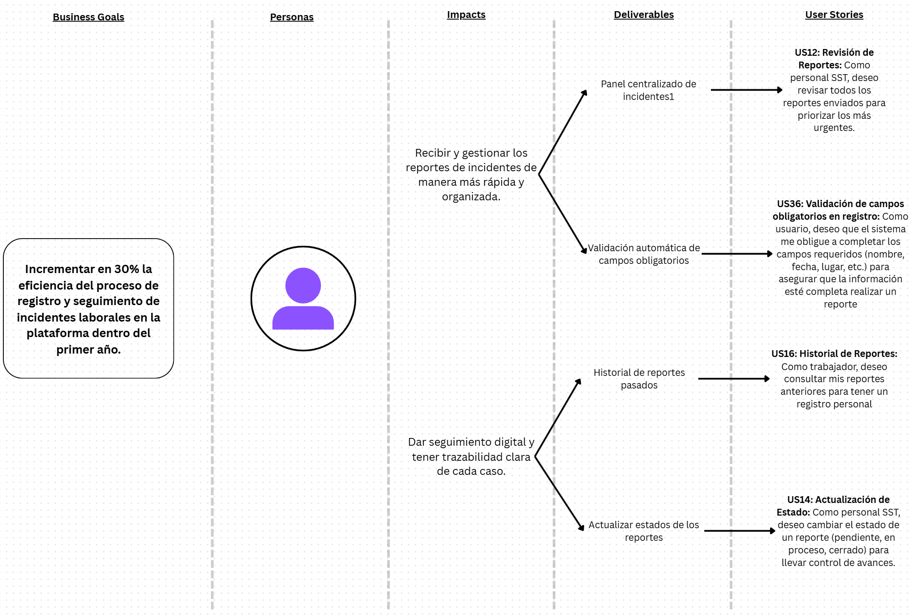

**Impact Map Segmento 2:** **Trabajadores afectados por accidentes o incidentes laborales**  
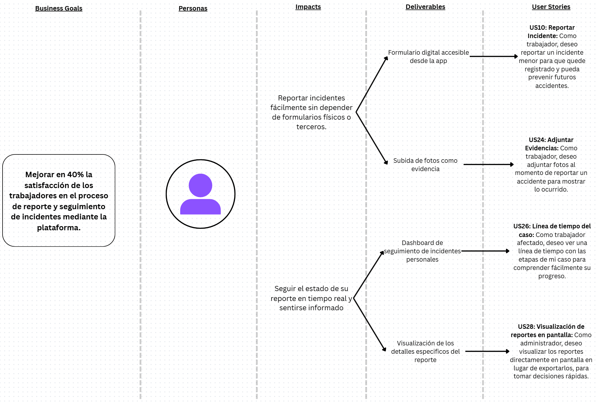

### 2.4.3. Product Backlog

Se utilizó la escala Fibonacci para la estimación de los Story Points. En total se tuvieron **93** Story Points.

| \#Orden | Epic / Story ID | Título | Descripción | Story Points (1/2/3/5/8) |
| :---: | :---: | ----- | ----- | :---: |
| 4 | US04 | Registro de Usuario | Como usuario nuevo, deseo registrarme con correo y usuario para crear una cuenta en SafeWork. | 5 |
| 5 | US05 | Inicio de Sesión Seguro | Como usuario, deseo iniciar sesión con mis credenciales para acceder a mis funcionalidades. | 5 |
| 6 | US06 | Roles Diferenciados | Como usuario, deseo seleccionar mi rol (trabajador o personal SST) para personalizar la experiencia. | 5 |
| 9 | US09 | Reportar Accidente | Como trabajador, deseo registrar un accidente laboral con fotos y detalles para notificar de inmediato a la empresa. | 8 |
| 10 | US10 | Reportar Incidente | Como trabajador, deseo reportar un incidente menor para que quede registrado y pueda prevenir futuros accidentes. | 5 |
| 11 | US11 | Inclusión de Referencias Externas | Como trabajador, deseo incluir un enlace de referencia en mi reporte para brindar mayor contexto o la ubicación exacta del incidente mediante un mapa externo. | 5 |
| 12 | US12 | Revisión de Reportes | Como personal SST, deseo revisar todos los reportes enviados para priorizar los más urgentes. | 5 |
| 13 | US13 | Asignación de Responsables | Como personal SST, deseo asignar responsables a cada caso para garantizar el seguimiento. | 5 |
| 14 | US14 | Actualización de Estado | Como personal SST, deseo cambiar el estado de un reporte (pendiente, en proceso, cerrado) para llevar control de avances. | 3 |
| 15 | US15 | Visualizar Estado del Reporte | Como trabajador, deseo ver en qué estado está mi reporte para mantenerme informado. | 3 |
| 16 | US16 | Historial de Reportes | Como trabajador, deseo consultar mis reportes anteriores para tener un registro personal. | 3 |
| 21 | US21 | Notificaciones en Tiempo Real | Como usuario, deseo recibir notificaciones push cuando mi reporte cambie de estado. | 8 |
| 23 | US23 | Adjuntar Documentos | Como personal SST, deseo adjuntar documentos técnicos al reporte para que quede registrado todo el proceso. | 5 |
| 24 | US24 | Adjuntar Evidencias | Como trabajador, deseo adjuntar fotos al momento de reportar un accidente para mostrar lo ocurrido. | 5 |
| 25 | US25 | Notas internas en el caso | Como personal de SST, deseo añadir notas internas a los casos para poder documentar hallazgos o comentarios relevantes sin necesidad de un chat. | 5 |
| 27 | US27 | Visualizar Detalles del reporte | Como personal SST, deseo ver detalles sobre los reportes enviados. | 3 |
| 28 | US28 | Visualización de reportes en pantalla | Como administrador, deseo visualizar los reportes directamente en pantalla en lugar de exportarlos, para tomar decisiones rápidas. | 5 |
| 32 | US32 | Actualización de área/departamento en perfil | Como usuario, deseo actualizar el área o departamento al que pertenezco para que la información de mi perfil refleje correctamente mi puesto en la organización. | 2 |
| 36 | US36 | Validación de campos obligatorios en registro | Como usuario, deseo que el sistema me obligue a completar los campos requeridos (nombre, fecha, lugar, etc.) para asegurar que la información esté completa realizar un reporte | 3 |
| 39 | US39 | Filtro por estado de casos | Como personal de SST, deseo filtrar los casos por estado (abierto, en proceso, cerrado) para gestionar mejor la carga de trabajo. | 3 |
| 40 | US40 | Registro de Auditoría | Como administrador, deseo tener un historial de todas las acciones en la plataforma para auditorías. | 5 |

## 2.5. Strategic-Level Domain-Driven Design
### 2.5.1. EventStorming
#### 2.5.1.1. Candidate Context Discovery
#### 2.5.1.2. Domain Message Flows Modeling
#### 2.5.1.3. Bounded Context Canvases
### 2.5.2. Context Mapping
### 2.5.3. Software Architecture
#### 2.5.3.1. Software Architecture Context Level Diagrams
#### 2.5.3.2. Software Architecture Container Level Diagrams
#### 2.5.3.3. Software Architecture Deployment Diagrams

## 2.6. Tactical-Level Domain-Driven Design
### 2.6.x. Bounded Context: <Bounded Context Name>
#### 2.6.x.1. Domain Layer
#### 2.6.x.2. Interface Layer
#### 2.6.x.3. Application Layer
#### 2.6.x.4. Infrastructure Layer
#### 2.6.x.5. Bounded Context Software Architecture Component Level Diagrams
#### 2.6.x.6. Bounded Context Software Architecture Code Level Diagrams
##### 2.6.x.6.1. Bounded Context Domain Layer Class Diagrams
##### 2.6.x.6.2. Bounded Context Database Design Diagram

---

# Capítulo III: Solution UI/UX Design

## 3.1. Product design
### 3.1.1. Style Guidelines
#### 3.1.1.1. General Style Guidelines
### 3.1.2. Information Architecture
#### 3.1.2.1. Organization Systems
#### 3.1.2.2. Labelling Systems
#### 3.1.2.3. SEO Tags and Meta Tags
#### 3.1.2.4. Searching Systems
#### 3.1.2.5. Navigation Systems
### 3.1.3. Landing Page UI Design
#### 3.1.3.1. Landing Page Wireframe
#### 3.1.3.2. Landing Page Mock-up
### 3.1.4. Mobile Applications UX/UI Design
#### 3.1.4.1. Mobile Applications Wireframes
#### 3.1.4.2. Mobile Applications Wireflow Diagrams
#### 3.1.4.3. Mobile Applications Mock-ups
#### 3.1.4.4. Mobile Applications User Flow Diagrams
#### 3.1.4.5. Mobile Applications Prototyping

---

# Capítulo IV: Product Implementation & Validation

## 4.1. Software Configuration Management
### 4.1.1. Software Development Environment Configuration
### 4.1.2. Source Code Management
### 4.1.3. Source Code Style Guide & Conventions
### 4.1.4. Software Deployment Configuration

## 4.2. Landing Page & Mobile Application Implementation
### 4.2.1. Sprint n
#### 4.2.1.1. Sprint Planning n
#### 4.2.1.2. Aspect Leaders and Collaborators
#### 4.2.1.3. Sprint Backlog n
#### 4.2.1.4. Development Evidence for Sprint Review
#### 4.2.1.5. Testing Suite Evidence for Sprint Review
#### 4.2.1.6. Execution Evidence for Sprint Review
#### 4.2.1.7. Services Documentation Evidence for Sprint Review
#### 4.2.1.8. Software Deployment Evidence for Sprint Review
#### 4.2.1.9. Team Collaboration Insights during Sprint

## 4.3. Validation Interviews
### 4.3.1. Diseño de Entrevistas
### 4.3.2. Registro de Entrevistas
### 4.3.3. Evaluaciones según heurísticas

---

# Conclusiones
## Conclusiones y recomendaciones

# Video App Validation
## Video About the product
## Video About the team

# Glosario

# Bibliografía

# Anexos
