

COURSE PROJECT

    </img> 
    <strong>Universidad Peruana de Ciencias Aplicadas</strong> 
     
    <strong>Facultad de Ingeniería</strong> 
    <strong>Carrera de Ingeniería de Software</strong> 
    <strong>Ciclo 2026-2</strong>

  <strong>Código del curso: </strong>1ACC0238 
  <strong>Curso: </strong>Aplicaciones para Dispositivos Móviles

  <strong>NRC: 4945</strong>

    <strong>Profesor: </strong>Mayta Guillermo, Jorge Luis

    <strong>Informe de la TB1</strong>

    <strong>Nombre del startup: </strong> NexoraPe

    <strong>Nombre del producto:</strong> SafeWork

    <h3 align="center">Integrantes del equipo:</h3>
    

     <table align="center">
        <tr>
            <th style="text-align:center;">Nombre</th>
            <th style="text-align:center;">Código</th>
        </tr>
        <tr>
            <td>Ruiz Huisa, Daniel Elias </td>
            <td>u202210764</td>
        </tr>
        <tr>
            <td>Masilla Rivero, Carlos Marcelo</td>
            <td>u202414510</td>
        </tr>
        <tr>
            <td>Uribe Linares, Francisco </td>
            <td>u20211b686</td>
        </tr>
    </table>

    <strong>Septiembre, 2026</strong>

---

# Registro de Versiones del Informe

| **Versión** | **Fecha** | **Autor** | **Descripción de modificación** |
|     ---     |     ---   |     ---   |             ---                 |
| 1.0 | 18/09/2026 | R. Daniel| Se adapto el proyecto utilizado anteriormente a la nueva plantilla de contenidos |
| 1.1 | 18/09/2026 | C. Mansilla | Se revisó y actualizó la estructura inicial del informe, realizando ajustes en la presentación del proyecto y organización de los contenidos. |
| 1.2 | 18/09/2026 | F. Uribe | Se revisó y complementó el contenido del informe, realizando ajustes en la redacción, organización de la información y documentación del proyecto SafeWork. |

---

# Project Report Collaboration Insights
**URL del repositorio para el Project Report:** [Reporte](https://github.com/NexoraPe-1ACC0238-2620-4945/report.git) 

**TB1**

---

# Contenido

- [Registro de Versiones del Informe](#registro-de-versiones-del-informe)
- [Project Report Collaboration Insights](#project-report-collaboration-insights)
- [Contenido](#contenido)
- [Student Outcome](#student-outcome)
- [Objetivos SMART](#objetivos-smart)
- [Capítulo I: Presentación](#capítulo-i-presentación)
  - [1.1. Startup Profile](#11-startup-profile)
    - [1.1.1. Descripción de la Startup](#111-descripción-de-la-startup)
    - [1.1.2. Perfiles de integrantes del equipo](#112-perfiles-de-integrantes-del-equipo)
  - [1.2. Solution Profile](#12-solution-profile)
    - [1.2.1. Antecedentes y problemática](#121-antecedentes-y-problemática)
        - [**¿Cuál es el problema? (What)**](#cuál-es-el-problema-what)
    - [1.2.2. Lean UX Process](#122-lean-ux-process)
      - [1.2.2.1. Lean UX Problem Statements](#1221-lean-ux-problem-statements)
      - [1.2.2.2. Lean UX Assumptions](#1222-lean-ux-assumptions)
      - [1.2.2.3. Lean UX Hypothesis Statements](#1223-lean-ux-hypothesis-statements)
      - [1.2.2.4. Lean UX Canvas](#1224-lean-ux-canvas)
  - [1.3. Segmentos objetivo](#13-segmentos-objetivo)
- [Capítulo II: Requirements Development and Software Solution Design](#capítulo-ii-requirements-development-and-software-solution-design)
  - [2.1. Competidores](#21-competidores)
    - [2.1.1. Análisis competitivo](#211-análisis-competitivo)
    - [2.1.2. Estrategias y tácticas frente a competidores](#212-estrategias-y-tácticas-frente-a-competidores)
  - [2.2. Entrevistas](#22-entrevistas)
    - [2.2.1. Diseño de entrevistas](#221-diseño-de-entrevistas)
    - [2.2.2. Registro de entrevistas](#222-registro-de-entrevistas)
    - [2.2.3. Análisis de entrevistas](#223-análisis-de-entrevistas)
  - [2.3. Needfinding](#23-needfinding)
    - [2.3.1. User Personas](#231-user-personas)
    - [2.3.2. User Task Matrix](#232-user-task-matrix)
    - [2.3.3. User Journey Mapping](#233-user-journey-mapping)
    - [2.3.4. Empathy Mapping](#234-empathy-mapping)
    - [2.3.5. Big Picture EventStorming](#235-big-picture-eventstorming)
    - [2.3.6. Ubiquitous Language](#236-ubiquitous-language)
  - [2.4. Requirements specification](#24-requirements-specification)
    - [2.4.1. User Stories](#241-user-stories)
    - [2.4.2. Impact Mapping](#242-impact-mapping)
    - [2.4.3. Product Backlog](#243-product-backlog)
  - [2.5. Strategic-Level Domain-Driven Design](#25-strategic-level-domain-driven-design)
    - [2.5.1. EventStorming](#251-eventstorming)
      - [2.5.1.1. Candidate Context Discovery](#2511-candidate-context-discovery)
      - [2.5.1.2. Domain Message Flows Modeling](#2512-domain-message-flows-modeling)
      - [2.5.1.3. Bounded Context Canvases](#2513-bounded-context-canvases)
    - [2.5.2. Context Mapping](#252-context-mapping)
    - [2.5.3. Software Architecture](#253-software-architecture)
      - [2.5.3.1. Software Architecture Context Level Diagrams](#2531-software-architecture-context-level-diagrams)
      - [2.5.3.2. Software Architecture Container Level Diagrams](#2532-software-architecture-container-level-diagrams)
      - [2.5.3.3. Software Architecture Deployment Diagrams](#2533-software-architecture-deployment-diagrams)
  - [2.6. Tactical-Level Domain-Driven Design](#26-tactical-level-domain-driven-design)
    - [2.6.1. Bounded Context: IncidentsBC](#261-bounded-context-incidentsbc)
      - [2.6.1.1. Domain Layer](#2611-domain-layer)
      - [2.6.1.2. Interface Layer](#2612-interface-layer)
      - [2.6.1.3. Application Layer](#2613-application-layer)
      - [2.6.1.4. Infrastructure Layer](#2614-infrastructure-layer)
      - [2.6.1.5. Bounded Context Software Architecture Component Level Diagrams](#2615-bounded-context-software-architecture-component-level-diagrams)
      - [2.6.1.6. Bounded Context Software Architecture Code Level Diagrams](#2616-bounded-context-software-architecture-code-level-diagrams)
        - [2.6.1.6.1. Bounded Context Domain Layer Class Diagrams](#26161-bounded-context-domain-layer-class-diagrams)
        - [2.6.1.6.2. Bounded Context Database Design Diagram](#26162-bounded-context-database-design-diagram)
    - [2.6.2. Bounded Context: AssignmentBC](#262-bounded-context-assignmentbc)
      - [2.6.2.1. Domain Layer](#2621-domain-layer)
      - [2.6.2.2. Interface Layer](#2622-interface-layer)
      - [2.6.2.3. Application Layer](#2623-application-layer)
      - [2.6.2.4. Infrastructure Layer](#2624-infrastructure-layer)
      - [2.6.2.5. Bounded Context Software Architecture Component Level Diagrams](#2625-bounded-context-software-architecture-component-level-diagrams)
      - [2.6.2.6. Bounded Context Software Architecture Code Level Diagrams](#2626-bounded-context-software-architecture-code-level-diagrams)
        - [2.6.2.6.1. Bounded Context Domain Layer Class Diagrams](#26261-bounded-context-domain-layer-class-diagrams)
        - [2.6.2.6.2. Bounded Context Database Design Diagram](#26262-bounded-context-database-design-diagram)
    - [2.6.3. Bounded Context: NotificationBC](#263-bounded-context-notificationbc)
      - [2.6.3.1. Domain Layer](#2631-domain-layer)
      - [2.6.3.2. Interface Layer](#2632-interface-layer)
      - [2.6.3.3. Application Layer](#2633-application-layer)
      - [2.6.3.4. Infrastructure Layer](#2634-infrastructure-layer)
      - [2.6.3.5. Bounded Context Software Architecture Component Level Diagrams](#2635-bounded-context-software-architecture-component-level-diagrams)
      - [2.6.3.6. Bounded Context Software Architecture Code Level Diagrams](#2636-bounded-context-software-architecture-code-level-diagrams)
        - [2.6.3.6.1. Bounded Context Domain Layer Class Diagrams](#26361-bounded-context-domain-layer-class-diagrams)
        - [2.6.3.6.2. Bounded Context Database Design Diagram](#26362-bounded-context-database-design-diagram)
    - [2.6.4. Bounded Context: AnalyticsBC](#264-bounded-context-analyticsbc)
      - [2.6.4.1. Domain Layer](#2641-domain-layer)
      - [2.6.4.2. Interface Layer](#2642-interface-layer)
      - [2.6.4.3. Application Layer](#2643-application-layer)
      - [2.6.4.4. Infrastructure Layer](#2644-infrastructure-layer)
      - [2.6.4.5. Bounded Context Software Architecture Component Level Diagrams](#2645-bounded-context-software-architecture-component-level-diagrams)
      - [2.6.4.6. Bounded Context Software Architecture Code Level Diagrams](#2646-bounded-context-software-architecture-code-level-diagrams)
        - [2.6.4.6.1. Bounded Context Domain Layer Class Diagrams](#26461-bounded-context-domain-layer-class-diagrams)
        - [2.6.4.6.2. Bounded Context Database Design Diagram](#26462-bounded-context-database-design-diagram)
    - [2.6.5. Bounded Context: ProfileBC](#265-bounded-context-profilebc)
      - [2.6.5.1. Domain Layer](#2651-domain-layer)
      - [2.6.5.2. Interface Layer](#2652-interface-layer)
      - [2.6.5.3. Application Layer](#2653-application-layer)
      - [2.6.5.4. Infrastructure Layer](#2654-infrastructure-layer)
      - [2.6.5.5. Bounded Context Software Architecture Component Level Diagrams](#2655-bounded-context-software-architecture-component-level-diagrams)
      - [2.6.5.6. Bounded Context Software Architecture Code Level Diagrams](#2656-bounded-context-software-architecture-code-level-diagrams)
        - [2.6.5.6.1. Bounded Context Domain Layer Class Diagrams](#26561-bounded-context-domain-layer-class-diagrams)
        - [2.6.5.6.2. Bounded Context Database Design Diagram](#26562-bounded-context-database-design-diagram)
- [Capítulo III: Solution UI/UX Design](#capítulo-iii-solution-uiux-design)
  - [3.1. Product design](#31-product-design)
    - [3.1.1. Style Guidelines](#311-style-guidelines)
      - [3.1.1.1. General Style Guidelines](#3111-general-style-guidelines)
    - [3.1.2. Information Architecture](#312-information-architecture)
      - [3.1.2.1. Organization Systems](#3121-organization-systems)
      - [3.1.2.2. Labelling Systems](#3122-labelling-systems)
      - [3.1.2.3. SEO Tags and Meta Tags](#3123-seo-tags-and-meta-tags)
      - [3.1.2.4. Searching Systems](#3124-searching-systems)
      - [3.1.2.5. Navigation Systems](#3125-navigation-systems)
    - [3.1.3. Landing Page UI Design](#313-landing-page-ui-design)
      - [3.1.3.1. Landing Page Wireframe](#3131-landing-page-wireframe)
      - [3.1.3.2. Landing Page Mock-up](#3132-landing-page-mock-up)
    - [3.1.4. Mobile Applications UX/UI Design](#314-mobile-applications-uxui-design)
      - [3.1.4.1. Mobile Applications Wireframes](#3141-mobile-applications-wireframes)
      - [3.1.4.2. Mobile Applications Wireflow Diagrams](#3142-mobile-applications-wireflow-diagrams)
      - [3.1.4.3. Mobile Applications Mock-ups](#3143-mobile-applications-mock-ups)
      - [3.1.4.4. Mobile Applications User Flow Diagrams](#3144-mobile-applications-user-flow-diagrams)
      - [3.1.4.5. Mobile Applications Prototyping](#3145-mobile-applications-prototyping)
- [Capítulo IV: Product Implementation \& Validation](#capítulo-iv-product-implementation--validation)
  - [4.1. Software Configuration Management](#41-software-configuration-management)
    - [4.1.1. Software Development Environment Configuration](#411-software-development-environment-configuration)
    - [4.1.2. Source Code Management](#412-source-code-management)
    - [4.1.3. Source Code Style Guide \& Conventions](#413-source-code-style-guide--conventions)
    - [4.1.4. Software Deployment Configuration](#414-software-deployment-configuration)
  - [4.2. Landing Page \& Mobile Application Implementation](#42-landing-page--mobile-application-implementation)
    - [4.2.1. Sprint n](#421-sprint-n)
      - [4.2.1.1. Sprint Planning n](#4211-sprint-planning-n)
      - [4.2.1.2. Aspect Leaders and Collaborators](#4212-aspect-leaders-and-collaborators)
      - [4.2.1.3. Sprint Backlog n](#4213-sprint-backlog-n)
      - [4.2.1.4. Development Evidence for Sprint Review](#4214-development-evidence-for-sprint-review)
      - [4.2.1.5. Testing Suite Evidence for Sprint Review](#4215-testing-suite-evidence-for-sprint-review)
      - [4.2.1.6. Execution Evidence for Sprint Review](#4216-execution-evidence-for-sprint-review)
      - [4.2.1.7. Services Documentation Evidence for Sprint Review](#4217-services-documentation-evidence-for-sprint-review)
      - [4.2.1.8. Software Deployment Evidence for Sprint Review](#4218-software-deployment-evidence-for-sprint-review)
      - [4.2.1.9. Team Collaboration Insights during Sprint](#4219-team-collaboration-insights-during-sprint)
  - [4.3. Validation Interviews](#43-validation-interviews)
    - [4.3.1. Diseño de Entrevistas](#431-diseño-de-entrevistas)
    - [4.3.2. Registro de Entrevistas](#432-registro-de-entrevistas)
    - [4.3.3. Evaluaciones según heurísticas](#433-evaluaciones-según-heurísticas)
- [Conclusiones](#conclusiones)
  - [Conclusiones y recomendaciones](#conclusiones-y-recomendaciones)
- [Video App Validation](#video-app-validation)
  - [Video About the product](#video-about-the-product)
  - [Video About the team](#video-about-the-team)
- [Glosario](#glosario)
- [Bibliografía](#bibliografía)
- [Anexos](#anexos)

---
# Student Outcome

El curso contribuye al cumplimiento del Student Outcome ABET: 
**ABET - EAC - Student Outcome 7**

**Criterio:** La capacidad de adquirir y aplicar nuevos conocimientos según sea necesario, utilizando estrategias de aprendizaje apropiadas.

En el siguiente cuadro se describen las acciones realizadas y los aportes individuales de los integrantes del equipo, que permiten sustentar el logro del ABET – EAC - Student Outcome 7.

<table>
  <thead>
    <tr>
      <th width="25%">Criterio específico</th>
      <th width="50%">Aportes Individuales</th>
      <th width="25%">Acciones realizadas (Equipo)</th>
    </tr>
  </thead>
  <tbody>
    <!-- FILA 1 -->
    <tr>
      <td>
        <b>
          Actualiza conceptos y conocimientos necesarios para su desarrollo profesional
          y en especial para su proyecto en soluciones de software.
        </b>
      </td>
      <td>
        
<b>Ruiz Huisa, Daniel Elias</b>

        <ul>
          <li><b>TB1:</b> Reforce conceptos de arquitectura de software y ahonede en nuevos orientados a architecturas moviles. Adapte estos conocimientos para darle una nueva forma al proyecto</li>
        </ul>
        
<b>Mansilla Rivero, Carlos Marcelo</b>

        <ul>
          <li>
            <b>TB1:</b> Revisé y reforcé conceptos relacionados con el análisis y diseño de
            soluciones de software, el desarrollo de aplicaciones móviles y la documentación
            técnica. Apliqué estos conocimientos en la adaptación de SafeWork al nuevo enfoque
            móvil, así como en la revisión de la estructura, consistencia y organización del
            informe de acuerdo con los requerimientos del curso.
          </li>
          <li><b>TP:</b> [Aporte correspondiente a TP sobre actualización de conceptos y conocimientos]</li>
          <li><b>TB2:</b> [Aporte correspondiente a TB2 sobre actualización de conceptos y conocimientos]</li>
          <li><b>TF:</b> [Aporte correspondiente a TF sobre actualización de conceptos y conocimientos]</li>
        </ul>
        
<b>Uribe Linares, Francisco</b>

        <ul>
          <li><b>TB1:</b> [Aporte correspondiente a TB1 sobre actualización de conceptos y conocimientos]</li>
          <li><b>TP:</b> [Aporte correspondiente a TP sobre actualización de conceptos y conocimientos]</li>
          <li><b>TB2:</b> [Aporte correspondiente a TB2 sobre actualización de conceptos y conocimientos]</li>
          <li><b>TF:</b> [Aporte correspondiente a TF sobre actualización de conceptos y conocimientos]</li>
        </ul>
      </td>
      <td>
        <ul>
          <li>
            <b>TB1:</b> El equipo revisó los conceptos y lineamientos necesarios para adaptar
            SafeWork a una solución orientada a dispositivos móviles, actualizando la
            problemática, la propuesta de solución y la documentación del proyecto según
            la nueva estructura del curso.
          </li>
          <li><b>TP:</b> [Acción realizada por el equipo en TP para la actualización de conceptos]</li>
          <li><b>TB2:</b> [Acción realizada por el equipo en TB2 para la actualización de conceptos]</li>
          <li><b>TF:</b> [Acción realizada por el equipo en TF para la actualización de conceptos]</li>
        </ul>
      </td>
    </tr>
    <!-- FILA 2 -->
    <tr>
      <td>
        <b>
          Reconoce la necesidad del aprendizaje permanente para el desempeño profesional
          y el desarrollo de proyectos en soluciones de software.
        </b>
      </td>
      <td>
        
<b>Ruiz Huisa, Daniel Elias</b>

        <ul>
          <li><b>TB1:</b> Reconozco la importancia del constante y permanente aprendizaje del desarrolador. Adaptandose a nuevos stacks tecnologicso que cumplen propositos distintos segun las necesidades del proyecto.</li>
        </ul>
        
<b>Mansilla Rivero, Carlos Marcelo</b>

        <ul>
          <li>
            <b>TB1:</b> Reconocí la importancia de mantener una actualización constante de
            conocimientos debido a la evolución de las tecnologías y metodologías utilizadas
            en el desarrollo de software. Durante la elaboración de la TB1 reforcé conocimientos
            relacionados con aplicaciones móviles, análisis de requerimientos y documentación
            de soluciones, aplicándolos directamente en el desarrollo y adaptación del proyecto
            SafeWork.
          </li>
          <li><b>TP:</b> [Aporte correspondiente a TP sobre aprendizaje permanente]</li>
          <li><b>TB2:</b> [Aporte correspondiente a TB2 sobre aprendizaje permanente]</li>
          <li><b>TF:</b> [Aporte correspondiente a TF sobre aprendizaje permanente]</li>
        </ul>
        
<b>Uribe Linares, Francisco</b>

        <ul>
          <li><b>TB1:</b> [Aporte correspondiente a TB1 sobre aprendizaje permanente]</li>
          <li><b>TP:</b> [Aporte correspondiente a TP sobre aprendizaje permanente]</li>
          <li><b>TB2:</b> [Aporte correspondiente a TB2 sobre aprendizaje permanente]</li>
          <li><b>TF:</b> [Aporte correspondiente a TF sobre aprendizaje permanente]</li>
        </ul>
      </td>
      <td>
        <ul>
          <li>
            <b>TB1:</b> El equipo investigó y revisó los conocimientos necesarios para adaptar
            el proyecto a los requerimientos del curso, identificando la necesidad de continuar
            aprendiendo nuevas herramientas, tecnologías y prácticas de desarrollo móvil durante
            las siguientes etapas de SafeWork.
          </li>
          <li><b>TP:</b> [Acción realizada por el equipo en TP para fomentar el aprendizaje permanente]</li>
          <li><b>TB2:</b> [Acción realizada por el equipo en TB2 para fomentar el aprendizaje permanente]</li>
          <li><b>TF:</b> [Acción realizada por el equipo en TF para fomentar el aprendizaje permanente]</li>
        </ul>
      </td>
    </tr>
  </tbody>
</table>

# Objetivos SMART
<table>
  <thead>
    <tr>
      <th width="20%">Integrante</th>
      <th width="35%">Objetivo SMART 1 (Desarrollo Profesional)</th>
      <th width="35%">Objetivo SMART 2 (Desarrollo Profesional)</th>
      <th width="10%">Plan de Medición</th>
    </tr>
  </thead>
  <tbody>
    <!-- DANIEL -->
    <tr>
      <td><b>Ruiz Huisa, Daniel Elias</b></td>
      <td>
        
<b>Certificación en Desarrollo Frontend Profesional (TypeScript / Frameworks Web)</b>

        <ul>
          <li><b>S (Específico):</b> Prepararme y aprobar la certificación profesional en desarrollo web full-stack enfocado en TypeScript, Node.js y frameworks modernos (Angular/Vue/Astro).</li>
          <li><b>M (Medible):</b> Obtención del certificado digital oficial expedido por la entidad certificadora con un puntaje mínimo del 80%.</li>
          <li><b>A (Alcanzable):</b> Dedicar 8 horas semanales al estudio autodidacta basándome en los aprendizajes técnicos iniciales del Startup Profile.</li>
          <li><b>R (Relevante):</b> Consolidará mi perfil técnico para desempeñarme como Frontend / Full-Stack Developer en proyectos de gran escala.</li>
          <li><b>T (Temporal):</b> Obtener la certificación dentro de los 6 meses posteriores a la graduación.</li>
        </ul>
      </td>
      <td>
        
<b>Especialización en Integración de Agentes de IA en Aplicaciones Web/Móviles</b>

        <ul>
          <li><b>S (Específico):</b> Diseñar y desplegar un proyecto que integre agentes de Inteligencia Artificial para el procesamiento inteligente de datos en plataformas web/móviles.</li>
          <li><b>M (Medible):</b> Repositorio público en GitHub con la solución documentada y una demo interactiva desplegada en la nube.</li>
          <li><b>A (Alcanzable):</b> Aprovechar la base de lenguajes como Python, C++ y TypeScript para seguir especializaciones en plataformas como DeepLearning.AI.</li>
          <li><b>R (Relevante):</b> Me posicionará en el campo emergente de AI Engineering, elevando mi competitividad en el mercado laboral.</li>
          <li><b>T (Temporal):</b> Lograr el despliegue del proyecto dentro de los 12 meses posteriores a la graduación.</li>
        </ul>
      </td>
      <td>
        <ul>
          <li><b>Revisión:</b> Semestral</li>
          <li><b>Evidencia:</b> Certificado Oficial / Repositorio GitHub</li>
        </ul>
      </td>
    </tr>
    <!-- CARLOS -->
    <tr>
      <td><b>Mansilla Rivero, Carlos Marcelo</b></td>
      <td>
        
<b>Obtener experiencia profesional en desarrollo de software</b>

        <ul>
          <li>
            <b>S (Específico):</b> Obtener una oportunidad laboral como practicante
            preprofesional o desarrollador junior en un área relacionada con desarrollo
            frontend, backend o desarrollo de aplicaciones.
          </li>
          <li>
            <b>M (Medible):</b> Conseguir al menos una experiencia laboral formal relacionada
            con Ingeniería de Software y mantener actualizado un portafolio con proyectos que
            demuestren mis conocimientos técnicos.
          </li>
          <li>
            <b>A (Alcanzable):</b> Mejorar mi CV y portafolio, continuar desarrollando proyectos
            académicos y personales, fortalecer mis conocimientos técnicos y participar
            periódicamente en procesos de selección para puestos de practicante o desarrollador junior.
          </li>
          <li>
            <b>R (Relevante):</b> Obtener experiencia profesional me permitirá aplicar los
            conocimientos adquiridos durante la carrera en proyectos reales y desarrollar las
            competencias necesarias para consolidar mi perfil como Ingeniero de Software.
          </li>
          <li>
            <b>T (Temporal):</b> Alcanzar este objetivo antes de finalizar el año 2027.
          </li>
        </ul>
      </td>
      <td>
        
<b>Consolidar un perfil profesional Full Stack</b>

        <ul>
          <li>
            <b>S (Específico):</b> Fortalecer mis conocimientos en desarrollo frontend y backend,
            complementándolos con tecnologías para el desarrollo de aplicaciones web y móviles.
          </li>
          <li>
            <b>M (Medible):</b> Desarrollar y publicar al menos tres proyectos funcionales en
            GitHub que utilicen diferentes tecnologías y demuestren conocimientos de frontend,
            backend, bases de datos y buenas prácticas de desarrollo.
          </li>
          <li>
            <b>A (Alcanzable):</b> Continuar aprendiendo mediante cursos, documentación,
            proyectos universitarios y proyectos personales, aplicando progresivamente nuevas
            tecnologías en soluciones funcionales.
          </li>
          <li>
            <b>R (Relevante):</b> Contar con conocimientos en distintas áreas del desarrollo de
            software ampliará mis oportunidades profesionales y me permitirá comprender el ciclo
            completo de construcción de una solución tecnológica.
          </li>
          <li>
            <b>T (Temporal):</b> Contar con los tres proyectos publicados y documentados antes
            de diciembre de 2027.
          </li>
        </ul>
      </td>
      <td>
        <ul>
          <li><b>Revisión:</b> Trimestral</li>
          <li><b>Evidencia:</b> GitHub</li>
          <li><b>Evidencia:</b> Portafolio personal</li>
          <li><b>Evidencia:</b> CV actualizado</li>
          <li><b>Evidencia:</b> Contrato o constancia de prácticas</li>
        </ul>
      </td>
    </tr>
    <!-- FRANCISCO -->
    <tr>
      <td><b>Uribe Linares, Francisco</b></td>
      <td>
        
<b>[Título breve del Objetivo 1]</b>

        <ul>
          <li><b>S (Específico):</b> [Descripción del objetivo profesional]</li>
          <li><b>M (Medible):</b> [Indicador de éxito]</li>
          <li><b>A (Alcanzable):</b> [Plan de acción]</li>
          <li><b>R (Relevante):</b> [Importancia para su carrera]</li>
          <li><b>T (Temporal):</b> [Plazo de cumplimiento]</li>
        </ul>
      </td>
      <td>
        
<b>[Título breve del Objetivo 2]</b>

        <ul>
          <li><b>S (Específico):</b> [Descripción del objetivo profesional]</li>
          <li><b>M (Medible):</b> [Indicador de éxito]</li>
          <li><b>A (Alcanzable):</b> [Plan de acción]</li>
          <li><b>R (Relevante):</b> [Importancia para su carrera]</li>
          <li><b>T (Temporal):</b> [Plazo de cumplimiento]</li>
        </ul>
      </td>
      <td>
        <ul>
          <li><b>Revisión:</b> Semestral</li>
          <li><b>Evidencia:</b> Certificados / Portafolio / Experiencia profesional</li>
        </ul>
      </td>
    </tr>
  </tbody>
</table>

# Capítulo I: Presentación

## 1.1. Startup Profile

### 1.1.1. Descripción de la Startup

Retornamos con NexoraPE, un equipo de estudiantes de la Universidad Peruana de Ciencias Aplicadas comprometidos con el desarrollo de soluciones tecnológicas que mejoren la seguridad laboral en el Perú.

Nuestra misión es ofrecer una plataforma digital que facilite el reporte y seguimiento de incidentes laborales en tiempo real, permitiendo a trabajadores y responsables de seguridad actuar de manera rápida y eficiente para prevenir accidentes y garantizar entornos de trabajo más seguros.

Nuestra visión es convertirnos en la herramienta líder en gestión de seguridad laboral en Latinoamérica, ayudando a las empresas a reducir riesgos, cumplir con normativas y proteger la integridad de sus trabajadores mediante el uso de tecnología accesible, intuitiva y confiable.

### 1.1.2. Perfiles de integrantes del equipo

| Foto | Nombre y Apellidos | Código | Carrera | Resumen de Conocimientos y Habilidades |
| :---: | :--- | :---: | :--- | :--- |
|  | **Daniel Elias Ruiz Huisa** | u202210764 | Ingeniería de Software | Soy estudiante de Ingeniería de Software. Me intereso por el desarrollo web y la evolución de tecnologías como los nuevos agentes de inteligencia artificial. Tengo conocimientos en frameworks orientados a Node.js como Astro, Vue y Angular. Domino lenguajes como Python, C++ y TypeScript. Soy una persona responsable que busca siempre generar un ambiente sano y agradable para todos. |
|  | **Carlos Marcelo Mansilla Rivero** | u202414510 | Ingeniería de Software | Soy estudiante de Ingeniería de Software en la Universidad Peruana de Ciencias Aplicadas. Cuento con conocimientos en programación y desarrollo web utilizando tecnologías como C++, HTML, CSS, JavaScript y Python. Me interesa el desarrollo de software tanto desde la parte técnica como desde el análisis y diseño de soluciones. En el desarrollo de SafeWork aporto en la revisión de consistencia del informe, mejora de redacción, organización de evidencias y alineación de la documentación con los requerimientos y rúbrica del curso. |
|  | **Francisco Uribe Linares** | u20211b686 | Ingeniería de Software | Soy estudiante de séptimo ciclo de Ingeniería de Software en la Universidad Peruana de Ciencias Aplicadas. Cuento con conocimientos en C++ y Python, orientados al desarrollo de soluciones y resolución de problemas. Me caracterizo por ser perseverante, responsable, adaptable y comprometido con el trabajo en equipo. |

## 1.2. Solution Profile
SafeWork empezo como una aplicación web diseñada para mejorar la gestión de la seguridad laboral en fábricas, almacenes y construcciones. Ahora cambiamos a un enfoque movil, mucho mas versatil e inmediato. El aplicativo debe permitir que los trabajadores reporten incidentes con su telefono, evitando retrasos o la pérdida de información en papeleo. La plataforma asigna responsables de seguimiento, envía notificaciones inmediatas y facilita el monitoreo de cada caso hasta su resolución. Con esto, se garantiza mayor transparencia, rapidez y trazabilidad en los procesos de seguridad. SafeWork contribuye a reducir riesgos, fomentar una cultura de prevención y brindar a las empresas una base de datos útil para analizar y prevenir futuros incidentes.
### 1.2.1. Antecedentes y problemática

##### **¿Cuál es el problema? (What)**

En muchas empresas del sector industrial, logístico y de construcción, los incidentes laborales (accidentes, riesgos o fallas de seguridad) no se reportan de manera inmediata o se pierden en trámites burocráticos. Este retraso impide que se tomen acciones correctivas rápidas y expone a los trabajadores a mayores riesgos. Según la Superintendencia Nacional de Fiscalización Laboral **(SUNAFIL, 2024)**, en el Perú se registraron más de 2,800 inspecciones relacionadas a accidentes de trabajo entre el 2023 y 2024, siendo 381 de ellos mortales. 

 **¿Cuándo ocurre el problema? (When)**

El problema ocurre en el día a día de las operaciones de fábricas, almacenes y obras de construcción, especialmente en actividades de alto riesgo (uso de maquinaria, manipulación de materiales, transporte interno). Los incidentes suelen suceder en horarios de alta carga laboral o en turnos nocturnos, cuando la supervisión es limitada y los procedimientos de reporte se vuelven más lentos o poco efectivos.

 **¿Dónde ocurre el problema? (Where)**

Esta problemática se presenta en empresas medianas y grandes del sector industrial, logístico y de construcción en el Perú, donde la alta rotación de personal y la falta de digitalización dificultan el seguimiento de incidentes. También es frecuente en organizaciones donde la gestión de la seguridad depende de reportes en papel o sistemas fragmentados, lo que genera pérdida de información y baja trazabilidad.

 **¿A quién afecta el problema? (Who)**

El problema impacta directamente a los trabajadores, quienes enfrentan riesgos de salud y seguridad sin un sistema eficiente para reportarlos. También afecta al personal de seguridad y salud ocupacional, que debe gestionar incidentes sin herramientas modernas de control, y a las empresas, que se ven expuestas a sanciones legales, pérdida de productividad y altos costos asociados a accidentes laborales.

 **¿Por qué sucede el problema? (Why)**

La causa principal es la dependencia de procesos manuales (formularios físicos, llamadas telefónicas o correos informales) que retrasan la comunicación. Además, existe una cultura de poca prevención, donde los reportes de incidentes menores no siempre se registran, lo que impide detectar patrones de riesgo a tiempo. A esto se suma la falta de plataformas digitales especializadas en seguridad laboral que integren reporte, seguimiento y análisis en un mismo sistema.

 **¿Cómo sucede el problema? (How)**

Cuando ocurre un incidente, el trabajador debe llenar formularios en papel o informar verbalmente a un supervisor. Esta información tarda en llegar al área de seguridad, se puede extraviar o se registra de manera incompleta. El seguimiento depende de llamadas o correos aislados, sin trazabilidad clara ni métricas de control. Como resultado, los incidentes se resuelven tarde o se repiten por falta de medidas preventivas oportunas.

**¿Cuán grande es el impacto de este problema? (How much)**

El impacto es significativo en términos humanos, legales y económicos. Según el Ministerio de Trabajo y Promoción del Empleo **(MTPE)**, en el año 2022 se registraron 16,458 accidentes laborales, siendo los sectores más afectados la construcción, manufactura y minería. A nivel social, la falta de sistemas efectivos de gestión de incidentes perpetúa entornos de trabajo inseguros y afecta la calidad de vida de miles de trabajadores y sus familias.

### 1.2.2. Lean UX Process
#### 1.2.2.1. Lean UX Problem Statements

En el sector industrial, logístico y de construcción en el Perú, los trabajadores y responsables de seguridad enfrentan grandes dificultades para gestionar de manera eficiente los incidentes laborales que ocurren en el día a día. La mayoría de reportes se realizan en papel, llamadas o mensajes informales, lo cual retrasa la atención y genera pérdida de información importante.

Hemos observado que no existen herramientas digitales simples y accesibles que permitan a los trabajadores reportar incidentes en tiempo real y a las empresas darles seguimiento estructurado hasta su resolución. Esta falta de digitalización limita la prevención de riesgos y perpetúa entornos de trabajo inseguros.

¿Cómo podemos ayudar a las empresas y trabajadores en el Perú a reportar y gestionar incidentes laborales de forma rápida, organizada y transparente, promoviendo la prevención de accidentes, reduciendo riesgos y garantizando la seguridad en sus entornos de trabajo?

#### 1.2.2.2. Lean UX Assumptions

**¿Quién es el usuario?**

Trabajadores de fábricas, almacenes y obras de construcción en el Perú, así como personal de seguridad y salud ocupacional que necesitan gestionar incidentes laborales de manera organizada y en tiempo real.

**¿Dónde encaja nuestro producto en su vida?**

SafeWork se integra como una herramienta esencial en la rutina laboral, permitiendo a los trabajadores reportar riesgos o accidentes de forma inmediata desde su celular, y al personal de seguridad darles seguimiento estructurado, reduciendo papeleo y asegurando que los incidentes no pasen desapercibidos.

**¿Qué problemas tiene nuestro producto y cómo se pueden resolver?**

* Posible resistencia al uso de tecnología por parte de algunos trabajadores.  
  → Solución: interfaz intuitiva, capacitaciones breves y soporte en campo.  
* Temor a represalias por reportar incidentes.  
  → Solución: opción de reportes anónimos y protocolos de confidencialidad.  
* Baja frecuencia de uso en ambientes donde no siempre ocurren incidentes.  
  → Solución: agregar funciones de checklist preventivo y recordatorios de seguridad.

**¿Cómo y cuándo es usado nuestro producto?**

El producto se utiliza en el momento exacto en que ocurre un incidente o cuando un trabajador detecta un riesgo. Además, es empleado diariamente por el personal de seguridad para monitorear reportes, asignar responsables y cerrar incidentes. También se puede usar en reuniones de seguridad para revisar métricas e historial de casos.

**¿Qué características son importantes?**

* Reporte de incidentes en tiempo real con foto, ubicación y descripción.  
* Panel de control para responsables de seguridad.  
* Historial de incidentes y estadísticas exportables.  
* Sistema de asignación de responsables y seguimiento de casos.  
* Opción de reportes anónimos.  
* Dashboard de indicadores de seguridad.  
* Multiplataforma: acceso desde web.

**¿Cómo debe verse nuestro producto y cómo comportarse?**

Debe tener un diseño claro, simple y profesional, con íconos fáciles de reconocer y colores asociados a seguridad **(verde, amarillo, rojo)**. Su comportamiento debe ser rápido y confiable, con notificaciones inmediatas y flujos de interacción que requieran pocos pasos para registrar un reporte. Debe comportarse de manera que transmita confianza, facilidad y utilidad real en el entorno laboral.

#### 1.2.2.3. Lean UX Hypothesis Statements

* **Creemos que** al permitir a los trabajadores reportar incidentes laborales de manera inmediata y digital desde la web, lograremos que los responsables de seguridad los atiendan más rápido y se reduzca el tiempo de respuesta ante riesgos. **Sabremos que** hemos tenido éxito cuando al menos el 60% de los incidentes sean registrados en la plataforma dentro de las primeras 24 horas de ocurridos.

* **Creemos que** al implementar un panel web de seguimiento con asignación de responsables y estado de incidentes, lograremos mayor control y trazabilidad en la gestión de la seguridad laboral. **Sabremos que** hemos tenido éxito cuando más del 70% de los reportes registrados tengan un responsable asignado y un estado actualizado dentro de los primeros 3 días.

* **Creemos que** ofrecer un historial accesible de incidentes con estadísticas y reportes ayudará a las empresas a tomar decisiones preventivas más efectivas. **Sabremos que** hemos tenido éxito cuando al menos el 80% de los usuarios responsables de seguridad accedan al módulo de reportes y estadísticas al menos una vez por semana.

#### 1.2.2.4. Lean UX Canvas

| 1. Businesses Problem | 5. Solutions | 2. Businesses Outcomes |
|-----------------------|--------------|-------------------------|
| Actualmente, muchas empresas en Perú gestionan incidentes laborales de forma manual y desorganizada, lo que dificulta la prevención de accidentes y el cumplimiento normativo. No existen muchas soluciones que sean digital accesible y estandarizada que permitan reportar, organizar y dar seguimiento a estos incidentes de forma eficiente. Esta falta de herramientas genera riesgos operativos, pérdida de información y baja transparencia en los entornos laborales. | SafeWork es una aplicación web que permite a los trabajadores reportar incidentes, riesgos y fallas de seguridad de forma inmediata desde sus dispositivos móviles. El personal de seguridad recibe estos reportes, asigna responsables, da seguimiento y cierra los casos una vez resueltos. La plataforma también almacena un historial de incidentes para generar reportes y estadísticas que faciliten la toma de decisiones preventivas.   Características clave: - Reporte de incidentes en tiempo real con foto, ubicación y descripción - Panel de control para responsables de seguridad - Historial de incidentes y estadísticas exportables - Sistema de asignación de responsables y seguimiento de casos - Opción de reportes anónimos - Panel visual con indicadores clave de seguridad | Sabremos que estamos resolviendo el problema cuando las empresas comiencen a reportar incidentes laborales a través de la plataforma de forma consistente, reduciendo el tiempo de hacer un reporte en al menos un 40%. Esperamos ver un aumento en la trazabilidad de los casos, una mejora en el cumplimiento normativo, y una adopción de la app sostenida por parte de empresas medianas, con una tasa de retención superior al 70% en los primeros seis meses. |

| 3. Users |
|----------|
| Nos enfocaremos inicialmente en tres tipos de usuarios: (1) trabajadores operativos en fábricas, almacenes y obras de construcción que necesitan reportar incidentes de forma rápida y sencilla; (2) personal de seguridad y salud ocupacional que gestiona y da seguimiento a los reportes; y (3) gerentes o jefes de área que aprueban la adopción del sistema y supervisan su uso. Estos perfiles son clave para garantizar la adopción, configuración y uso efectivo de la aplicación. |

| 4. User Outcomes & Benefits |
|-----------------------------|
| Los usuarios buscan nuestra solución para reducir el tiempo y la complejidad al reportar incidentes laborales, lo que les permite enfocarse en tareas más importantes y disminuir el estrés. El personal de seguridad obtiene una herramienta organizada para clasificar y gestionar incidentes, mejorando la trazabilidad y la respuesta. Los gerentes logran mayor visibilidad y control sobre los riesgos, lo que se traduce en decisiones más efectivas y ahorro económico. Observamos como cambio de comportamiento una mayor frecuencia en los reportes, tiempos de respuesta más cortos y una disminución en incidentes repetitivos. |

| 6. Hypotheses |
|----------------|
| - Creemos que se logrará una reducción del tiempo de hacer un reporte en al menos 40% si los trabajadores operativos pueden reportar incidentes rápidamente mediante la función de reporte en tiempo real con foto, ubicación y descripción. - Creemos que se mejorará la trazabilidad de los casos si el personal de seguridad y salud ocupacional obtiene mayor control mediante el panel de gestión de incidentes. - Creemos que se logrará un mejor cumplimiento normativo de riesgos si los gerentes pueden visualizar métricas clave mediante el panel de indicadores de seguridad. - Creemos que se alcanzará una adopción sostenida por parte de empresas medianas en al menos 70% de los casos si los usuarios pueden acceder fácilmente a la plataforma mediante la versión web. |

| 7. What's the most important thing we need to learn first? | 8. What's the least amount of work we need to do to learn the next most important thing? |
|------------------------------------------------------------|--------------------------------------------------------------------------------------------|
| ¿Realmente los trabajadores usarán la función de reporte en tiempo real en el momento del incidente? | Validar si los trabajadores están dispuestos y son capaces de reportar incidentes en tiempo real, sin necesidad de construir el sistema completo:  - Prototipo interactivo (sin backend): Simulación de la función de reporte en una app o mockup clickable - Video demo + encuesta: Mostrar cómo funciona la aplicación y recolectar feedback |

## 1.3. Segmentos objetivo

**Personal encargado de la tramitación de accidentes e incidentes laborales**

Profesionales y responsables dentro de las áreas de seguridad ocupacional, recursos humanos o jefaturas inmediatas, que tienen como función reportar, registrar y dar seguimiento a accidentes o incidentes en el centro laboral.

**Características:**

* Buscan herramientas digitales que simplifiquen el proceso de reporte y documentación.  
* Necesitan reducir errores y duplicidad en la información al gestionar casos.  
* Valoran contar con un sistema centralizado que facilite la comunicación con las entidades competentes.

**Trabajadores afectados por accidentes o incidentes laborales**

Colaboradores que han sufrido un accidente o incidente en su centro de trabajo y requieren un seguimiento adecuado de su caso.

**Características:**

* Necesitan acceso rápido y claro a la información sobre el estado de su reporte.  
* Buscan confianza y transparencia en el proceso de registro y resolución de incidentes.  
* Valoran plataformas que les permitan sentirse acompañados y respaldados durante la gestión de su caso.

---

# Capítulo II: Requirements Development and Software Solution Design

## 2.1. Competidores

Los competidores que hemos identificado para SafeWork son los siguientes:
CetAPP GO: Solución móvil especializada en la gestión de seguridad, salud y medio ambiente (HSE), con enfoque en grandes corporaciones. Destaca por su escalabilidad, rendimiento y operación sin instalación.
Laus: Plataforma integral para la gestión de Seguridad y Salud en el Trabajo (SST), orientada al cumplimiento normativo y automatización de procesos como capacitaciones, reportes de incidentes y control de equipos de protección.
Work Wallet: Aplicación todo-en-uno para la gestión digital de procesos de seguridad laboral, que incluye reportes de accidentes, auditorías, permisos de trabajo y control de personal, con enfoque en flexibilidad y personalización

### 2.1.1. Análisis competitivo

<table>
  <tr>
    <th colspan="6">Competitive Analysis Landscape</th>
  </tr>

  <tr>
    <th>¿Por qué llevar a cabo este análisis?</th>
    <th colspan="5">
      Con el objetivo de identificar las ventajas competitivas de SafeWork ante los competidores y definir las estrategias competitivas frente al mercado de seguridad en el trabajo.
    </th>
  </tr>

  <tr>
    <th rowspan="4">Perfil</th>
    <th></th>
    <th>SafeWork 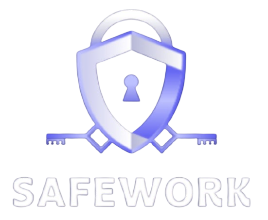</th>
    <th>CetApp GO </th>
    <th>Laus </th>
    <th>Work Wallet </th>
  </tr>

  <tr>
    <td><b>Overview</b></td>
    <td>
      Plataforma web que centraliza el reporte, seguimiento y resolución de incidentes laborales, con un enfoque en simplicidad, accesibilidad y trazabilidad para empresas medianas y pequeñas.
    </td>
    <td>
      Herramienta digital de gestión de Seguridad y Salud en el Trabajo (SST), utilizada para registrar, investigar y hacer seguimiento de incidentes laborales.
    </td>
    <td>
      Software especializado en prevención de riesgos laborales y gestión de salud ocupacional, con módulos de formación, inspecciones y auditorías.
    </td>
    <td>
      Plataforma internacional enfocada en comunicación de seguridad y gestión de incidentes en el lugar de trabajo. Incluye reportes en tiempo real, auditorías y checklists móviles.
    </td>
  </tr>

  <tr>
    <td><b>Ventaja competitiva</b></td>
    <td>
      Simplicidad, accesibilidad y costos bajos enfocados en PYMEs, permitiendo reportes y trazabilidad en tiempo real sin requerir grandes infraestructuras.
    </td>
    <td>
      Adaptación sólida al marco normativo de seguridad local e integración orientada a la gestión documental exigida por las normativas de la región.
    </td>
    <td>
      Solución integral de prevención de riesgos que combina de forma robusta la formación, las inspecciones y la gestión avanzada de incidentes.
    </td>
    <td>
      Fuerte enfoque en la experiencia móvil, comunicación instantánea y reportes en tiempo real para operaciones dinámicas a gran escala.
    </td>
  </tr>

  <tr>
    <td><b>¿Qué valor ofrece a los clientes?</b></td>
    <td>
      Permite a trabajadores y responsables registrar y dar seguimiento en tiempo real a los incidentes, con reportes claros y exportables. Accesible y económico frente a soluciones internacionales.
    </td>
    <td>
      Cumplimiento con normativa nacional de SST, mayor formalización de los procesos y reducción del papeleo.
    </td>
    <td>
      Ofrece una solución integral de prevención, combinando gestión de incidentes con capacitación y control de cumplimiento.
    </td>
    <td>
      Accesibilidad móvil y comunicación inmediata, lo que agiliza la reacción en incidentes y refuerza la cultura de seguridad.
    </td>
  </tr>

  <tr>
    <th rowspan="2">Perfil de Marketing</th>
    <td><b>Mercado Objetivo</b></td>
    <td>
      Empresas medianas o pequeñas, especialmente de manufactura, logística y construcción que requieren cumplir con normativas de seguridad sin grandes costos.
    </td>
    <td>
      Empresas nacionales que deben cumplir con la Ley de Seguridad y Salud en el Trabajo en Perú y Latinoamérica.
    </td>
    <td>
      Corporaciones y empresas con alta exposición a riesgos laborales, interesadas en centralizar prevención, formación y control.
    </td>
    <td>
      Empresas globales que buscan mejorar la comunicación interna en seguridad y reducir incidentes mediante apps móviles.
    </td>
  </tr>

  <tr>
    <td><b>Estrategias de Marketing</b></td>
    <td>
      Alianzas con gremios empresariales, campañas educativas en LinkedIn y webinars sobre SST accesible.
    </td>
    <td>
      Posicionamiento a través de consultoras en SST y capacitaciones empresariales.
    </td>
    <td>
      Marketing institucional, presencia en ferias de seguridad laboral, venta directa a grandes clientes.
    </td>
    <td>
      Campañas digitales en mercados internacionales, uso de casos de éxito en grandes organizaciones.
    </td>
  </tr>

  <tr>
    <th rowspan="3">Perfil de Producto</th>
    <td><b>Productos & Servicios</b></td>
    <td>
      Registro digital de incidentes y accidentes laborales. Panel de seguimiento para responsables de seguridad. Historial de casos por trabajador y por área. Sistema de asignación de responsables y seguimiento de casos. Opción de reportes anónimos. Dashboard de indicadores de seguridad.
    </td>
    <td>
      Registro y notificación de accidentes e incidentes en cumplimiento con normativas locales. Módulos de investigación y análisis de causas. Gestión documental para SST (informes, actas, auditorías). Generación de indicadores y estadísticas de seguridad. Integración con capacitaciones en seguridad.
    </td>
    <td>
      Gestión integral de prevención de riesgos laborales. Módulo de inspecciones y auditorías internas. Capacitación online para trabajadores. Registro de incidentes y enfermedades ocupacionales. Herramientas de cumplimiento normativo internacional.
    </td>
    <td>
      Reporte de incidentes en tiempo real desde dispositivos móviles. Auditorías y checklists digitales. Comunicación instantánea entre trabajadores y responsables vía app. Módulo de inducción digital para trabajadores nuevos. Herramientas de análisis de tendencias en seguridad.
    </td>
  </tr>

  <tr>
    <td><b>Precios & Costos</b></td>
    <td>
      Modelo SaaS accesible, con planes escalonados según número de usuarios y nivel de funcionalidad.
    </td>
    <td>
      Suscripción por licencia anual, con precios adaptados al tamaño de la empresa.
    </td>
    <td>
      Modelo de licencias empresariales con costo elevado, diseñado para corporaciones.
    </td>
    <td>
      Planes por suscripción mensual, con precios diferenciados según cantidad de usuarios activos.
    </td>
  </tr>

  <tr>
    <td><b>Canales de distribución (Web y/o Móvil)</b></td>
    <td>Plataforma web responsive</td>
    <td>Plataforma web y aplicación móvil</td>
    <td>Plataforma web con módulos móviles</td>
    <td>Web y aplicación móvil (iOS y Android)</td>
  </tr>

  <tr>
    <th rowspan="4">Análisis SWOT</th>
    <td><b>Fortalezas</b></td>
    <td>
      Simplicidad y accesibilidad para PYMEs, costos bajos, enfoque local amigable.
    </td>
    <td>
      Adaptación al marco normativo peruano y latinoamericano, experiencia sólida en SST.
    </td>
    <td>
      Solución muy completa e integral que combina formación, prevención e incidentes.
    </td>
    <td>
      Fuerte enfoque móvil, diseño multiplataforma y comunicación instantánea fluida.
    </td>
  </tr>

  <tr>
    <td><b>Debilidades</b></td>
    <td>
      Base de usuarios inicial limitada y falta de reputación consolidada en el mercado.
    </td>
    <td>
      Interfaz más técnica, orientada a especialistas y menos intuitiva para el trabajador promedio.
    </td>
    <td>
      Costo elevado, accesible principalmente para empresas grandes o corporaciones.
    </td>
    <td>
      Dependencia estricta de conectividad móvil y mayor curva de aprendizaje para usuarios operativos.
    </td>
  </tr>

  <tr>
    <td><b>Oportunidades</b></td>
    <td>
      Creciente necesidad de digitalizar reportes y cumplir normativas de forma económica en PYMEs.
    </td>
    <td>
      Alta demanda continua de cumplimiento legal obligatorio en empresas medianas de la región.
    </td>
    <td>
      Expansión constante en corporaciones multinacionales con altos presupuestos de prevención.
    </td>
    <td>
      Auge global del trabajo remoto, esquemas híbridos y digitalización avanzada de la SST.
    </td>
  </tr>

  <tr>
    <td><b>Amenazas</b></td>
    <td>
      Presencia de competidores internacionales robustos y cambios regulatorios imprevistos.
    </td>
    <td>
      Aparición constante de nuevas soluciones locales orientadas a ser más fáciles de usar.
    </td>
    <td>
      Pérdida paulatina de atractivo comercial frente a alternativas de software más económicas.
    </td>
    <td>
      Competencia directa de apps locales adaptadas de manera específica al marco legal de cada país.
    </td>
  </tr>
</table>

### 2.1.2. Estrategias y tácticas frente a competidores

**SafeWork** aplicará una estrategia de diferenciación enfocada en la simplicidad de uso y en la adaptación al contexto local de seguridad laboral, destacando por su sistema de reportes inmediatos, trazabilidad clara de casos y generación automática de informes. Frente a competidores como CetApp GO, Laus y Work Wallet, SafeWork se posiciona como una solución ágil, accesible y diseñada para pequeñas y medianas empresas, donde el cumplimiento normativo y la prevención de riesgos son críticos, pero los recursos suelen ser limitados.

El valor de SafeWork está en ofrecer una plataforma ligera y directa, con un flujo de reporte optimizado, lo que reduce los tiempos de respuesta y minimiza la subnotificación de incidentes. Además, integra un chat interno para comunicación rápida, lo cual no está plenamente desarrollado en soluciones competidoras.

Aprovechará las debilidades de otros sistemas como su alta complejidad, precios elevados o la poca adaptación a la realidad de las PYMEs locales. Para mitigar amenazas como la resistencia al cambio tecnológico o la competencia de grandes soluciones internacionales, SafeWork implementará capacitaciones digitales simples, un modelo de precios accesible y un acompañamiento continuo al cliente, reforzando la confianza y el uso sostenido de la herramienta.

## 2.2. Entrevistas
### 2.2.1. Diseño de entrevistas

**Segmento objetivo 1: Personal encargado de la tramitación de accidentes e incidentes laborales**

* ¿Cuál es tu nombre completo?

* ¿Cuántos años tienes?

* ¿En dónde vives?

* ¿Cuál es tu cargo dentro de la empresa?

* ¿Cada cuánto tiempo recibes reportes de incidentes laborales?

* ¿Qué medios utilizan actualmente para registrar y dar seguimiento a los incidentes?

* ¿Qué problemas encuentras en el proceso actual de reporte y documentación de incidentes?

* ¿Has tenido casos en los que los reportes se pierden o llegan tarde? ¿Qué consecuencias generó?

* ¿Qué características crees que debería tener una herramienta digital para ayudarte a gestionar incidentes de manera más eficiente?

* ¿Te resultaría útil que la plataforma genere reportes automáticos y consolidados para auditorías o inspecciones?

* ¿Qué tan importante es para ti poder asignar responsables y dar seguimiento en tiempo real a la resolución de un incidente?

**Segmento objetivo 2: Trabajadores afectados por accidentes o incidentes laborales**

* ¿Cuál es tu nombre completo?

* ¿Cuántos años tienes?

* ¿En dónde vives?

* ¿En qué área o puesto trabajas actualmente?

* ¿Has tenido algún accidente o incidente laboral en tu centro de trabajo? ¿Cómo lo reportaste?

* ¿Qué tan fácil o difícil fue reportarlo en ese momento?

* ¿Alguna vez sentiste que tu reporte no fue atendido o quedó sin seguimiento?

* ¿Qué tanto confías en el proceso actual que tiene tu empresa para registrar y resolver incidentes laborales?

* ¿Qué tan importante sería para ti contar con una plataforma donde pudieras reportar un incidente de forma rápida y saber el estado de tu caso en tiempo real?

* ¿Qué información te gustaría poder registrar en un reporte digital (fotos, ubicación, descripción, testigos, etc.)?

* ¿Crees que una plataforma así te daría más confianza de que tu seguridad y bienestar están siendo tomados en serio?

* ¿Qué temores o preocupaciones tendrías al usar una herramienta digital para reportar incidentes?

### 2.2.2. Registro de entrevistas

**Segmento objetivo \#1: Personal encargado de la tramitación de accidentes e incidentes laborales** 

Entrevistado N°1: Miguel Angel Saucedo Zambrano

* Sexo: Masculino  
* Edad: 34 años  
* Ubicación en la que vive: Santiago de Chile

Acerca de la entrevista:

* Instante en el que inicia: 0:00
* Duración: 3:24

Resumen:

Para Miguel, debido a que en su puesto de trabajo se realizan estos informes de manera manual en papel, tienen problemas debido a que en ocasiones estos formularios llegan incompletos, con el papel dañado o sin ciertos datos que no permiten realizar un correcto seguimiento, además a tenido varios casos en los que se pierden los informes lo que lleva a faltas de coordinación e incluso a más riesgos en un futuro ya que los problemas no son solucionados como deberían.

Entrevistado N°2: Nicole Requena Saiwa

* Sexo: Femenino   
* Edad: 27 años  
* Ubicación en la que vive: Ciudad de Arequipa

Acerca de la entrevista:

* Instante en el que inicia: 3:33
* Duración: 2:53

Resumen:

En el puesto de trabajo de Nicole, utilizan métodos tradicionales para completar los formularios de incidentes como a mano en una hoja de papel o en ocasiones dentro de hojas de excel. Considera que es difícil consolidar todos los datos para el informe ya que muchas veces estos informes llegan incompletos o son perdidos antes de ser terminados. Finalmente cree que una aplicación similar a SafeWork podría ayudarle mucho en su posición. 

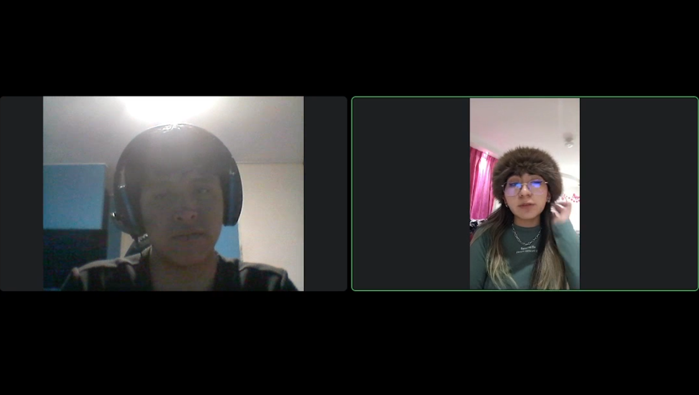

Entrevistado N°3: Luis Alberto Paredes

* Sexo: Masculino  
* Edad: 24  
* Ubicación en la que vive: San Martín de Porres

Acerca de la entrevista:

* Instante en el que inicia: 6:29 
* Duración: 4:55

Luis Alberto es un asistente de seguridad en una empresa de construcción y comenta que recibe reportes de accidentes laborales casi semanalmente, la mayoría de estos siendo casos pequeños. En su empresa, utilizan excel o medios comunicativos como WhatsApp para reportar estos incidentes. Considera que tienen problemas ya que los reportes no siempre llegan completos lo que lleva a un difícil seguimiento. Cree que una aplicación como SafeWork si le ayudaria bastante en su área de trabajo.

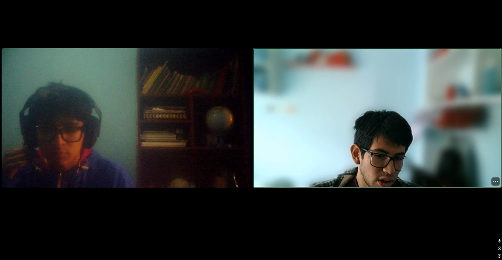

**Segmento objetivo \#2: Trabajadores afectados por accidentes o incidentes laborales**

Entrevistada N°1: Mario André Cacho Seminario

* Sexo: Masculino  
* Edad: 22  
* Ubicación en la que vive: Lima, Surco

Acerca de la entrevista:

* Instante en el que inicia: 11:29
* Duración: 3:20

Resumen:  
Para Mario, cuando pasó por este pequeño accidente durante sus horas de trabajo, lo más complicado para él fue realizar el reporte ya que el sistema presentaba fallas y se demoraba en responder, por ello se le fue difícil subir la información para su reporte. Considera además que una plataforma como SafeWork podría ser muy útil cuando no puedes depender de solo el servicio que tiene tu empresa ya que en ocasiones pueden ocurrir problemas como le ocurrió a él.

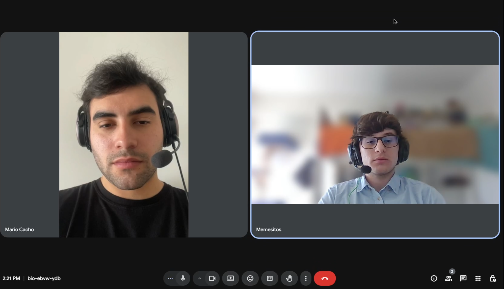

Entrevistado N°2: Sebastián De Las Casas Latour

* Sexo: Masculino  
* Edad: 21  
* Ubicación en la que vive: Lima, Surco

Acerca de la entrevista:

* Instante en el que inicia: 14:52  
* Duración: 5:26

Resumen:

Para Sebastián una plataforma que le permita organizar y mantener un seguimiento de los incidentes o accidentes podría ser de gran ayuda en caso pase por un problema similar en un futuro. Si bien considera que no tuvo problemas al reportar los incidentes ya que la empresa lo manejo de una manera correcta, indica que si hubiera tenido una herramienta similar a SafeWork, el proceso hubiera sido más rápido, no se habría encontrado confundido de qué hacer cuando sufrió el accidente y podría tener un registro de lo que ocurre en caso se tenga que realizar algún seguimiento.

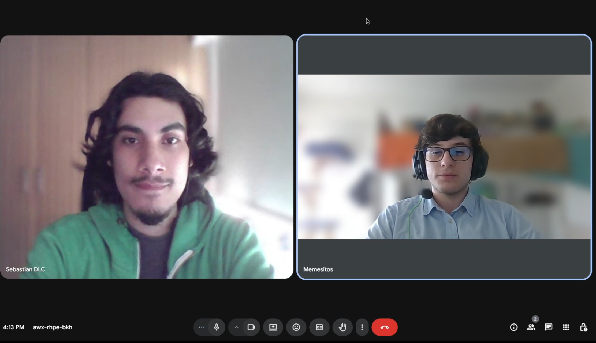

Entrevistado N°3: Diego Alarcon Rivas

* Sexo: Masculino  
* Edad: 22  
* Ubicación en la que vive: San Juan de Lurigancho

Acerca de la entrevista:

* Instante en el que inicia: 20:22
* Duración: 5:10

Resumen:

Diego trabaja actualmente en el área de almacenamiento, es un ayudante de logística y si ha tenido accidentes anteriormente en este puesto. En su trabajo anotan los incidentes/accidentes que ocurren en los cuadernos para llevar un seguimiento simple de los problemas que ocurren. Debido a que no había un formato claro para el reporte, se le complicó llenar con la información que consideraba importante. Considera que SafeWork podría ayudar bastante en su puesto de trabajo para llevar una lista de los incidentes y poder seguirlos correctamente.

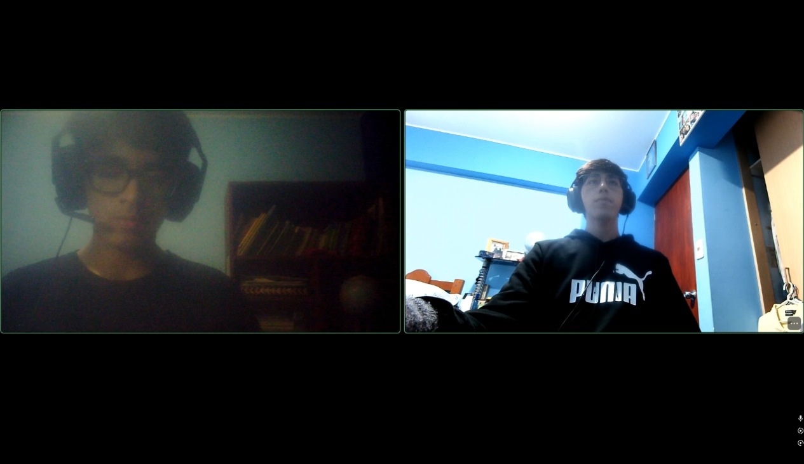

El video completo de las entrevistas puede ser visualizado en el siguiente link: https://upcedupe-my.sharepoint.com/:v:/g/personal/u202223990_upc_edu_pe/EXompS5DmExMneyAoAHRKAgBHiOofaiA4tbpoGPA-7fmFQ?e=NXfew1 [https://upcedupe-my.sharepoint.com/personal/u202223990_upc_edu_pe/_layouts/15/stream.aspx?id=%2Fpersonal%2Fu202223990_upc_edu_pe%2FDocuments%2Fupc-pre-202520-1asi0729-7349-SafeWork-needfinding-sprint-1%2Emp4&ga=1&referrer=StreamWebApp%2EWeb&referrerScenario=AddressBarCopied%2Eview%2E3a8e9694-9835-42b7-a44b-12e8189e3111]

### 2.2.3. Análisis de entrevistas

De acuerdo con la información recopilada de las entrevistas, realizamos el siguiente análisis de entrevistas:

* **Segmento objetivo \#1:**

**Hallazgos:**
**Uso de métodos informales:** actualmente se emplean Excel, WhatsApp o formularios en papel para recibir y procesar reportes (caso Luis, Nicole y Miguel).  
**Reportes incompletos:** la información llega con datos faltantes, lo que complica el seguimiento adecuado de los casos.  
**Pérdida de información:** los formularios físicos o archivos mal gestionados se extravían o se dañan, generando riesgos de coordinación.  
**Dificultad en la consolidación de datos:** procesar la información de forma manual o dispersa hace que elaborar informes sea lento y poco confiable.  
**Valor percibido de SafeWork:** todos coinciden en que una aplicación digital centralizada facilitaría enormemente su trabajo, asegurando reportes completos y organizados.

* **Segmento objetivo \#2:** 

**Hallazgos:**  
**Problemas técnicos**: los sistemas actuales pueden fallar o ser poco confiables (caso Mario).  
**Falta de claridad**: los trabajadores no siempre saben qué hacer en el momento del accidente (caso Sebastián).  
**Valor percibido de SafeWork**: ambos coinciden en que una plataforma externa facilitaría el proceso, ya sea por ser más confiable o por ofrecer seguimiento claro.  
**Necesidad de accesibilidad**: los trabajadores quieren poder reportar y dar seguimiento de manera rápida, sencilla y sin depender exclusivamente del área de la empresa.

* Conclusiones de ambos segmentos:

El segmento de personal SST enfrenta problemas recurrentes de desorganización, pérdida de información y falta de uniformidad en los reportes debido al uso de métodos manuales o informales. Existe una clara percepción de que una herramienta como SafeWork podría optimizar la gestión de reportes, mejorar la trazabilidad y reducir riesgos derivados de información incompleta o extraviada.

Por otro lado, para el segmento 2, las entrevistas muestran que, aunque la gestión interna de accidentes puede funcionar en algunos casos, existen fallas técnicas y vacíos en la experiencia del trabajador que generan frustración o confusión. Una herramienta como SafeWork representa una oportunidad clara para mejorar la confiabilidad del proceso de reporte frente a fallas en los sistemas empresariales, guiar al trabajador en los pasos a seguir inmediatamente después del accidente y por último brindar trazabilidad y registro histórico, aumentando la seguridad y confianza de los trabajadores en la gestión de sus incidentes.

## 2.3. Needfinding

Se presentan en esta sección los resultados del análisis de la información recolectada de los segmentos objetivos.

**Segmento objetivo \#1: Personal encargado de la tramitación de accidentes e incidentes laborales** 

* Motivaciones Principales:  
- Garantizar un registro completo y confiable de los incidentes laborales.

- Reducir la carga administrativa que generan los reportes manuales.
  
- Mejorar el seguimiento de los casos para prevenir futuros accidentes.
   
- Cumplir con las normativas de seguridad y salud en el trabajo.

* Problemas Identificados:  
- Reportes incompletos que dificultan el análisis posterior.
  
- Uso de medios informales (WhatsApp, papel, Excel) que generan desorden.
  
- Pérdida de información por documentos extraviados o dañados.
  
- Dificultad en consolidar datos para elaborar informes y reportes oficiales.
  
- Falta de trazabilidad en los procesos de gestión de incidentes.

* Requerimientos para una plataforma ideal:  
- Un sistema digital centralizado y seguro para registrar los incidentes.
  
- Formularios estructurados que obliguen a completar todos los campos necesarios.
  
- Posibilidad de almacenar y consultar reportes anteriores de forma organizada.
  
- Herramientas para consolidar automáticamente los datos y generar informes.
  
- Interfaz simple y accesible para que todo el personal pueda usarla fácilmente.

**Segmento objetivo \#2: Trabajadores afectados por accidentes o incidentes laborales**

* Motivaciones Principales:  
- Reportar rápidamente un accidente/incidente para recibir ayuda inmediata.

- Garantizar que su caso sea atendido y no quede olvidado en trámites internos.

- Tener claridad y orientación sobre qué hacer en el momento del accidente.

- Mantener un registro personal de los accidentes/incidentes sufridos.

- Confiar en que su información será tratada de forma segura y transparente.

* Problemas Identificados:  
- Sistemas internos de la empresa que presentan fallas técnicas o lentitud al momento de reportar (ejemplo Mario).

- Falta de claridad sobre los pasos a seguir después de un accidente (ejemplo Sebastián).

- Procesos burocráticos que generan demora en la atención.

- Ausencia de un registro personal accesible de los casos.

- Dependencia total de las áreas internas de la empresa, lo que genera vulnerabilidad cuando fallan sus sistemas.

* Requerimientos para una plataforma ideal:  
- Interfaz simple y rápida que permita registrar un reporte en pocos pasos.

- Guía paso a paso para que el trabajador sepa qué hacer en cada situación.

- Confiabilidad técnica (sin fallas, carga ligera, accesible desde web y móvil).

- Funcionalidad de seguimiento en tiempo real para ver el estado del caso.

- Historial de reportes accesible en el perfil del usuario.

- Seguridad de datos que brinde confianza en el manejo de la información sensible.

### 2.3.1. User Personas

**User Persona del Personal encargado de la tramitación de accidentes e incidentes laborales:** 
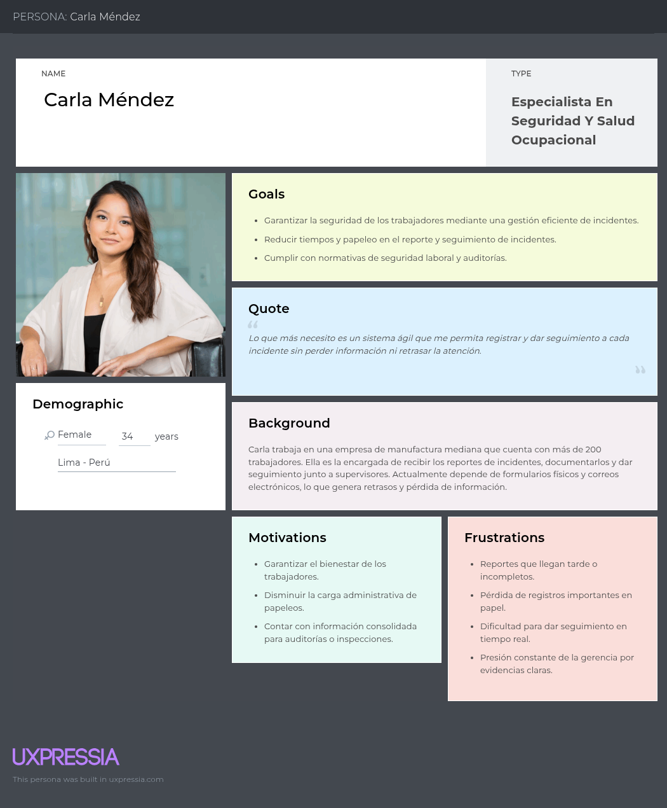

**User Persona del Trabajador afectado por accidentes o incidentes laborales:**  
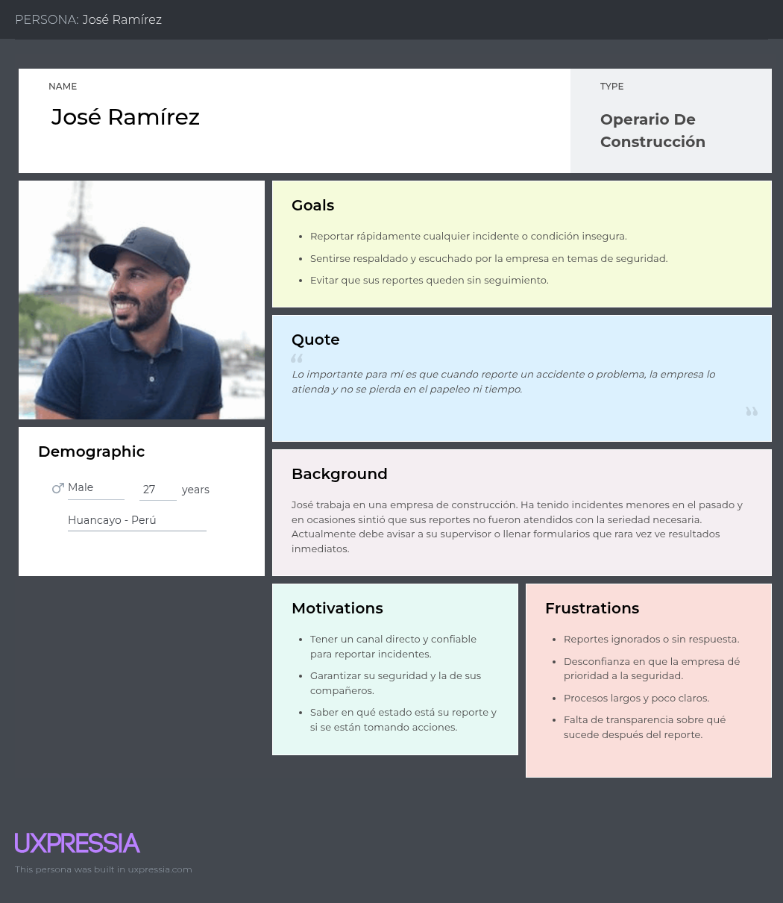

### 2.3.2. User Task Matrix

En esta se presenta el user task matrix, herramienta centrada en los segmentos objetivos que nos permitirá identificar las tareas y objetivos claves de los usuarios.

| USER TASK  | Carla Méndez |  | José Ramírez |  |
| ----- | :---: | :---: | :---: | :---: |
|  | **Frequency** | **Importance** | **Frequency** | **Importance** |
| Registrar un accidente o incidente | Always | High | Sometimes | High |
| Revisar reportes de trabajadores | Often | High | Rarely | Medium |
| Revisar reportes de trabajadores | Always | High | Often | High |
| Generar informes para auditorías o gerencia | Often | High | Never | Low |
| Acceder al historial de incidentes pasados | Often | Medium | Sometimes | Medium |
| Recibir notificaciones sobre actualizaciones de casos | Always | High | Always | High |
| Subir evidencia (fotos, documentos, videos) | Sometimes | High | Often | High |
| Consultar medidas correctivas aplicadas | Often | High | Sometimes | High |
| Comunicarme con responsables (supervisor, médico laboral, etc.) | Often | High | Sometimes | High |
| Reportar condiciones inseguras (antes que un accidente ocurra) | Sometimes | High | Often | High |

### 2.3.3. User Journey Mapping

**User Journey Mapping Personal encargado de la tramitación de accidentes e incidentes laborales:**  
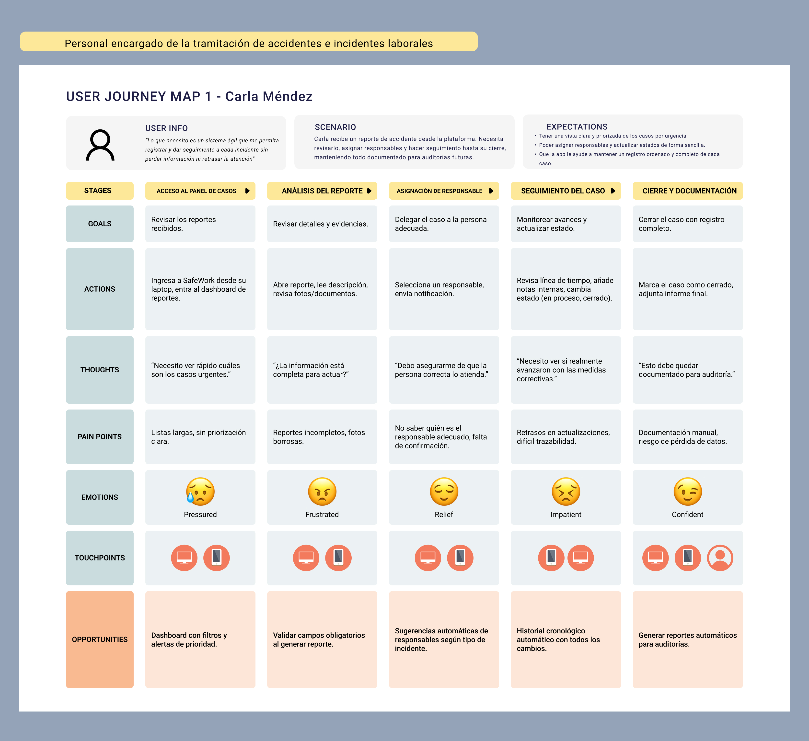

**User Journey Mapping Trabajador afectado por accidentes o incidentes laborales:**  
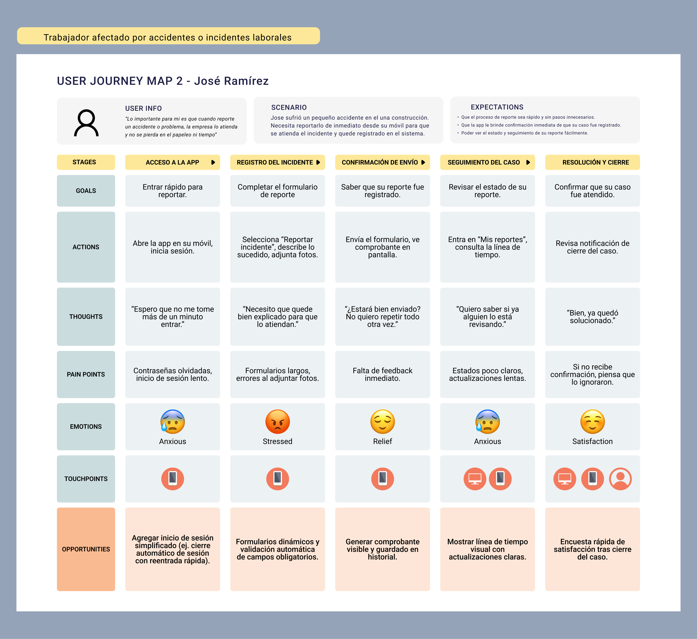

### 2.3.4. Empathy Mapping

**Empathy mapping de Personal encargado de la tramitación de accidentes e incidentes laborales:**  
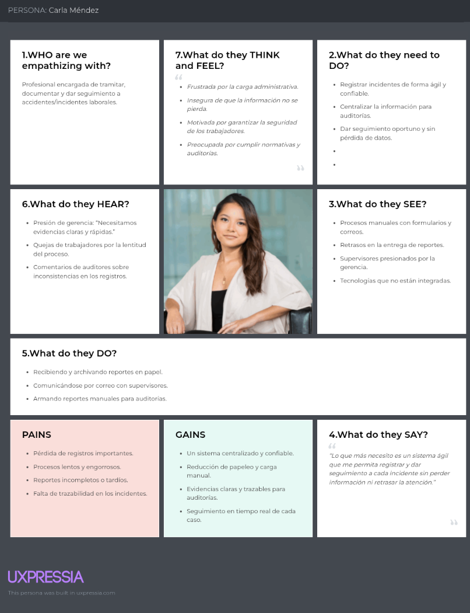

**Empathy mapping de Trabajador afectado por accidentes o incidentes laborales:**

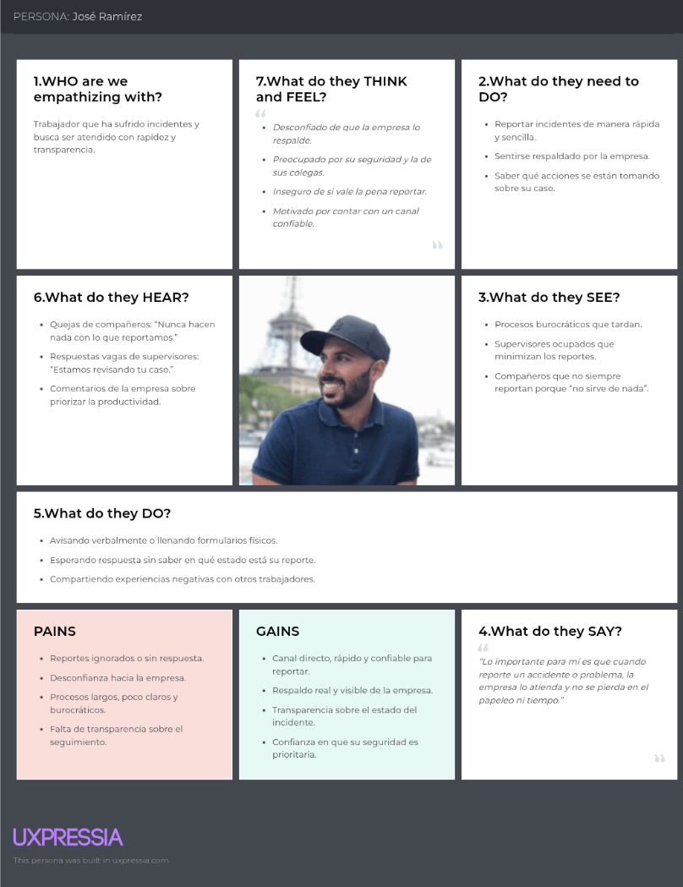

### 2.3.5. Big Picture EventStorming

Big Picture Event Storming es una técnica colaborativa que nos permitirá comprender el funcionamiento global de SAFEWORK. Se basará en visualizar eventos clave del dominio(domain events), fomentar el diálogo entre roles (actores) diversos y detectar oportunidades de mejora. El proceso se divide en tres fases principales:

**Primera Etapa: OPEN**

Aquí colocamos todos los eventos de dominios que se nos pueda ocurrir.
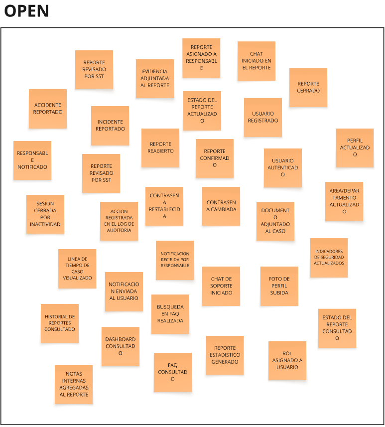

**Segunda Etapa: EXPLORE**

Identificamos actores y pain points que luego cuestionamos, y lo más importante crear una secuencia entre los eventos de dominio.
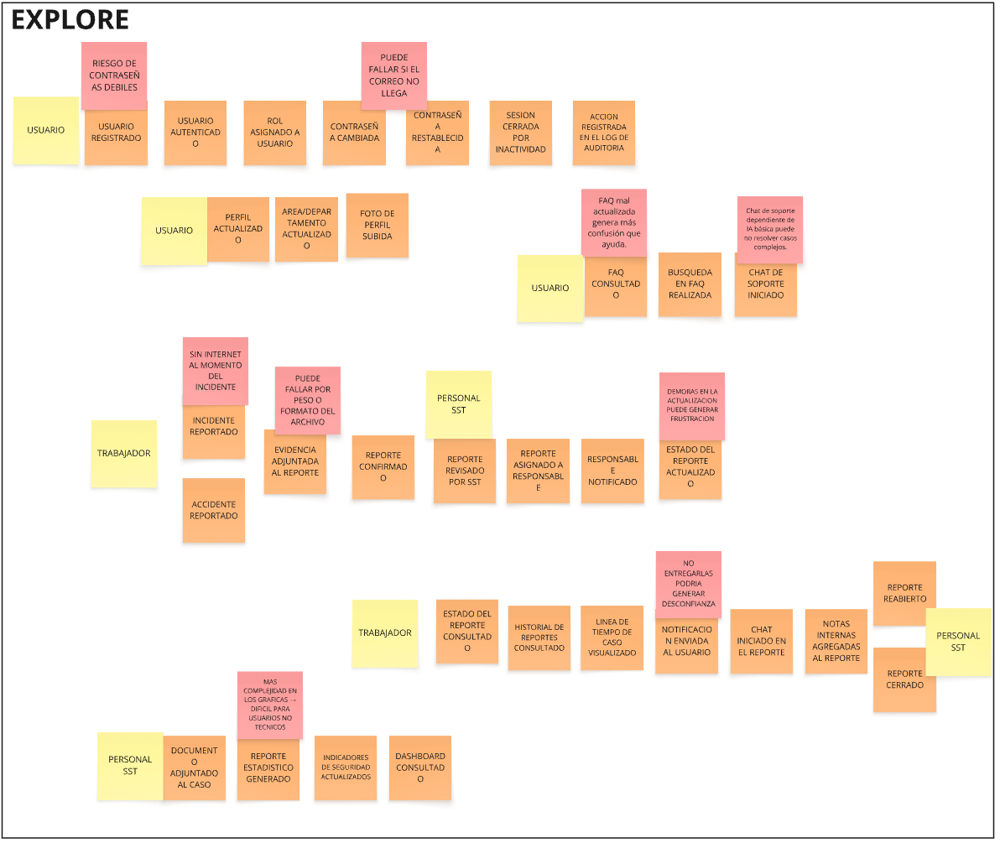

**Tercera Etapa: CLOSE**

Identificamos problemas que hayamos encontrado, temas a investigar más a fondo y declaramos que esta fuera de nuestro alcance actual.

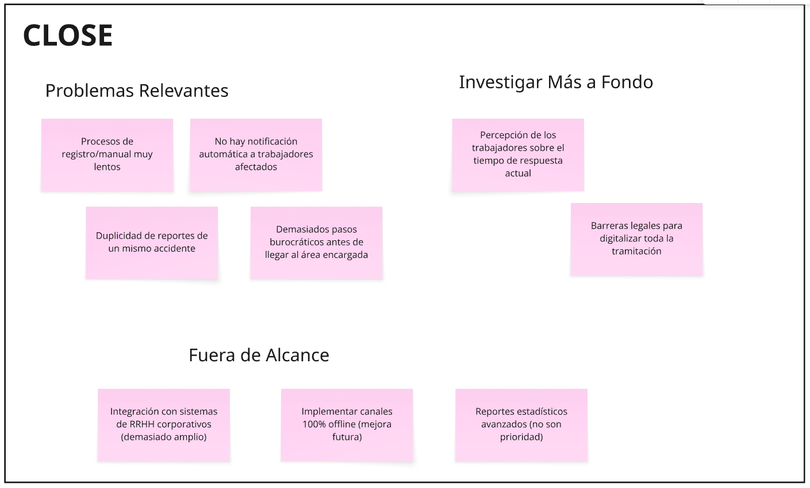

### 2.3.6. Ubiquitous Language

**Términos Clave:**
*- Incident (Incidente):*
Evento no deseado que ocurre en el lugar de trabajo y que no causa daño grave, pero que puede indicar una condición insegura.

*- Accident (Accidente):*
Suceso inesperado en el trabajo que causa daño físico a un trabajador o afecta la seguridad.

*- Report (Reporte):*
Registro formal de un accidente o incidente, que incluye datos relevantes como descripción, lugar, fecha, fotos o documentos.

*- Case (Caso):*
Conjunto de reportes y acciones relacionadas a un accidente o incidente específico que está siendo gestionado.

*- Case Status (Estado del caso):*
Fase en la que se encuentra un reporte: pendiente, en revisión, en proceso de acción correctiva o cerrado.

**Roles y Actores**

*- Worker (Trabajador):*
Persona que realiza labores en la empresa y que puede reportar incidentes o accidentes.

*- Affected Worker (Trabajador afectado):*
Colaborador que ha sufrido un accidente o incidente y requiere seguimiento de su caso.

*- Occupational Health and Safety Staff (Personal SST):*
Especialistas responsables de recibir, gestionar y dar seguimiento a los reportes de accidentes e incidentes laborales.

*-Responsible (Responsable):*
Persona designada para atender y resolver un caso específico.

*- Administrator (Administrador):*
Usuario con permisos para gestionar configuraciones, seguridad de datos y auditorías dentro de la plataforma.

**Acciones y Procesos**

*- Report Submission (Registro de reporte):*
Acción realizada por un trabajador para informar sobre un accidente o incidente.

*- Case Management (Gestión de casos):*
Proceso que incluye la recepción, revisión, asignación de responsables, actualización de estado y cierre de un caso.

*- Follow-up (Seguimiento):*
Actividad de monitoreo continuo sobre el progreso de un caso hasta su resolución.

*- Evidence (Evidencia):*
Documentos, fotos o archivos que respaldan la veracidad de un reporte.

*- Audit (Auditoría):*
Revisión oficial de registros y casos para comprobar cumplimiento de normativas de seguridad.

*- Notification (Notificación):*
Aviso enviado en tiempo real al usuario sobre cambios en el estado de un reporte o asignación de responsabilidades.

*- Timeline (Línea de tiempo):*
Representación cronológica de las etapas de un caso desde su registro hasta su cierre.

 
**Contexto Organizacional:**

*- Occupational Safety (Seguridad Ocupacional):*
Conjunto de medidas y procedimientos destinados a proteger la integridad física y psicológica de los trabajadores.

*- Corrective Action (Acción Correctiva):*
Medida implementada para solucionar un problema detectado en un reporte.

*- Preventive Action (Acción Preventiva):*
Medida destinada a evitar que un accidente o incidente vuelva a ocurrir.

*- Transparency (Transparencia):*
Cualidad del sistema que permite a los trabajadores conocer en todo momento el estado de sus reportes.

---

## 2.4. Requirements specification
### 2.4.1. User Stories

* EPICS

Las Epic definidas para SafeWork están orientadas a cubrir las necesidades principales tanto del personal encargado de la tramitación de accidentes e incidentes laborales como la de los trabajadores afectados por accidentes o incidentes laborales. Estas epics abordan funcionalidades esenciales para el funcionamiento de la plataforma, asegurando una experiencia fluida y efectiva por parte de ambos segmentos.

| Epic ID | Título | Descripción |
| :---: | :--- | :--- |
| **EP01** | Landing Page y Captación App Móvil | Como visitante o usuario interesado, deseo acceder a una vista/landing responsiva e informativa para conocer las funcionalidades móviles de SafeWork y descargar la aplicación. |
| **EP02** | Autenticación y Registro Móvil | Como usuario, deseo registrarme e iniciar sesión de forma segura usando biometría o credenciales para acceder a mis funciones según mi rol (trabajador o personal SST). |
| **EP03** | Recuperación de Contraseña | Como usuario registrado, deseo solicitar la recuperación de mi clave desde la app para restablecerla mediante código/enlace y no perder acceso. |
| **EP04** | Reporte In-Situ de Accidentes e Incidentes | Como trabajador, deseo registrar incidentes desde mi smartphone usando la cámara y el GPS integrado (con o sin señal) para notificar de inmediato al área encargada. |
| **EP05** | Gestión y Asignación de Reportes Móviles | Como personal SST, deseo recibir, revisar, filtrar y asignar casos desde mi dispositivo móvil para dar respuesta ágil en la planta o campo. |
| **EP06** | Tracking y Estado de Casos | Como trabajador, deseo consultar el estado de mis reportes en tiempo real para hacer un seguimiento transparente desde mi teléfono. |
| **EP07** | Soporte y Centro de Ayuda Móvil | Como usuario, deseo un centro de ayuda táctil con FAQ y un chatbot móvil para resolver dudas rápidamente dentro de la aplicación. |
| **EP08** | Perfil de Usuario y Ajustes Móviles | Como usuario, deseo configurar mi perfil, foto, rol y preferencias en la app para personalizar la experiencia táctil. |
| **EP09** | Sistema de Notificaciones Push y Alertas | Como usuario, deseo recibir notificaciones push en tiempo real en mi teléfono sobre actualizaciones de reportes y asignación de casos. |
| **EP10** | Captura de Evidencia y Gestión Documental | Como usuario (trabajador o SST), deseo tomar/adjuntar fotos, notas de voz o PDFs a los reportes directamente desde el almacenamiento o cámara de la app. |
| **EP11** | Comunicación e Interacción Móvil | Como trabajador o personal SST, deseo utilizar notas internas e historial del caso para estar coordinados sobre cada incidente. |
| **EP12** | Dashboard y Analítica Móvil | Como personal SST o administrador, deseo visualizar indicadores clave y gráficos adaptados a pantallas móviles para tomar decisiones rápidas. |
| **EP13** | Seguridad de Datos y Modo Offline Móvil | Como administrador, deseo que los datos almacenados localmente y transmitidos por la app estén encriptados y protegidos para asegurar la confidencialidad. |

* User Stories

| Epic / Story ID | Título | Descripción | Criterios de Aceptación | Relacionado con (Epic ID) |
| :---: | :--- | :--- | :--- | :---: |
| **US01** | Navegación Intuitiva en Landing Movilizada | Como visitante, deseo que la landing page sea 100% responsiva con menús táctiles para conocer la app. | **Escenario 01:** Given el usuario entra a la landing desde su smartphone, When abre el menú desplegable, Then ve accesos a “Beneficios”, “Descargar App” y “Contacto”.  **Escenario 02:** Given el usuario toca un elemento del menú, When interactúa con él, Then el botón muestra retroalimentación visual inmediata. | EP01 |
| **US02** | Visualización de Beneficios Móviles | Como visitante, deseo ver cómo la app agiliza el reporte en campo para conocer su valor. | **Escenario 01:** Given el usuario está en la landing, When desliza verticalmente, Then ve íconos y textos sobre captura con cámara, GPS y alertas push. | EP01 |
| **US03** | Testimonios en Pantalla Móvil | Como visitante, deseo leer testimonios formateados para pantallas pequeñas para ganar confianza. | **Escenario 01:** Given el usuario revisa la landing, When llega al carrusel de testimonios, Then puede deslizar horizontalmente (*swipe*) entre las opiniones. | EP01 |
| **US04** | Registro de Usuario en App | Como usuario nuevo, deseo registrarme desde la app con mis datos corporativos para crear mi cuenta. | **Escenario 01:** Given el usuario abre la app por primera vez, When completa el formulario de registro y acepta términos, Then su cuenta se crea y se inicia su sesión. | EP02 |
| **US05** | Iniciar Sesión con Biometría | Como usuario, deseo iniciar sesión con credenciales o biometría (huella/FaceID) para ingresar rápido. | **Escenario 01:** Given el usuario ya se registró, When ingresa credenciales o usa autenticación biométrica, Then accede a su panel principal. | EP02 |
| **US06** | Selección de Rol en la App | Como usuario nuevo, deseo elegir si soy "Trabajador" o "Personal SST" para ajustar la interfaz. | **Escenario 01:** Given el usuario está registrándose, When selecciona su rol, Then la app adapta las pestañas principales según los permisos del rol. | EP02 |
| **US07** | Recuperación de Contraseña en Móvil | Como usuario, deseo solicitar el restablecimiento de mi clave mediante código/enlace desde la app. | **Escenario 01:** Given el usuario no recuerda su clave, When toca "Olvidé mi contraseña" e ingresa su correo, Then recibe un token/código para cambiarla.  **Escenario 02:** Given el usuario ingresa el código recibido, When valida e ingresa una nueva contraseña, Then recupera su acceso. | EP03 |
| **US08** | Validación de Contraseña Segura | Como usuario, deseo que la app valide que mi clave cumple requisitos de seguridad al crearla. | **Escenario 01:** Given el usuario escribe una clave débil, When la app la analiza, Then muestra alertas en tiempo real sobre los requisitos faltantes.  **Escenario 02:** Given la clave cumple con los criterios, When confirma el registro, Then la cuenta se crea exitosamente. | EP02 |
| **US09** | Reporte In-Situ con Cámara y GPS | Como trabajador, deseo tomar fotos y usar mi ubicación GPS para reportar un accidente al instante. | **Escenario 01:** Given el trabajador abre la función de reporte, When toma la foto con la cámara del celular y activa el GPS, Then los datos se adjuntan automáticamente al formulario. | EP04 |
| **US10** | Reporte Rápido de Incidente Menor | Como trabajador, deseo reportar un incidente menor mediante un formulario corto de pocos toques. | **Escenario 01:** Given el trabajador selecciona "Incidente Menor", When completa la descripción rápida y ubicación, Then puede enviar el reporte sin requerir adjuntos obligatorios. | EP04 |
| **US11** | Agregar Referencias de Ubicación Externa | Como trabajador, deseo adjuntar un enlace o coordenada externa si el incidente ocurrió fuera de la ruta habitual. | **Escenario 01:** Given el trabajador llena un reporte, When pega una URL de mapa o selecciona un punto en el mapa, Then la coordenada queda vinculada al caso. | EP04 |
| **US12** | Revisión de Reportes para SST | Como personal SST, deseo ver una lista priorizada de reportes en mi smartphone para actuar rápido. | **Escenario 01:** Given el usuario SST abre la app, When accede al listado de casos, Then observa tarjetas visuales ordenadas por nivel de urgencia. | EP05 |
| **US13** | Asignación de Responsables en Móvil | Como personal SST, deseo asignar un caso a un técnico desde la app para delegar su atención. | **Escenario 01:** Given el personal SST revisa un caso, When selecciona "Asignar responsable" y elige un usuario, Then el sistema envía una alerta push al asignado. | EP05 |
| **US14** | Actualización Táctil de Estado | Como personal SST, deseo cambiar el estado de un caso tocando un selector para reflejar avances. | **Escenario 01:** Given el personal SST actualiza un caso, When cambia el estado a "En proceso" o "Resuelto", Then la interfaz refresca el estado en la base de datos local y remota. | EP05 |
| **US15** | Visualización del Estado en Tiempo Real | Como trabajador, deseo consultar el estado de mi reporte dentro de la app para saber su avance. | **Escenario 01:** Given el trabajador abre la pestaña "Mis Reportes", When toca sobre su caso, Then visualiza el estado actual y quién lo tiene a cargo. | EP05 |
| **US16** | Historial Personal de Reportes | Como trabajador, deseo ver un historial de todos mis reportes pasados con filtros simples. | **Escenario 01:** Given el trabajador entra a su perfil, When presiona "Historial de Reportes", Then la app muestra una lista cronológica con badges de estado final. | EP06 |
| **US17** | FAQ Interactivo en la App | Como usuario, deseo un menú desplegable de FAQ en la app para resolver dudas comunes. | **Escenario 01:** Given el usuario entra al módulo de ayuda, When navega por las categorías de preguntas, Then puede desplegar y leer las respuestas con un toque. | EP07 |
| **US18** | Chatbot Integrado en la App | Como usuario, deseo conversar con un asistente virtual dentro de la app para consultas inmediatas. | **Escenario 01:** Given el usuario tiene dudas, When abre la pestaña de chat, Then el bot responde sus consultas con mensajes predeterminados e IA. | EP07 |
| **US19** | Edición de Perfil desde el Teléfono | Como usuario, deseo editar mi información de contacto directamente en la app. | **Escenario 01:** Given el usuario está en la vista de perfil, When modifica su teléfono o datos y toca "Guardar", Then su información se actualiza.  **Escenario 02:** Given el usuario vuelve a ingresar al perfil, When carga la pantalla, Then observa los datos modificados. | EP08 |
| **US20** | Foto de Perfil desde la Galería/Cámara | Como usuario, deseo subir o tomar una foto desde mi smartphone para mi avatar. | **Escenario 01:** Given el usuario edita su perfil, When otorga permisos de cámara/galería y elige una imagen, Then la foto se procesa y guarda como avatar. | EP08 |
| **US21** | Notificaciones Push por Cambio de Estado | Como trabajador, deseo recibir una notificación push en mi teléfono cuando mi caso cambie de estado. | **Escenario 01:** Given el trabajador tiene la app cerrada o en segundo plano, When el área SST actualiza su caso, Then recibe una alerta push instantánea en la barra de su móvil. | EP09 |
| **US22** | Avisos e Indicadores In-App | Como trabajador, deseo ver badges de alerta dentro de la app sobre actualizaciones de mis reportes. | **Escenario 01:** Given el reporte del usuario sigue en revisión, When el usuario abre la app, Then observa una tarjeta/banner indicando la etapa actual.  **Escenario 02:** Given el reporte fue cerrado, When abre la app, Then observa un aviso de confirmación de cierre. | EP08 |
| **US23** | Adjuntar Archivos Móviles (SST) | Como personal SST, deseo adjuntar PDFs o imágenes de inspección usando el gestor de archivos del móvil. | **Escenario 01:** Given el personal SST edita un caso, When presiona "Adjuntar Documento" y selecciona un archivo, Then el archivo se sube y asocia al registro. | EP10 |
| **US24** | Captura Instantánea de Evidencias | Como trabajador, deseo tomar y adjuntar múltiples fotos al momento de realizar el reporte. | **Escenario 01:** Given el trabajador está creando un reporte, When presiona el ícono de cámara y captura 2 o más fotos, Then estas se previsualizan y se envían con la alerta. | EP10 |
| **US25** | Notas Internas en la Ficha del Caso | Como personal SST, deseo redactar notas internas en la app para dejar registro del seguimiento. | **Escenario 01:** Given el personal SST inspecciona el lugar, When escribe una nota interna y guarda, Then se almacena con marca de tiempo y nombre del auditor.  **Escenario 02:** Given otro miembro SST abre el caso, When consulta la sección de notas, Then observa los comentarios en orden cronológico. | EP09 |
| **US26** | Línea de Tiempo Visual del Caso | Como trabajador, deseo ver un gráfico de línea de tiempo dentro de la app para entender las etapas transcurridas. | **Escenario 01:** Given el trabajador abre el detalle de su reporte, When revisa la línea de tiempo, Then ve íconos de avance con fechas (Enviado -> En Revisión -> Resuelto).  **Escenario 02:** Given hay un cambio de etapa, When se actualiza el registro, Then la línea de tiempo marca la nueva fase como completada. | EP09 |
| **US27** | Vista Detallada de Incidente Móvil | Como personal SST, deseo ver todos los detalles (mapa, fotos, datos) en una sola vista adaptada a mi smartphone. | **Escenario 01:** Given el personal SST selecciona un reporte de la lista, When abre el detalle, Then ve una pantalla optimizada con galería de fotos, ubicación en mapa y datos del emisor. | EP12 |
| **US28** | Tarjetas de Métricas Rápidas en App | Como administrador/SST, deseo ver tarjetas resumidas de métricas en mi celular para evaluación rápida. | **Escenario 01:** Given el usuario tiene perfil administrador, When entra al Dashboard móvil, Then observa tarjetas resumen (KPIs) e indicadores visuales simples.  **Escenario 02:** Given el usuario aplica un filtro de fechas, When confirma, Then las tarjetas recalculan los valores en pantalla. | EP07 |
| **US29** | Encriptación de Datos Local y Remota | Como administrador, deseo que los reportes guardados en el dispositivo se encripten para proteger la información. | **Escenario 01:** Given la app almacena reportes localmente, When la información se escribe en el almacenamiento del teléfono, Then se guarda encriptada mediante AES. | EP13 |
| **US30** | Cambio de Contraseña desde la App | Como usuario, deseo cambiar mi clave desde los ajustes de la app para mantener la cuenta segura. | **Escenario 01:** Given el usuario entra a "Seguridad" en la app, When ingresa su clave actual y la nueva contraseña, Then se valida el cambio.  **Escenario 02:** Given la clave se actualiza correctamente, When vuelve a abrir la app, Then el inicio de sesión solicita los nuevos accesos. | EP02 |
| **US31** | Adaptabilidad en Pantallas Móviles | Como visitante, deseo que la landing page responda de forma fluida a distintos tamaños de smartphone o tablet. | **Escenario 01:** Given el usuario abre la landing desde cualquier modelo móvil, When navega verticalmente, Then el contenido y botones se reescalan sin desbordes. | EP01 |
| **US32** | Actualización de Área/Departamento | Como usuario, deseo seleccionar/editar mi área de trabajo dentro del perfil de la app. | **Escenario 01:** Given el usuario está en la configuración de su cuenta, When selecciona su nuevo departamento de un desplegable y guarda, Then la app actualiza sus datos de área.  **Escenario 02:** Given el usuario revisa su perfil, When abre la vista principal, Then observa el nombre del área actualizada. | EP08 |
| **US33** | Cierre de Sesión por Inactividad Móvil | Como usuario, deseo que la app bloquee o cierre mi sesión tras inactividad para evitar accesos no autorizados en mi teléfono. | **Escenario 01:** Given el usuario deja la app abierta sin interactuar por 15 minutos, When intenta realizar una acción, Then la app solicita nuevamente credenciales o biometría.  **Escenario 02:** Given el usuario autentica su identidad nuevamente, When ingresa, Then es devuelto a la pantalla donde se encontraba. | EP02 |
| **US34** | Comprobante de Reporte Generado | Como trabajador, deseo ver un modal/pantalla de confirmación tras enviar un reporte para estar seguro del envío. | **Escenario 01:** Given el trabajador presiona "Enviar Reporte", When la app procesa el envío, Then se despliega una pantalla con el número de ticket generado. | EP04 |
| **US35** | Buscador y Filtros Táctiles de Reportes | Como personal SST, deseo un buscador con filtros táctiles en la app para encontrar reportes específicos. | **Escenario 01:** Given el usuario SST abre el listado de casos, When escribe el nombre de un trabajador o tipo de falta en la barra de búsqueda, Then la app filtra y muestra únicamente las coincidencias. | EP05 |
| **US36** | Validación de Campos en Registro de Incidente | Como trabajador, deseo que la app me señale qué campos faltan llenar antes de enviar un reporte. | **Escenario 01:** Given el trabajador olvida colocar la descripción obligatoria, When intenta enviar, Then la app resalta el campo vacío en rojo y bloquea el envío.  **Escenario 02:** Given el trabajador completa todos los campos requeridos, When presiona enviar, Then el formulario se procesa con éxito. | EP06 |
| **US37** | Buscador por Palabras Clave en FAQ | Como usuario, deseo buscar temas específicos dentro de la sección de ayuda de la app. | **Escenario 01:** Given el usuario usa el buscador de la FAQ, When escribe "GPS", Then se muestran solo las preguntas relacionadas con la ubicación.  **Escenario 02:** Given el usuario escribe un término sin coincidencias, When busca, Then la app muestra el mensaje "No se encontraron resultados". | EP07 |
| **US38** | Notificación Push por Asignación de Caso | Como personal SST/Técnico, deseo recibir una notificación push cuando se me asigna un caso. | **Escenario 01:** Given al usuario se le asigna un caso nuevo, When la acción se registra, Then el teléfono emite una alerta push indicando el nuevo número de caso. | EP09 |
| **US39** | Filtro Rápido por Estado (Pestañas) | Como personal SST, deseo filtrar la lista de reportes mediante pestañas o chips para agilizar la gestión. | **Escenario 01:** Given el personal SST está en la app, When presiona la pestaña "Abiertos", Then solo se muestran las tarjetas de reportes en estado abierto.  **Escenario 02:** Given el personal SST cambia a la pestaña "Cerrados", When la app refresca, Then la lista cambia inmediatamente a los casos finalizados. | EP05 |
| **US40** | Registro de Auditoría de Acciones Móviles | Como administrador, deseo que cada acción realizada en la app quede registrada en un log seguro para trazabilidad. | **Escenario 01:** Given un usuario aprueba, modifica o crea un reporte desde la app, When se completa la solicitud, Then se envía un evento cifrado al log de auditoría con ID del dispositivo, usuario y hora. | EP13 |
| **US41** | Botones de Acción (CTA) Móviles | Como visitante de la landing page, deseo botones de acción adaptados al toque digital para interactuar fácilmente. | **Escenario 01:** Given el usuario navega la landing en su smartphone, When observa los botones "Descargar App" o "Probar Demo", Then estos se muestran destacados en pantalla.  **Escenario 02:** Given el usuario hace clic en el CTA de descarga, When interactúa, Then es redirigido a la tienda de aplicaciones o flujo correspondiente.  **Escenario 03:** Given la resolución móvil varia, When la página carga, Then el tamaño del botón CTA se adapta al ancho de pantalla. | EP01 |
| **US42** | Sección FAQ Desplegable en Landing Móvil | Como visitante, deseo ver una sección de FAQ tipo acordeón en la landing para leer información sin saturar la pantalla. | **Escenario 01:** Given el usuario navega la landing, When llega a la sección FAQ, Then observa las preguntas categorizadas.  **Escenario 02:** Given el usuario toca una pregunta, When se activa el toque, Then la respuesta se despliega hacia abajo sin cambiar de página.  **Escenario 03:** Given el usuario necesita más detalles, When llega al final de la FAQ, Then observa un botón para contactar al equipo por soporte móvil. | EP01 |
| **US43** | Visualización de Planes y Membresías Móviles | Como visitante, deseo comparar planes corporativos mediante tarjetas deslizables en mi smartphone. | **Escenario 01:** Given el usuario busca planes en la landing, When entra a la sección de membresías, Then visualiza las alternativas estructuradas en tarjetas.  **Escenario 02:** Given el usuario revisa las funciones del plan, When desliza lateralmente, Then puede comparar precios y características.  **Escenario 03:** Given el usuario escoge un plan, When presiona "Seleccionar Plan", Then se abre el flujo móvil de registro o contacto comercial. | EP01 |

### 2.4.2. Impact Mapping

Se realizaron los siguientes cuadros en la herramienta Canva Whiteboard, el link original puede ser observado aquí: 

**Impact Map Segmento 1:** **Personal encargado de la tramitación de accidentes e incidentes laborales**  
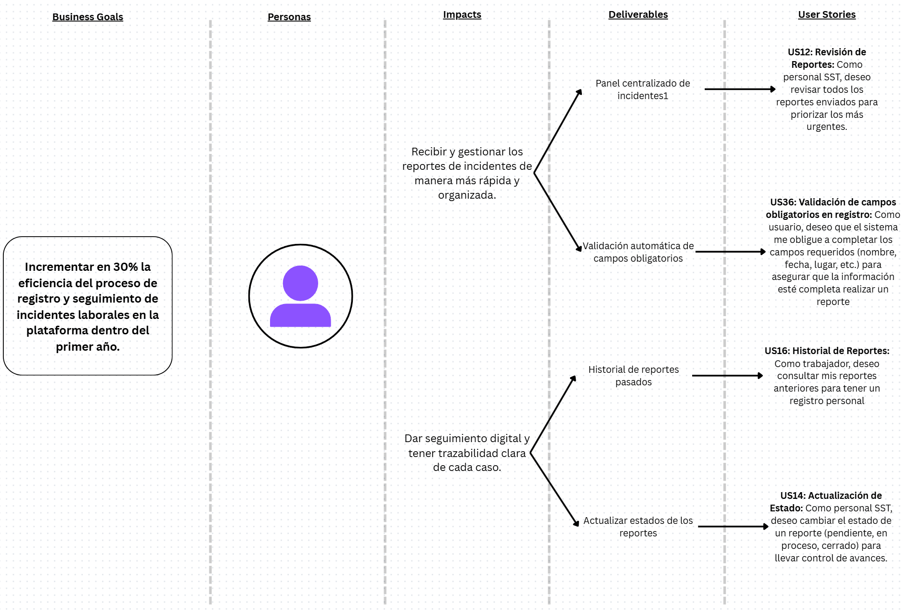

**Impact Map Segmento 2:** **Trabajadores afectados por accidentes o incidentes laborales**  
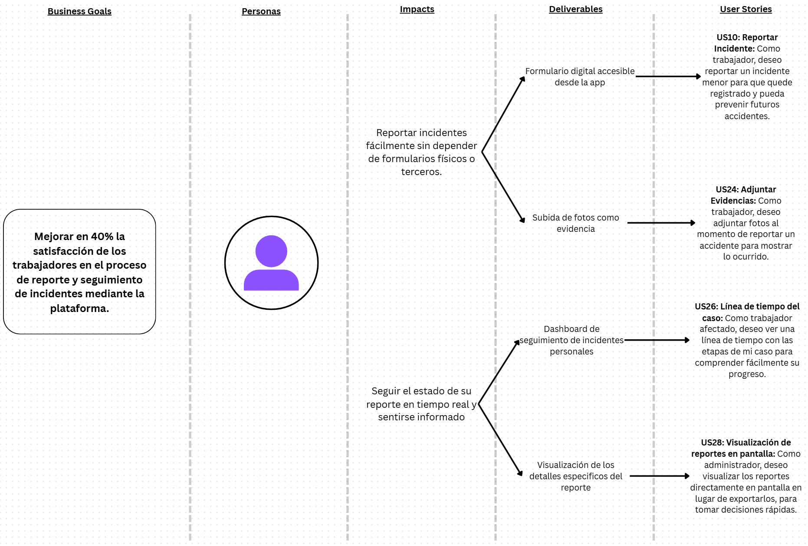

### 2.4.3. Product Backlog

Se utilizó la escala Fibonacci para la estimación de los Story Points. En total se tuvieron **93** Story Points.

| \#Orden | Epic / Story ID | Título | Descripción | Story Points (1/2/3/5/8) |
| :---: | :---: | ----- | ----- | :---: |
| 4 | US04 | Registro de Usuario | Como usuario nuevo, deseo registrarme con correo y usuario para crear una cuenta en SafeWork. | 5 |
| 5 | US05 | Inicio de Sesión Seguro | Como usuario, deseo iniciar sesión con mis credenciales para acceder a mis funcionalidades. | 5 |
| 6 | US06 | Roles Diferenciados | Como usuario, deseo seleccionar mi rol (trabajador o personal SST) para personalizar la experiencia. | 5 |
| 9 | US09 | Reportar Accidente | Como trabajador, deseo registrar un accidente laboral con fotos y detalles para notificar de inmediato a la empresa. | 8 |
| 10 | US10 | Reportar Incidente | Como trabajador, deseo reportar un incidente menor para que quede registrado y pueda prevenir futuros accidentes. | 5 |
| 11 | US11 | Inclusión de Referencias Externas | Como trabajador, deseo incluir un enlace de referencia en mi reporte para brindar mayor contexto o la ubicación exacta del incidente mediante un mapa externo. | 5 |
| 12 | US12 | Revisión de Reportes | Como personal SST, deseo revisar todos los reportes enviados para priorizar los más urgentes. | 5 |
| 13 | US13 | Asignación de Responsables | Como personal SST, deseo asignar responsables a cada caso para garantizar el seguimiento. | 5 |
| 14 | US14 | Actualización de Estado | Como personal SST, deseo cambiar el estado de un reporte (pendiente, en proceso, cerrado) para llevar control de avances. | 3 |
| 15 | US15 | Visualizar Estado del Reporte | Como trabajador, deseo ver en qué estado está mi reporte para mantenerme informado. | 3 |
| 16 | US16 | Historial de Reportes | Como trabajador, deseo consultar mis reportes anteriores para tener un registro personal. | 3 |
| 21 | US21 | Notificaciones en Tiempo Real | Como usuario, deseo recibir notificaciones push cuando mi reporte cambie de estado. | 8 |
| 23 | US23 | Adjuntar Documentos | Como personal SST, deseo adjuntar documentos técnicos al reporte para que quede registrado todo el proceso. | 5 |
| 24 | US24 | Adjuntar Evidencias | Como trabajador, deseo adjuntar fotos al momento de reportar un accidente para mostrar lo ocurrido. | 5 |
| 25 | US25 | Notas internas en el caso | Como personal de SST, deseo añadir notas internas a los casos para poder documentar hallazgos o comentarios relevantes sin necesidad de un chat. | 5 |
| 27 | US27 | Visualizar Detalles del reporte | Como personal SST, deseo ver detalles sobre los reportes enviados. | 3 |
| 28 | US28 | Visualización de reportes en pantalla | Como administrador, deseo visualizar los reportes directamente en pantalla en lugar de exportarlos, para tomar decisiones rápidas. | 5 |
| 32 | US32 | Actualización de área/departamento en perfil | Como usuario, deseo actualizar el área o departamento al que pertenezco para que la información de mi perfil refleje correctamente mi puesto en la organización. | 2 |
| 36 | US36 | Validación de campos obligatorios en registro | Como usuario, deseo que el sistema me obligue a completar los campos requeridos (nombre, fecha, lugar, etc.) para asegurar que la información esté completa realizar un reporte | 3 |
| 39 | US39 | Filtro por estado de casos | Como personal de SST, deseo filtrar los casos por estado (abierto, en proceso, cerrado) para gestionar mejor la carga de trabajo. | 3 |
| 40 | US40 | Registro de Auditoría | Como administrador, deseo tener un historial de todas las acciones en la plataforma para auditorías. | 5 |

## 2.5. Strategic-Level Domain-Driven Design
### 2.5.1. EventStorming

Proceso del Design-Level EventStorming:

Paso 1: Partimos del Big Picture Event Storming, como base

Paso 2: Ordenamos de manera cronologíca los eventos de dominio, tuvimos en cuenta el 'happy path'.

Paso 3: Se colocó dudas/posibles problemas a futuro sobre el dominio en algunas partes del flujo

#### 2.5.1.1. Candidate Context Discovery

Paso 4: Se buscó eventos importantes que indiquen un cambio en el contexto.

Paso 5: Se añadió comandos que desencadenen eventos y tambien agregamos sus actores

Paso 6: Se equipo añadió 'policies' o reglas de negocio que hacen que se ejecuten eventos de dominio

#### 2.5.1.2. Domain Message Flows Modeling

Paso 7: Se añadió read models, son la vista de datos o 'views' que ayudarán al usuario con la ejecución de comandos

Paso 8: Se identifico sistemas externos, tales como el servicio de guardado de imagenes en la nube, por ahora va como "Cloud Storage"

Paso 9: Se identifico los aggregates

#### 2.5.1.3. Bounded Context Canvases

Paso 10: Separamos por bounded context, en los cuales algunos tienen un cierto tipo de relación medianto comando y domain

### 2.5.2. Context Mapping

### 2.5.3. Software Architecture
#### 2.5.3.1. Software Architecture Context Level Diagrams

El diagrama de contexto muestra a los dos actores principales —**Encargado** y **Trabajador**— interactuando con la plataforma **SafeWork**, así como la relación con los contenedores principales.  
Este nivel refleja la visión global del sistema y cómo los usuarios acceden a él.  

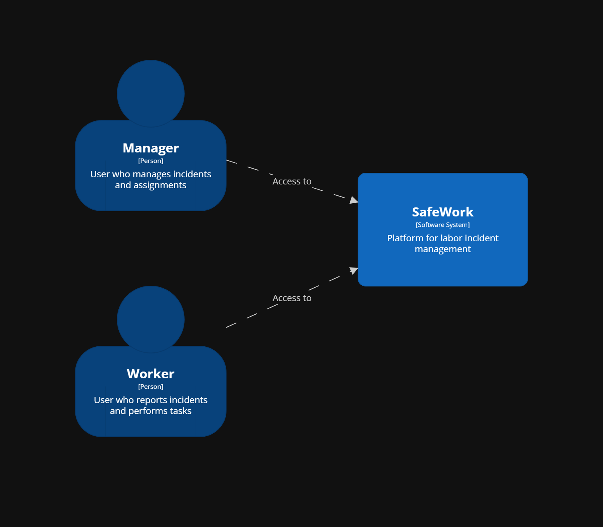

#### 2.5.3.2. Software Architecture Container Level Diagrams

El diagrama de contenedores descompone **SafeWork** en sus partes principales:  
- **Landing Page** como punto de entrada.  
- **Mobile App** para la interacción de usuarios.
- **Backend API** que centraliza la lógica de negocio y gestiona la comunicación con otros sistemas.
- **Database** para el almacenamiento de información.
- Integración con un **Notification Gateway** externo para el envío de notificaciones por SMS y correo electrónico.

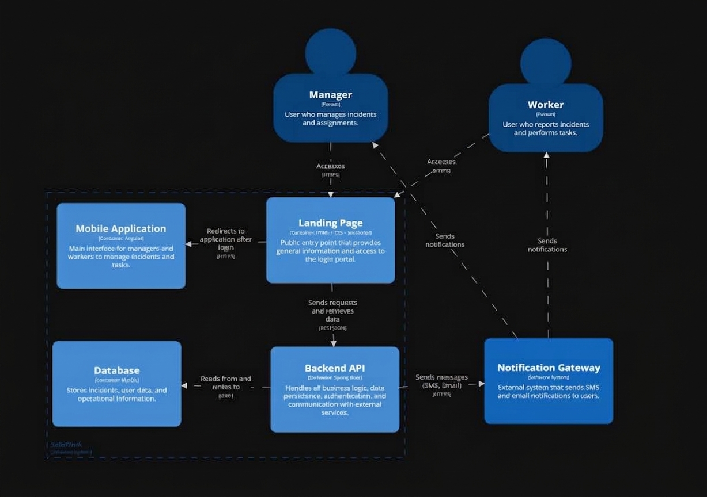

#### 2.5.3.3. Software Architecture Deployment Diagrams

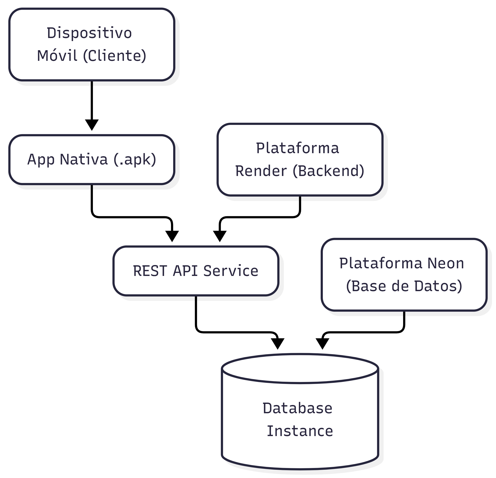

## 2.6. Tactical-Level Domain-Driven Design

### 2.6.1. Bounded Context: IncidentsBC

#### 2.6.1.1. Domain Layer
* **Entities & Aggregates:** `Incident` (Agregado Raíz que contiene la lógica de ciclo de vida del reporte).
* **Value Objects:** `IncidentId`, `Location` (latitud, longitud), `EvidencePhoto`, `IncidentSeverity` (Enum: BAJA, MEDIA, ALTA, CRÍTICA), `IncidentStatus` (Enum: ABIERTO, EN_PROCESO, RESUELTO, CERRADO).
* **Domain Services:** `IncidentStateMachine` (Valida las transiciones de estado permitidas del incidente).
* **Domain Events:** `IncidentReportedEvent`, `IncidentStatusUpdatedEvent`, `IncidentClosedEvent`.
* **Repository Interfaces:** `IncidentRepository` (Interfaz del puerto de persistencia).

#### 2.6.1.2. Interface Layer
* **Controllers:** `IncidentController` (Spring MVC REST Controller que expone endpoints para la App Móvil).
* **DTOs:** `CreateIncidentRequest`, `UpdateIncidentStatusRequest`, `IncidentResponse`.

#### 2.6.1.3. Application Layer
* **Application Services:** `IncidentService` (Orquesta la creación, actualización y cierre de incidentes delegando las reglas de estado a `IncidentStateMachine`).
* **Use Cases:** `CreateIncidentUseCase`, `UpdateIncidentStatusUseCase`, `CloseIncidentUseCase`.

#### 2.6.1.4. Infrastructure Layer
* **Persistence:** `IncidentRepositoryImpl` (Implementación de `IncidentRepository` usando Spring Data JPA/Hibernate sobre MySQL).

#### 2.6.1.5. Bounded Context Software Architecture Component Level Diagrams
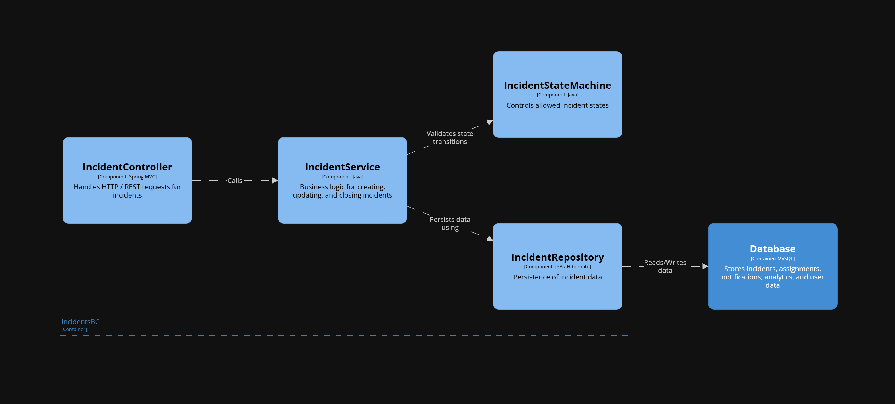

#### 2.6.1.6. Bounded Context Software Architecture Code Level Diagrams

##### 2.6.1.6.1. Bounded Context Domain Layer Class Diagrams

##### 2.6.1.6.2. Bounded Context Database Design Diagram

---

### 2.6.2. Bounded Context: AssignmentBC

#### 2.6.2.1. Domain Layer
* **Entities & Aggregates:** `Assignment` (Agregado Raíz que vincula un `IncidentId` con un `ResponsibleUserId`).
* **Value Objects:** `AssignmentId`, `SlaDeadline`, `AssignmentStatus` (Enum: ASIGNADO, EN_REVISIÓN, VENCIDO, REASIGNADO).
* **Domain Services:** `SlaEngine` (Aplica y evalúa las reglas del Acuerdo de Nivel de Servicio / SLA según el tipo de incidente).
* **Domain Events:** `AssignmentCreatedEvent`, `SlaBreachedEvent`.
* **Repository Interfaces:** `AssignmentRepository` (Interfaz del puerto de persistencia).

#### 2.6.2.2. Interface Layer
* **Controllers:** `AssignmentController` (Spring MVC REST Controller con endpoints para asignación manual y gestión de casos).
* **DTOs:** `AssignIncidentRequest`, `AssignmentStatusResponse`.

#### 2.6.2.3. Application Layer
* **Application Services:** `AssignmentService` (Lógica de negocio para asignación automática/manual evaluando reglas mediante `SlaEngine`).
* **Use Cases:** `AssignResponsibleUseCase`, `EvaluateSlaBreachUseCase`.

#### 2.6.2.4. Infrastructure Layer
* **Persistence:** `AssignmentRepositoryImpl` (Implementación de `AssignmentRepository` usando JPA/Hibernate sobre MySQL).

#### 2.6.2.5. Bounded Context Software Architecture Component Level Diagrams
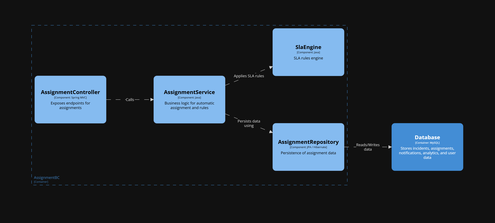

#### 2.6.2.6. Bounded Context Software Architecture Code Level Diagrams

##### 2.6.2.6.1. Bounded Context Domain Layer Class Diagrams

##### 2.6.2.6.2. Bounded Context Database Design Diagram

---

### 2.6.3. Bounded Context: NotificationBC

#### 2.6.3.1. Domain Layer
* **Entities & Aggregates:** `Notification` (Agregado que representa el mensaje y el destinatario).
* **Value Objects:** `NotificationId`, `Recipient`, `NotificationContent`, `DeliveryChannel` (Enum: PUSH, EMAIL, SMS).
* **Domain Events:** `NotificationSentEvent`, `NotificationFailedEvent`.
* **Interfaces Outbound:** `NotificationProvider` (Interfaz para abstraer los proveedores de mensajería).

#### 2.6.3.2. Interface Layer
* **Controllers:** `NotificationController` (Expone endpoints REST para consultar el historial de notificaciones del usuario).
* **DTOs:** `SendNotificationRequest`, `NotificationHistoryResponse`.

#### 2.6.3.3. Application Layer
* **Application Services:** `NotificationService` (Decide el canal y compone el contenido del mensaje antes de enviarlo).
* **Use Cases:** `SendPushNotificationUseCase`, `SendEmailNotificationUseCase`.

#### 2.6.3.4. Infrastructure Layer
* **Adapters & Providers:** 
  * `NotificationAdapter` (Adaptador genérico que implementa `NotificationProvider`).
  * `EmailProvider` (Componente de integración para servicios de correo).
  * `SmsProvider` / `PushProvider` (Integración con Firebase Cloud Messaging o SMS).
* **Persistence:** Guardado del historial de notificaciones en MySQL.

#### 2.6.3.5. Bounded Context Software Architecture Component Level Diagrams
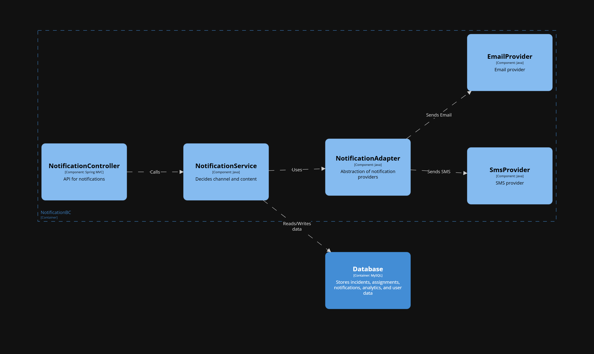

#### 2.6.3.6. Bounded Context Software Architecture Code Level Diagrams

##### 2.6.3.6.1. Bounded Context Domain Layer Class Diagrams

##### 2.6.3.6.2. Bounded Context Database Design Diagram

---

### 2.6.4. Bounded Context: AnalyticsBC

#### 2.6.4.1. Domain Layer
* **Entities & Aggregates:** `AnalyticsReport` (Representación agregada de las métricas de seguridad y reportes generados).
* **Value Objects:** `MetricType`, `TimeWindow`, `IncidentKPI`.
* **Domain Services:** Algoritmos de agregación y detección de patrones de riesgo laboral.

#### 2.6.4.2. Interface Layer
* **Controllers / Exporters:** `ReportGenerator` (Componente Django/Python que renderiza y genera dashboards y reportes exportables).
* **DTOs:** `AnalyticsFilterRequest`, `KPISummaryResponse`.

#### 2.6.4.3. Application Layer
* **Application Services:** `AnalyticsService` (Procesa los eventos entrantes y prepara los datos estructurados para las métricas).
* **Use Cases:** `ProcessAnalyticsEventUseCase`, `GenerateSafetyReportUseCase`.

#### 2.6.4.4. Infrastructure Layer
* **Event Processing Pipeline:**
  * `EventBus` (Componente Apache Kafka para consumir el flujo de eventos de los otros BCs).
  * `AnalyticsPipeline` (Componente Apache Spark / Python para procesamiento de datos en flujo y por lotes).
* **Persistence:** Conexión a la base de datos de analítica / MySQL.

#### 2.6.4.5. Bounded Context Software Architecture Component Level Diagrams
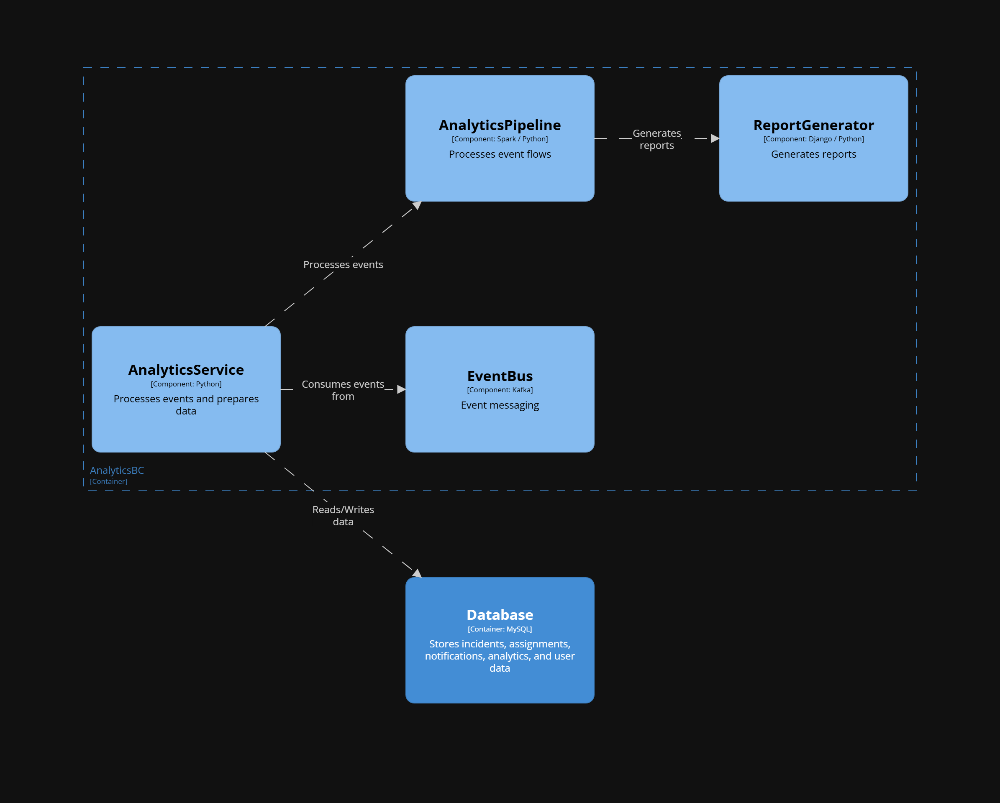

#### 2.6.4.6. Bounded Context Software Architecture Code Level Diagrams

##### 2.6.4.6.1. Bounded Context Domain Layer Class Diagrams

##### 2.6.4.6.2. Bounded Context Database Design Diagram

---

### 2.6.5. Bounded Context: ProfileBC

#### 2.6.5.1. Domain Layer
* **Entities & Aggregates:** `UserProfile` (Agregado Raíz que maneja los datos personales e identidades del sistema).
* **Value Objects:** `UserId`, `Email`, `WorkArea`, `Role` (Enum: TRABAJADOR, PERSONAL_SST, ADMINISTRADOR).
* **Domain Services:** `RoleManager` (Gestiona permisos y reglas asociadas a cada rol).
* **Domain Events:** `UserProfileUpdatedEvent`, `UserRoleChangedEvent`.
* **Repository Interfaces:** `ProfileRepository`.

#### 2.6.5.2. Interface Layer
* **Controllers:** `ProfileController` (Spring MVC REST Controller para endpoints de gestión de perfiles).
* **DTOs:** `UserProfileRequest`, `UserProfileResponse`, `LoginRequest`, `AuthTokenResponse`.

#### 2.6.5.3. Application Layer
* **Application Services:** 
  * `ProfileService` (Gestiona la información del usuario y su rol coordinando con `RoleManager`).
  * `AuthService` (Maneja el proceso de autenticación y la emisión/validación de tokens JWT).
* **Use Cases:** `UpdateProfileUseCase`, `AuthenticateUserUseCase`, `ManageRolesUseCase`.

#### 2.6.5.4. Infrastructure Layer
* **Persistence:** `ProfileRepositoryImpl` (Implementación de `ProfileRepository` mediante JPA/Hibernate sobre MySQL).

#### 2.6.5.5. Bounded Context Software Architecture Component Level Diagrams
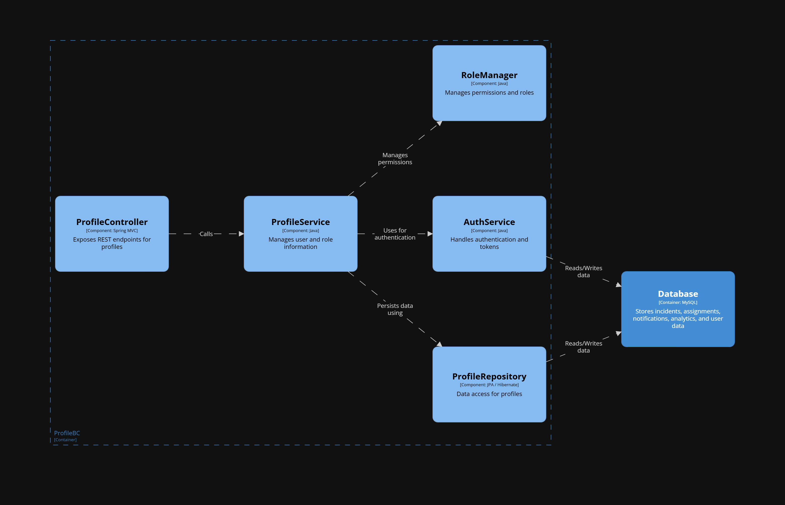

#### 2.6.5.6. Bounded Context Software Architecture Code Level Diagrams

##### 2.6.5.6.1. Bounded Context Domain Layer Class Diagrams

##### 2.6.5.6.2. Bounded Context Database Design Diagram

---

# Capítulo III: Solution UI/UX Design

## 3.1. Product design

El diseño de **SafeWork** se orienta a una experiencia de uso centrada en el trabajador y en el personal de Seguridad y Salud en el Trabajo (SST). A diferencia de la solución web documentada en el ciclo anterior, la propuesta actual prioriza el uso desde teléfonos móviles para reportar accidentes e incidentes en campo, consultar el seguimiento y recibir alertas. La **landing page** mantiene el propósito de presentar el servicio a potenciales usuarios y empresas.

### 3.1.1. Style Guidelines

#### 3.1.1.1. General Style Guidelines

##### Tipografía

Se conserva la identidad tipográfica documentada para SafeWork. **Raleway** se propone para títulos y botones por su estilo moderno y fácil de reconocer, mientras que **Montserrat** se emplea para los textos generales, instrucciones, descripciones y formularios. En la aplicación móvil se dará prioridad a tamaños legibles, jerarquía visual consistente y textos breves que faciliten la lectura durante las operaciones de campo.

**Figura 1:**  
Uso de la tipografía **"Raleway"** en encabezados

Fuente: [1001 Fonts - Raleway](https://www.1001fonts.com/raleway-font.html)  

**Figura 2:**  
Uso de la tipografía **"Montserrat"** en textos generales
 

Fuente: [1001 Fonts - Montserrat](https://www.1001fonts.com/montserrat-font.html)

##### Colores principales

SafeWork mantiene como base gráfica el **violeta `#7B7DC1`**, asociado a confianza y modernidad, y el **azul muy oscuro `#0D0C22`** como fondo de contraste. Los textos principales utilizan blanco `#FFFFFF` y grises claros (`#888A9C`, `#E1E3EC`). Como colores complementarios para la **interpretación del estado de los incidentes**, la propuesta móvil prevé señales visuales en verde, amarillo y rojo, coherentes con el enfoque de seguridad expuesto en el capítulo I. Estos colores de estado irán acompañados de etiquetas e íconos, de modo que la información no dependa únicamente del color.

**Figura 1:** Colores del texto

[Paleta en Coolors](https://coolors.co/ffffff-000000-7b7dc1)  

**Figura 2:** Colores principales

[Paleta en Coolors](https://coolors.co/0d0c22-7b7dc1-5a5ca0-1a1835)  

**Figura 3:** Colores secundarios

[Paleta en Coolors](https://coolors.co/444654-888a9c-e1e3ec)  

**Figura 4:** Colores aplicados en wireframes

[Paleta en Coolors](https://coolors.co/f0f0f0-bdbdbd-b3b3b3-3f3f3f-2e2e2e)

##### Estilo visual

La interfaz utiliza tarjetas, campos bien delimitados, iconografía reconocible, espacios regulares y esquinas redondeadas. Las pantallas móviles presentan primero la información relevante para la tarea: reportar un incidente, revisar su estado, consultar asignaciones y responder a notificaciones. El diseño adapta los formularios al espacio vertical del smartphone y muestra mensajes de validación cercanos a los campos correspondientes.

##### Interactividad

En la landing page se mantienen los cambios de color, desplazamiento suave y retroalimentación visual de botones documentados en el informe anterior. En la **aplicación móvil**, esas interacciones se adaptan al **toque, desplazamiento vertical y selección táctil**; no se considera el efecto *hover* como interacción principal. Se priorizan botones fáciles de pulsar, confirmación del envío de reportes, indicadores de carga y mensajes claros de éxito o error.

##### Accesibilidad y adaptación móvil

La propuesta considera contraste legible, tamaño de texto adecuado, etiquetas comprensibles y jerarquía visual consistente. Los formularios se diseñan para pantallas pequeñas, contemplando la aparición del teclado en pantalla y el acceso a permisos de cámara o ubicación únicamente cuando corresponda. Los componentes deben ajustarse a distintas resoluciones de teléfonos y orientaciones compatibles con el diseño.

### 3.1.2. Information Architecture

La arquitectura de información de SafeWork se organiza en dos experiencias diferenciadas: la **landing page**, orientada a informar y captar interesados, y la **aplicación móvil**, orientada a ejecutar operaciones y gestionar reportes. Los módulos y acciones de la aplicación se alinean con las épicas e historias de usuario definidas en el apartado **2.4.1** del presente informe.

#### 3.1.2.1. Organization Systems

**Organización jerárquica — landing page.** Se mantiene una estructura de navegación desde el inicio hacia secciones como *About Us*, *Services*, *Benefits*, *Plans*, *Testimonials*, *FAQ* y *Contact*. Este modelo facilita que los visitantes conozcan los beneficios, las funcionalidades y los medios de contacto de SafeWork antes de decidir utilizar la solución.

**Organización por tareas y por rol — aplicación móvil.** La navegación se estructura según las necesidades del trabajador y del personal SST:

- **Trabajador:** inicio, reportar incidente, mis reportes, detalle y estado del caso, notificaciones, ayuda y perfil.
- **Personal SST:** inicio, listado de reportes, búsqueda y filtros, revisión de casos, asignación de responsables, actualización de estados, indicadores y perfil.

Esta estructura considera los módulos de autenticación, incidentes, asignaciones, notificaciones, analítica y perfil ya definidos en el diseño de dominio de SafeWork. Las funcionalidades avanzadas, como el registro sin conexión, la evidencia multimedia y el asistente de ayuda, se contemplan en la propuesta de requisitos y deberán incorporarse progresivamente de acuerdo con el backlog.

#### 3.1.2.2. Labelling Systems

**Etiquetado de la landing page.** Para conservar continuidad con el diseño anterior, el menú utiliza nombres breves como *Home*, *About Us*, *Services*, *Plans*, *Testimonials*, *FAQ* y *Contact*, así como llamadas a la acción del tipo *Start Now* y *Learn More*. En su adaptación al enfoque móvil, el proyecto incorpora los CTA **“Descargar App”** y **“Probar Demo”**, según las historias US01 y US41.

**Etiquetado de la aplicación móvil.** Se utilizan acciones directas como **“Iniciar sesión”**, **“Crear cuenta”**, **“Olvidé mi contraseña”**, **“Reportar incidente”**, **“Mis reportes”**, **“Asignar responsable”**, **“Guardar”**, **“Enviar reporte”**, **“Ver estado”**, **“Notificaciones”** y **“Ayuda”**. Los reportes deben mostrar estados explícitos, por ejemplo **“Enviado”**, **“En revisión”** y **“Resuelto”**, conforme a la línea de tiempo propuesta en la historia US26.

Los mensajes de error y confirmación emplearán un lenguaje concreto, como *“Completa la descripción obligatoria”* o *“Reporte enviado correctamente”*, evitando que el usuario tenga que interpretar íconos sin texto.

#### 3.1.2.3. SEO Tags and Meta Tags

Las prácticas de SEO aplican principalmente a la **landing page pública**, y no directamente a las pantallas privadas de la aplicación móvil. Se mantiene la definición utilizada en la versión anterior: el título de la página identifica el producto en la pestaña del navegador; la descripción resume la propuesta de valor; y la metaetiqueta de viewport permite que el contenido se ajuste a smartphones y tabletas.

**Título (`title`).** Establece el nombre presentado en la pestaña del navegador y en resultados de búsqueda.

**Meta descripción.** Presenta una explicación breve de SafeWork y su enfoque en reportes de incidentes laborales.

**Palabras clave y autoría.** Se conservan como parte de la configuración documental de la página. Las palabras clave pueden describir el producto, aunque la etiqueta `keywords` no es determinante para el posicionamiento en los buscadores modernos.

**Adaptación a pantallas móviles.** Se utiliza la declaración de viewport para favorecer el diseño responsivo, junto con etiquetas de idioma y codificación apropiadas.

Las capturas anteriores corresponden al **informe previo** y se conservan como evidencia de referencia de la landing page. Si el código de la versión actual cambia, las capturas deberán actualizarse.

#### 3.1.2.4. Searching Systems

En el informe web anterior se indicaba que todavía no había un sistema de búsqueda implementado. Para la propuesta móvil actual **sí se han especificado funcionalidades de búsqueda**, por lo que este apartado se actualiza de acuerdo con las historias de usuario:

- **US35 — Buscador y filtros táctiles de reportes:** el personal SST podrá localizar casos por trabajador o tipo de incidente desde una barra de búsqueda.
- **US39 — Filtro rápido por estado:** se prevén pestañas o *chips* como **“Abiertos”** y **“Cerrados”** para acotar los resultados.
- **US37 — Buscador de preguntas frecuentes:** el módulo de ayuda permitirá buscar temas mediante palabras clave y mostrará un mensaje cuando no existan coincidencias.

Estas funcionalidades están **definidas como requisitos**, y su estado de implementación deberá verificarse durante los sprints; no se presentan aquí como funcionalidades ya desplegadas.

#### 3.1.2.5. Navigation Systems

**Landing page.** Conserva un menú superior, enlaces a secciones y navegación secundaria en el pie de página. En teléfonos, la barra debe transformarse en un menú compacto o desplegable, manteniendo visible el acceso a la presentación de beneficios y a los CTA de la aplicación.

**Aplicación móvil.** Se propone una navegación centrada en las tareas principales, con accesos destacados al registro de incidentes y a su seguimiento. Las rutas disponibles dependen del rol del usuario: los trabajadores consultan sus reportes y el personal SST accede a herramientas de gestión, asignación y métricas. Las notificaciones deben abrir el detalle del caso relacionado.

**Flujo lógico y retorno.** Cada pantalla mostrará claramente su título y el mecanismo para regresar. Se evitará que el usuario pierda la información introducida cuando deba revisar un campo, adjuntar una fotografía o consultar permisos de ubicación.

### 3.1.3. Landing Page UI Design

La landing page de SafeWork presenta la solución, sus ventajas y sus funcionalidades para empresas y trabajadores. Se utiliza como punto de contacto inicial antes de acceder a la aplicación móvil. El diseño del proyecto anterior se conserva como base visual, incorporando la necesidad de que sus botones y bloques informativos funcionen adecuadamente en pantallas táctiles.

**Landing page documentada en el proyecto anterior:** https://nexorape.github.io/Landing-Page/

#### 3.1.3.1. Landing Page Wireframe

Los wireframes representan la disposición básica de las secciones de la landing page antes de aplicar el estilo gráfico definitivo. Se conservan las siguientes evidencias de SafeWork del proyecto anterior:

Para el nuevo enfoque del curso, el mismo diseño deberá contemplar el menú móvil desplegable, la visualización de beneficios de cámara/GPS/alertas, las preguntas frecuentes adaptadas y el CTA **“Descargar App”**, conforme a US01, US02, US31, US41 y US42.

#### 3.1.3.2. Landing Page Mock-up

Los mock-ups detallan colores, tipografías, componentes y distribución visual. Se conservan las siguientes capturas de la landing page de SafeWork como referencia de continuidad del diseño:

Para evidenciar el cumplimiento de las historias de usuario móviles, se deberán agregar los mock-ups de la **vista responsiva en smartphone**, principalmente el menú, los CTA táctiles y las tarjetas de planes (US43).

### 3.1.4. Mobile Applications UX/UI Design

A diferencia del trabajo anterior, centrado en una **aplicación web**, SafeWork se plantea ahora como una **aplicación para dispositivos móviles**. Se priorizan la rapidez para registrar incidentes desde el lugar del evento, la captura de evidencias con cámara y GPS, la revisión del historial y la atención de casos desde el teléfono. La distribución de las pantallas se adapta a los roles de trabajador y personal SST, conforme a las épicas EP02 a EP13.

**Nota sobre las evidencias:** los wireframes, mock-ups y enlaces de Figma del informe previo corresponden a una **aplicación web**. Sirven para conservar la lógica del producto, pero no deben presentarse como si fueran capturas de una app móvil ya diseñada o implementada.

#### 3.1.4.1. Mobile Applications Wireframes

Para el diseño de baja fidelidad se propone un conjunto de pantallas verticales que abarcan los principales objetivos de ambos segmentos:

| Pantalla | Elementos y finalidad de diseño | Relación con requisitos |
| --- | --- | --- |
| **Inicio de sesión** | Credenciales, acceso biométrico cuando esté disponible, recuperar contraseña e iniciar registro. | EP02, US05, US07 |
| **Registro de cuenta** | Datos corporativos, rol, validación de contraseña y confirmación. | US04, US06, US08 |
| **Inicio del trabajador** | Acceso destacado a “Reportar incidente”, “Mis reportes” y notificaciones. | EP04, EP06, EP09 |
| **Nuevo reporte** | Tipo, descripción, cámara, ubicación GPS, adjuntos, validación y botón de envío. | US09, US10, US24, US36 |
| **Confirmación de reporte** | Número de caso generado, estado inicial y enlace para seguimiento. | US34 |
| **Mis reportes / Detalle del caso** | Tarjetas con estado, responsable asignado, evidencias e historial de cambios. | US15, US16, US26 |
| **Bandeja de SST / Asignaciones** | Reportes priorizados, filtros, búsqueda y acciones para asignar o actualizar casos. | US12, US13, US14, US35, US39 |
| **Notificaciones** | Alertas de cambio de estado y nuevas asignaciones con acceso a cada caso. | US21, US38 |
| **Dashboard** | Tarjetas de indicadores e información de seguimiento adaptada a pantalla móvil. | EP12, US28 |
| **Perfil y ayuda** | Datos del usuario, foto, cambios de contraseña, FAQ y ayuda contextual. | EP07, EP08 |

**[PENDIENTE: insertar aquí los wireframes móviles reales —capturas de Figma o herramienta equivalente—. Los archivos adjuntos no incluyen estas imágenes.]**

#### 3.1.4.2. Mobile Applications Wireflow Diagrams

El wireflow permite visualizar cómo se conectan las pantallas y qué acciones del usuario provocan cada transición. Para SafeWork se propone partir del siguiente recorrido base, coherente con el registro y seguimiento de incidentes de las historias de usuario:

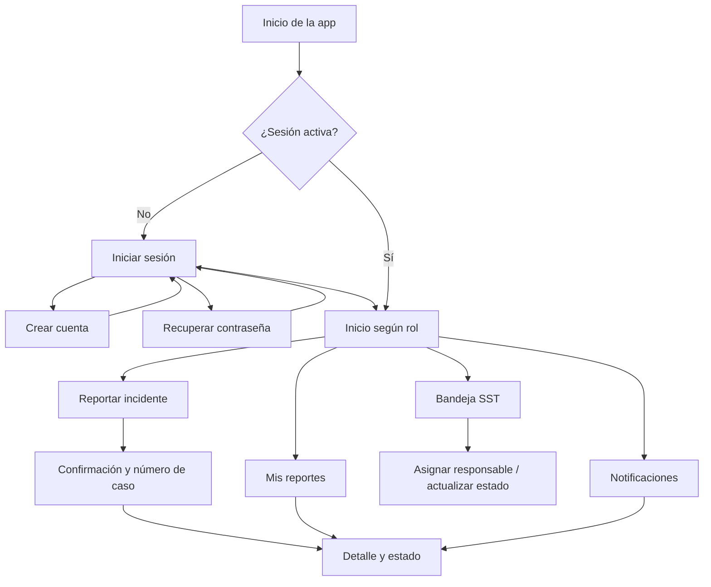
```mermaid
flowchart TD
    A[Inicio de la app] --> B{¿Sesión activa?}
    B -- No --> C[Iniciar sesión]
    C --> D[Crear cuenta]
    C --> E[Recuperar contraseña]
    D --> C
    E --> C
    C --> F[Inicio según rol]
    B -- Sí --> F
    F --> G[Reportar incidente]
    G --> H[Confirmación y número de caso]
    H --> I[Detalle y estado]
    F --> J[Mis reportes]
    J --> I
    F --> K[Bandeja SST]
    K --> L[Asignar responsable / actualizar estado]
    F --> M[Notificaciones]
    M --> I
```

Este esquema documenta **conexiones funcionales propuestas**. El wireflow gráfico definitivo debe conectar **miniaturas de las pantallas móviles** e identificar sus controles táctiles.

**[PENDIENTE: agregar el wireflow visual de los wireframes móviles definitivos.]**

#### 3.1.4.3. Mobile Applications Mock-ups

Los mock-ups deberán trasladar la identidad de SafeWork a componentes visuales de alta fidelidad. Se mantendrán, cuando corresponda, la tipografía Raleway para títulos, Montserrat para textos, el violeta corporativo `#7B7DC1` y el contraste entre fondo oscuro y texto claro. Las tarjetas de incidentes incorporarán indicadores de estado fácilmente distinguibles y la pantalla de reporte priorizará el botón de envío y la captura de evidencias.

Los mock-ups deben representar al menos los recorridos de **registro e inicio de sesión**, **reporte de incidente**, **consulta del estado**, **gestión de casos por SST**, **notificaciones** y **panel de indicadores**, en las dimensiones propias de un smartphone.

**[PENDIENTE: insertar capturas de mock-ups móviles de alta fidelidad. No sustituirlas por mock-ups web del informe anterior.]**

#### 3.1.4.4. Mobile Applications User Flow Diagrams

El user flow describe las acciones y decisiones que toma una persona para cumplir un objetivo concreto, diferenciándose del wireflow porque no necesita representar visualmente cada pantalla. Se considera prioritario el proceso de **reporte inmediato de un incidente**:

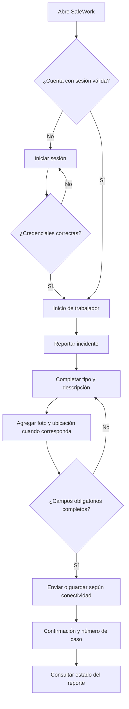
```mermaid
flowchart TD
    A[Abre SafeWork] --> B{¿Cuenta con sesión válida?}
    B -- No --> C[Iniciar sesión]
    C --> D{¿Credenciales correctas?}
    D -- No --> C
    D -- Sí --> E[Inicio de trabajador]
    B -- Sí --> E
    E --> F[Reportar incidente]
    F --> G[Completar tipo y descripción]
    G --> H[Agregar foto y ubicación cuando corresponda]
    H --> I{¿Campos obligatorios completos?}
    I -- No --> G
    I -- Sí --> J[Enviar o guardar según conectividad]
    J --> K[Confirmación y número de caso]
    K --> L[Consultar estado del reporte]
```

Para el personal SST, el flujo complementario comprende **abrir la bandeja de reportes → localizar un caso → revisar detalle → asignar responsable → actualizar estado → registrar seguimiento**.

**[PENDIENTE: incluir los user flows finales generados en la herramienta de diseño, con la distinción por rol.]**

#### 3.1.4.5. Mobile Applications Prototyping

El prototipo navegable de SafeWork deberá unir las pantallas diseñadas para permitir evaluar las rutas principales sin necesidad de que todas las funcionalidades estén conectadas a un backend. La primera validación puede centrarse en que un trabajador logre ingresar, reportar un incidente y consultar su estado; la segunda, en que un responsable SST pueda encontrar, asignar y actualizar un caso.

Como referencia de la etapa anterior, el proyecto cuenta con un enlace a un diseño de **aplicación web** en Figma: https://www.figma.com/design/4lfYU4omqUax0rxIYtyXp1/Untitled?node-id=87-101&t=vINDSY2w8lBsUY2f-1. Este enlace **no se considera evidencia del prototipo móvil**.

**[PENDIENTE: incorporar el enlace al prototipo móvil interactivo y capturas de las conexiones entre pantallas.]**

---

# Capítulo IV: Product Implementation & Validation

## 4.1. Software Configuration Management

Esta sección describe la configuración y organización de las herramientas empleadas o previstas en la continuidad de SafeWork. Se distinguen las herramientas ya documentadas para la landing page y el sistema web previo de los recursos que deberán confirmarse durante la implementación de la versión móvil.

### 4.1.1. Software Development Environment Configuration

Las herramientas documentadas en el proyecto SafeWork anterior sirven como base del nuevo entorno de trabajo:

| Área | Herramientas documentadas | Aplicación en SafeWork |
| --- | --- | --- |
| **Coordinación** | WhatsApp | Comunicación y organización del equipo. |
| **Análisis UX** | Uxpressia | Elaboración de personas, mapas de empatía y recorridos del usuario. |
| **Diseño de interfaz** | Figma | Diseño de wireframes, wireflows, mock-ups y prototipos. |
| **Landing page** | HTML5, CSS y JavaScript | Construcción y mantenimiento de la web informativa. |
| **Edición de código** | Visual Studio Code e IntelliJ IDEA | Herramientas empleadas en el proyecto anterior. |
| **Pruebas web** | Chrome, Brave, Opera y Edge | Evaluación visual y funcional de la landing. |
| **Versionado y documentación** | Git, GitHub y Google Docs | Historial de cambios, colaboración y documentación. |
| **Publicación web** | GitHub Pages | Alojamiento de la landing page documentada anteriormente. |

En la arquitectura del informe actual se plantea una **Mobile App** conectada con servicios del dominio de SafeWork, mientras que las descripciones de infraestructura contemplan un backend basado en Spring y persistencia en MySQL. Esta especificación arquitectónica **no confirma que todos esos componentes ya estén implementados o desplegados**.

**[PENDIENTE: indicar la tecnología móvil realmente seleccionada (por ejemplo, Android Studio/Kotlin, Flutter u otra), la versión del SDK, las dependencias y el emulador o dispositivo físico utilizado. La fuente nueva todavía no identifica este entorno.]**

### 4.1.2. Source Code Management

El código y la documentación se gestionan mediante un sistema de control de versiones basado en Git y GitHub. A diferencia de las referencias del informe del ciclo anterior, el repositorio de informe correspondiente a este curso es:

**Repositorio del informe actual:** https://github.com/NexoraPe-1ACC0238-2620-4945/report.git

Las modificaciones deben registrarse con mensajes de commit descriptivos y ramas de trabajo que permitan distinguir correcciones del informe, desarrollo de la landing e implementación móvil. El informe previo menciona ramas como `main` y `docs/`; su existencia y configuración en el repositorio de este ciclo deben confirmarse antes de presentarlas como parte del flujo actual.

**[PENDIENTE: agregar URL del repositorio de la aplicación móvil y evidencias actuales de ramas, commits y pull requests, cuando estén disponibles.]**

### 4.1.3. Source Code Style Guide & Conventions

Para mantener la legibilidad del código y facilitar la participación del equipo se retoman las convenciones del proyecto web anterior y se distinguen de las que deberá adoptar la aplicación móvil:

**HTML (landing page).** Los documentos deben declarar su tipo, indicar el idioma, utilizar etiquetas semánticas en minúsculas, escribir atributos entre comillas y definir textos alternativos para imágenes. Se conserva el uso adecuado de `title` y metadatos para la web informativa.

**CSS (landing page).** Se emplean selectores descriptivos, nombres de clase consistentes, espacios e indentación uniformes, propiedades terminadas en punto y coma y recursos externos cargados mediante HTTPS. La presentación se adapta mediante reglas responsivas a móviles y computadoras.

**JavaScript (landing page).** Se recomienda utilizar identificadores expresivos, funciones de responsabilidad acotada, estructura modular y manejo explícito de errores. Estas pautas constituyen criterios de desarrollo y deberán verificarse con el código que se entregue.

**Código móvil.** Al tratarse de un nuevo canal de implementación, se requiere una guía correspondiente al lenguaje seleccionado y a su arquitectura efectiva. Como criterios generales se propone: separar interfaz y lógica de negocio, reutilizar componentes, nombrar clases y funciones de forma descriptiva, centralizar constantes, gestionar permisos de cámara y GPS de manera controlada y evitar incluir credenciales o información sensible en el repositorio.

### 4.1.4. Software Deployment Configuration

La landing page cuenta con la referencia histórica de publicación mediante **GitHub Pages**, accesible en https://nexorape.github.io/Landing-Page/. Su publicación consiste en mantener el contenido web versionado y verificar que el sitio sea accesible mediante HTTPS.

Para la aplicación móvil se deberá documentar el procedimiento real una vez seleccionado y configurado el entorno: compilación, identificación de versión, ejecución en emulador o dispositivo, instalación, configuración de endpoints de servicios y validación de las funciones principales. Si se desarrolla una aplicación Android, los archivos APK o AAB podrán constituir evidencia de compilación y distribución, según el objetivo del sprint.

**[PENDIENTE: evidencias de compilación, instalación y despliegue móvil; no se adjuntaron archivos ejecutables ni registros de publicación de esta versión.]**

## 4.2. Landing Page & Mobile Application Implementation

En esta etapa se documentan los incrementos del producto realizados durante los sprints. La **landing page** presenta la propuesta de SafeWork y dirige al usuario hacia la solución; la **aplicación móvil** busca permitir reportar incidentes desde el teléfono, consultar el seguimiento y gestionar los casos según el rol del usuario. Los componentes se vinculan con las épicas y las historias de usuario ya definidas en el apartado 2.4.1.

La estructura siguiente se conserva de la plantilla del informe actual. Se presenta como **guía para registrar las actividades y evidencias del sprint real**, sin atribuir fechas, horas ni resultados del proyecto anterior al equipo del ciclo 2026-2.

### 4.2.1. Sprint n

#### 4.2.1.1. Sprint Planning n

El objetivo del sprint debe identificar qué incremento de la landing page o de la aplicación móvil se busca entregar. Según la planificación elegida, una primera iteración puede priorizar los flujos de autenticación y registro de incidentes, junto con la revisión de la landing responsiva.

| Campo | Información del sprint |
| --- | --- |
| **Sprint** | **[PENDIENTE: número del sprint]** |
| **Fecha de planificación** | **[PENDIENTE]** |
| **Duración** | **[PENDIENTE]** |
| **Objetivo del sprint** | **[PENDIENTE: especificar funcionalidades comprometidas]** |
| **Historias priorizadas** | **[PENDIENTE: seleccionar del Product Backlog 2.4.3]** |
| **Velocidad y story points** | **[PENDIENTE: incluir solo si fueron definidos]** |

#### 4.2.1.2. Aspect Leaders and Collaborators

Los integrantes del equipo del informe actual son **Daniel Elías Ruiz Huisa**, **Carlos Marcelo Mansilla Rivero** y **Francisco Uribe Linares**. Los roles de líder y colaborador de cada aspecto deben completarse con la asignación realizada en el sprint.

| Integrante | UI/UX Design | Landing Page | Mobile App | Testing | Documentation |
| --- | --- | --- | --- | --- | --- |
| Daniel Elías Ruiz Huisa | Por asignar | Por asignar | Por asignar | Por asignar | Por asignar |
| Carlos Marcelo Mansilla Rivero | Por asignar | Por asignar | Por asignar | Por asignar | Por asignar |
| Francisco Uribe Linares | Por asignar | Por asignar | Por asignar | Por asignar | Por asignar |

*Nota:* reemplazar “Por asignar” por **L (Leader)** o **C (Collaborator)** según el trabajo real del equipo.

#### 4.2.1.3. Sprint Backlog n

El Sprint Backlog debe vincular las historias comprometidas con tareas concretas, responsables y evidencias. El siguiente cuadro es una **propuesta de organización** que utiliza identificadores existentes en el backlog del informe actual, no una declaración de tareas terminadas.

| User Story | Funcionalidad prevista | Tarea propuesta | Responsable | Estado |
| --- | --- | --- | --- | --- |
| **US01, US31** | Navegación responsiva de landing | Revisar menú táctil y adaptación a smartphone | [PENDIENTE] | Por planificar |
| **US04, US05** | Registro e inicio de sesión | Diseñar e implementar flujo móvil de acceso | [PENDIENTE] | Por planificar |
| **US09, US10** | Reporte in-situ | Preparar formulario y captura de foto/ubicación | [PENDIENTE] | Por planificar |
| **US15, US16** | Consulta de casos | Crear listado y detalle del seguimiento | [PENDIENTE] | Por planificar |
| **US35, US39** | Búsqueda de reportes | Diseñar buscador y filtros táctiles para SST | [PENDIENTE] | Por planificar |

#### 4.2.1.4. Development Evidence for Sprint Review

En este apartado deberán adjuntarse capturas y enlaces de los cambios realizados en el repositorio, archivos creados o modificados, interfaces implementadas y funcionalidades desarrolladas durante el sprint. Las evidencias deben corresponder a la versión móvil y al equipo actual, sin copiar capturas del frontend web anterior como implementación móvil.

**[PENDIENTE: insertar commits, pull requests y capturas del código o pantallas desarrolladas.]**

#### 4.2.1.5. Testing Suite Evidence for Sprint Review

Se documentarán las pruebas ejecutadas sobre las funcionalidades implementadas. De acuerdo con las historias priorizadas, podrán incluir validación de campos obligatorios (US36), flujo de inicio de sesión, envío de reportes, permisos de cámara/ubicación y adaptación a pantallas de diferentes resoluciones (US31).

**[PENDIENTE: agregar casos de prueba, resultados observados y evidencia de ejecución; no se cuenta todavía con resultados verificables de la aplicación móvil.]**

#### 4.2.1.6. Execution Evidence for Sprint Review

Corresponde presentar evidencia de ejecución en el entorno real de pruebas: capturas de la aplicación abierta en un emulador o dispositivo, recorridos de navegación y demostración de las funciones completadas. Si alguna funcionalidad está solo prototipada en Figma, debe indicarse expresamente, sin clasificarla como ejecución de código.

**[PENDIENTE: añadir capturas o videos de ejecución.]**

#### 4.2.1.7. Services Documentation Evidence for Sprint Review

Cuando el sprint incluya integración con backend, se deberán documentar los servicios consumidos por la aplicación, su propósito, parámetros, respuestas y mecanismos de autenticación. Los dominios descritos en el capítulo II —incidentes, asignaciones, notificaciones, analítica y perfil— sirven para organizar estos servicios, pero no acreditan por sí mismos APIs funcionando.

**[PENDIENTE: incluir documentación de endpoints o indicar que no se integraron servicios durante el sprint.]**

#### 4.2.1.8. Software Deployment Evidence for Sprint Review

Se consignarán los pasos utilizados para preparar y distribuir la versión evaluada: configuración de compilación, resultado del build, instalación en dispositivo o emulador y ubicación del artefacto generado. Para la landing se podrá incluir la URL publicada y capturas de su funcionamiento. La entrega móvil deberá sustentarse mediante evidencias de la versión realmente obtenida.

**[PENDIENTE: incorporar capturas de despliegue y artefactos reales del sprint.]**

#### 4.2.1.9. Team Collaboration Insights during Sprint

Para demostrar la colaboración se incluirán las contribuciones registradas durante el sprint: commits por integrante, pull requests, revisiones, issues y decisiones relevantes de coordinación. El repositorio de referencia para este curso es https://github.com/NexoraPe-1ACC0238-2620-4945/report.git; cualquier métrica de colaboración debe corresponder a las actividades efectivas del equipo actual.

**[PENDIENTE: insertar la evidencia de colaboración del sprint y un breve comentario de los avances y dificultades.]**

## 4.3. Validation Interviews
### 4.3.1. Diseño de Entrevistas
### 4.3.2. Registro de Entrevistas
### 4.3.3. Evaluaciones según heurísticas

---

# Conclusiones
## Conclusiones y recomendaciones

# Video App Validation
## Video About the product
## Video About the team

# Glosario

# Bibliografía

# Anexos
